# ProCohere Database Technical Reference

Source: schema/query dump you provided (`results2.txt`).

## High-level architecture

- **Schemas**: `public` (shared platform/tenancy/licensing) and `procohere` (application data).
- **Multi-tenancy**: `organization_id` appears broadly and is enforced with RLS policies.
- **Auth context**: many routines reference `auth.uid()` to resolve the current user and tenant context.

## Relationship overview (FK constraints)

```mermaid
erDiagram
  procohere_activity_feed }o--|| procohere_team_members : "actor_id"
  procohere_ai_conversations }o--|| procohere_team_members : "team_member_id"
  procohere_ai_insights }o--|| procohere_team_members : "generated_for"
  procohere_ai_insights }o--|| procohere_team_members : "team_member_id"
  procohere_ai_messages }o--|| procohere_ai_conversations : "conversation_id"
  procohere_attachments }o--|| procohere_team_members : "uploaded_by"
  procohere_audit_log }o--|| procohere_team_members : "team_member_id"
  procohere_calendar_integrations }o--|| procohere_team_members : "team_member_id"
  procohere_comments }o--|| procohere_team_members : "author_id"
  procohere_comments }o--|| procohere_comments : "parent_comment_id"
  procohere_development_plan_items }o--|| procohere_competencies : "competency_id"
  procohere_development_plan_items }o--|| procohere_development_plans : "development_plan_id"
  procohere_development_plans }o--|| procohere_team_members : "team_member_id"
  procohere_entity_tags }o--|| procohere_tags : "tag_id"
  procohere_feedback }o--|| procohere_team_members : "from_member_id"
  procohere_feedback }o--|| procohere_meetings : "meeting_id"
  procohere_feedback }o--|| procohere_team_members : "to_member_id"
  procohere_feedback_templates }o--|| procohere_team_members : "created_by"
  procohere_goal_metrics }o--|| procohere_goals : "goal_id"
  procohere_goal_metrics }o--|| procohere_metrics : "metric_id"
  procohere_goal_templates }o--|| procohere_goal_categories : "category_id"
  procohere_goal_templates }o--|| procohere_team_members : "created_by"
  procohere_goals }o--|| procohere_goal_categories : "category_id"
  procohere_goals }o--|| procohere_team_members : "owner_id"
  procohere_goals }o--|| procohere_goals : "parent_goal_id"
  procohere_kudos }o--|| procohere_team_members : "from_member_id"
  procohere_kudos }o--|| procohere_team_members : "to_member_id"
  procohere_meeting_agenda_item_links }o--|| procohere_meeting_agenda_items : "meeting_agenda_item_id"
  procohere_meeting_agenda_items }o--|| procohere_team_members : "added_by"
  procohere_meeting_agenda_items }o--|| procohere_meetings : "meeting_id"
  procohere_meeting_agenda_scaffold_items }o--|| procohere_meeting_agenda_scaffolds : "scaffold_id"
  procohere_meeting_agenda_scaffolds }o--|| procohere_team_members : "created_by"
  procohere_meeting_attendees }o--|| procohere_meetings : "meeting_id"
  procohere_meeting_attendees }o--|| procohere_team_members : "team_member_id"
  procohere_meeting_notes }o--|| procohere_team_members : "author_id"
  procohere_meeting_notes }o--|| procohere_meetings : "meeting_id"
  procohere_meeting_prep_item_links }o--|| procohere_meeting_prep_items : "meeting_prep_item_id"
  procohere_meeting_series }o--|| procohere_team_members : "created_by"
  procohere_meeting_summaries }o--|| procohere_team_members : "approved_by"
  procohere_meeting_summaries }o--|| procohere_meetings : "meeting_id"
  procohere_meeting_templates }o--|| procohere_team_members : "created_by"
  procohere_meetings }o--|| procohere_team_members : "created_by"
  procohere_meetings }o--|| procohere_meeting_series : "meeting_series_id"
  procohere_meetings }o--|| procohere_meetings : "parent_meeting_id"
  procohere_metric_values }o--|| procohere_metrics : "metric_id"
  procohere_metric_values }o--|| procohere_team_members : "recorded_by"
  procohere_metrics }o--|| procohere_team_members : "owner_id"
  procohere_notes }o--|| procohere_team_members : "created_by"
  procohere_notes }o--|| procohere_metrics : "linked_metric_id"
  procohere_notes }o--|| procohere_targets : "linked_target_id"
  procohere_notes }o--|| procohere_meetings : "meeting_id"
  procohere_notes }o--|| procohere_team_members : "team_member_id"
  procohere_notifications }o--|| procohere_team_members : "team_member_id"
  procohere_performance_reviews }o--|| procohere_review_cycles : "review_cycle_id"
  procohere_performance_reviews }o--|| procohere_team_members : "reviewee_id"
  procohere_performance_reviews }o--|| procohere_team_members : "reviewer_id"
  procohere_survey_answers }o--|| procohere_survey_questions : "question_id"
  procohere_survey_answers }o--|| procohere_survey_responses : "response_id"
  procohere_survey_questions }o--|| procohere_surveys : "survey_id"
  procohere_survey_responses }o--|| procohere_team_members : "respondent_id"
  procohere_survey_responses }o--|| procohere_surveys : "survey_id"
  procohere_surveys }o--|| procohere_team_members : "created_by"
  procohere_targets }o--|| procohere_goals : "goal_id"
  procohere_tasks }o--|| procohere_team_members : "assigned_to"
  procohere_tasks }o--|| procohere_team_members : "created_by"
  procohere_team_member_competencies }o--|| procohere_team_members : "assessed_by"
  procohere_team_member_competencies }o--|| procohere_competencies : "competency_id"
  procohere_team_member_competencies }o--|| procohere_team_members : "team_member_id"
  procohere_team_members }o--|| procohere_team_members : "manager_team_member_id"
  procohere_team_members }o--|| procohere_roles : "role_id"
  procohere_teams }o--|| procohere_team_members : "lead_team_member_id"
  procohere_teams }o--|| procohere_teams : "parent_team_id"
  procohere_user_settings }o--|| procohere_team_members : "team_member_id"
```



*(Generated from FK constraints; limited to the first ~160 edges for readability.)*

---

## Tables: Core app data

### procohere.activity_feed

**RLS**: enabled=True forced=False

**Columns**

| Column | Type | Nullable | Default |
|---|---|---:|---|
| `action` | text | NO |  |
| `actor_id` | uuid | NO |  |
| `created_at` | timestamp with time zone | NO | now() |
| `entity_id` | uuid | NO |  |
| `entity_title` | text | YES |  |
| `entity_type` | text | NO |  |
| `id` | uuid | NO | gen_random_uuid() |
| `is_deleted` | boolean | NO | false |
| `metadata` | jsonb | YES |  |
| `organization_id` | uuid | NO |  |

**Constraints**
- `activity_feed_actor_id_fkey`: FOREIGN KEY (actor_id) REFERENCES procohere.team_members(id)
- `activity_feed_organization_id_fkey`: FOREIGN KEY (organization_id) REFERENCES organizations(id)
- `activity_feed_pkey`: PRIMARY KEY (id)

**Indexes**
- `activity_feed_pkey`: CREATE UNIQUE INDEX activity_feed_pkey ON procohere.activity_feed USING btree (id)
- `idx_activity_feed_actor`: CREATE INDEX idx_activity_feed_actor ON procohere.activity_feed USING btree (actor_id) WHERE (is_deleted = false)
- `idx_activity_feed_created`: CREATE INDEX idx_activity_feed_created ON procohere.activity_feed USING btree (created_at DESC) WHERE (is_deleted = false)
- `idx_activity_feed_entity`: CREATE INDEX idx_activity_feed_entity ON procohere.activity_feed USING btree (entity_type, entity_id) WHERE (is_deleted = false)
- `idx_activity_feed_org`: CREATE INDEX idx_activity_feed_org ON procohere.activity_feed USING btree (organization_id) WHERE (is_deleted = false)

---

### procohere.ai_conversations

**RLS**: enabled=True forced=False

**Columns**

| Column | Type | Nullable | Default |
|---|---|---:|---|
| `context_id` | uuid | YES |  |
| `context_type` | text | YES |  |
| `created_at` | timestamp with time zone | NO | now() |
| `deleted_at` | timestamp with time zone | YES |  |
| `deleted_by` | uuid | YES |  |
| `id` | uuid | NO | gen_random_uuid() |
| `is_deleted` | boolean | NO | false |
| `model_used` | text | YES |  |
| `organization_id` | uuid | NO |  |
| `team_member_id` | uuid | NO |  |
| `title` | text | YES |  |
| `updated_at` | timestamp with time zone | NO | now() |

**Constraints**
- `ai_conversations_deleted_by_fkey`: FOREIGN KEY (deleted_by) REFERENCES users(id)
- `ai_conversations_organization_id_fkey`: FOREIGN KEY (organization_id) REFERENCES organizations(id)
- `ai_conversations_pkey`: PRIMARY KEY (id)
- `ai_conversations_team_member_id_fkey`: FOREIGN KEY (team_member_id) REFERENCES procohere.team_members(id)

**Indexes**
- `ai_conversations_pkey`: CREATE UNIQUE INDEX ai_conversations_pkey ON procohere.ai_conversations USING btree (id)
- `idx_ai_conversations_member`: CREATE INDEX idx_ai_conversations_member ON procohere.ai_conversations USING btree (team_member_id) WHERE (is_deleted = false)
- `idx_ai_conversations_org`: CREATE INDEX idx_ai_conversations_org ON procohere.ai_conversations USING btree (organization_id) WHERE (is_deleted = false)

**Triggers**
- `tr_ai_conversations_set_updated_at`: CREATE TRIGGER tr_ai_conversations_set_updated_at BEFORE UPDATE ON procohere.ai_conversations FOR EACH ROW EXECUTE FUNCTION set_updated_at()

---

### procohere.ai_insights

**RLS**: enabled=True forced=False

**Columns**

| Column | Type | Nullable | Default |
|---|---|---:|---|
| `content` | text | NO |  |
| `created_at` | timestamp with time zone | NO | now() |
| `deleted_at` | timestamp with time zone | YES |  |
| `deleted_by` | uuid | YES |  |
| `dismissed_at` | timestamp with time zone | YES |  |
| `generated_for` | uuid | NO |  |
| `id` | uuid | NO | gen_random_uuid() |
| `insight_type` | text | NO |  |
| `is_deleted` | boolean | NO | false |
| `is_dismissed` | boolean | NO | false |
| `organization_id` | uuid | NO |  |
| `relevance_score` | numeric | YES |  |
| `source_id` | uuid | YES |  |
| `source_type` | text | YES |  |
| `team_member_id` | uuid | YES |  |
| `title` | text | NO |  |
| `updated_at` | timestamp with time zone | NO | now() |

**Constraints**
- `ai_insights_deleted_by_fkey`: FOREIGN KEY (deleted_by) REFERENCES users(id)
- `ai_insights_generated_for_fkey`: FOREIGN KEY (generated_for) REFERENCES procohere.team_members(id)
- `ai_insights_organization_id_fkey`: FOREIGN KEY (organization_id) REFERENCES organizations(id)
- `ai_insights_pkey`: PRIMARY KEY (id)
- `ai_insights_team_member_id_fkey`: FOREIGN KEY (team_member_id) REFERENCES procohere.team_members(id)

**Indexes**
- `ai_insights_pkey`: CREATE UNIQUE INDEX ai_insights_pkey ON procohere.ai_insights USING btree (id)
- `idx_ai_insights_about`: CREATE INDEX idx_ai_insights_about ON procohere.ai_insights USING btree (team_member_id) WHERE ((is_deleted = false) AND (team_member_id IS NOT NULL))
- `idx_ai_insights_for`: CREATE INDEX idx_ai_insights_for ON procohere.ai_insights USING btree (generated_for) WHERE (is_deleted = false)
- `idx_ai_insights_org`: CREATE INDEX idx_ai_insights_org ON procohere.ai_insights USING btree (organization_id) WHERE (is_deleted = false)

**Triggers**
- `tr_ai_insights_set_updated_at`: CREATE TRIGGER tr_ai_insights_set_updated_at BEFORE UPDATE ON procohere.ai_insights FOR EACH ROW EXECUTE FUNCTION set_updated_at()

---

### procohere.ai_messages

**RLS**: enabled=True forced=False

**Columns**

| Column | Type | Nullable | Default |
|---|---|---:|---|
| `content` | text | NO |  |
| `conversation_id` | uuid | NO |  |
| `created_at` | timestamp with time zone | NO | now() |
| `deleted_at` | timestamp with time zone | YES |  |
| `deleted_by` | uuid | YES |  |
| `id` | uuid | NO | gen_random_uuid() |
| `is_deleted` | boolean | NO | false |
| `organization_id` | uuid | NO |  |
| `role` | text | NO |  |
| `tokens_used` | integer | YES |  |
| `updated_at` | timestamp with time zone | NO | now() |

**Constraints**
- `ai_messages_conversation_id_fkey`: FOREIGN KEY (conversation_id) REFERENCES procohere.ai_conversations(id)
- `ai_messages_deleted_by_fkey`: FOREIGN KEY (deleted_by) REFERENCES users(id)
- `ai_messages_organization_id_fkey`: FOREIGN KEY (organization_id) REFERENCES organizations(id)
- `ai_messages_pkey`: PRIMARY KEY (id)

**Indexes**
- `ai_messages_pkey`: CREATE UNIQUE INDEX ai_messages_pkey ON procohere.ai_messages USING btree (id)
- `idx_ai_messages_conversation`: CREATE INDEX idx_ai_messages_conversation ON procohere.ai_messages USING btree (conversation_id) WHERE (is_deleted = false)
- `idx_ai_messages_org`: CREATE INDEX idx_ai_messages_org ON procohere.ai_messages USING btree (organization_id) WHERE (is_deleted = false)

**Triggers**
- `tr_ai_messages_set_updated_at`: CREATE TRIGGER tr_ai_messages_set_updated_at BEFORE UPDATE ON procohere.ai_messages FOR EACH ROW EXECUTE FUNCTION set_updated_at()

---

### procohere.audit_log

**RLS**: enabled=True forced=False

**Columns**

| Column | Type | Nullable | Default |
|---|---|---:|---|
| `action` | text | NO |  |
| `actor_id` | uuid | YES |  |
| `created_at` | timestamp with time zone | NO | now() |
| `entity_id` | uuid | YES |  |
| `entity_type` | text | NO |  |
| `id` | uuid | NO | gen_random_uuid() |
| `ip_address` | inet | YES |  |
| `new_values` | jsonb | YES |  |
| `old_values` | jsonb | YES |  |
| `organization_id` | uuid | NO |  |
| `team_member_id` | uuid | YES |  |
| `user_agent` | text | YES |  |

**Constraints**
- `audit_log_actor_id_fkey`: FOREIGN KEY (actor_id) REFERENCES users(id)
- `audit_log_organization_id_fkey`: FOREIGN KEY (organization_id) REFERENCES organizations(id)
- `audit_log_pkey`: PRIMARY KEY (id)
- `audit_log_team_member_id_fkey`: FOREIGN KEY (team_member_id) REFERENCES procohere.team_members(id)

**Indexes**
- `audit_log_pkey`: CREATE UNIQUE INDEX audit_log_pkey ON procohere.audit_log USING btree (id)
- `idx_audit_log_actor`: CREATE INDEX idx_audit_log_actor ON procohere.audit_log USING btree (actor_id)
- `idx_audit_log_created`: CREATE INDEX idx_audit_log_created ON procohere.audit_log USING btree (created_at)
- `idx_audit_log_entity`: CREATE INDEX idx_audit_log_entity ON procohere.audit_log USING btree (entity_type, entity_id)
- `idx_audit_log_org`: CREATE INDEX idx_audit_log_org ON procohere.audit_log USING btree (organization_id)

---

### procohere.calendar_integrations

**RLS**: enabled=True forced=True

**Columns**

| Column | Type | Nullable | Default |
|---|---|---:|---|
| `access_token` | text | YES |  |
| `created_at` | timestamp with time zone | NO | now() |
| `deleted_at` | timestamp with time zone | YES |  |
| `deleted_by` | uuid | YES |  |
| `external_account_id` | text | YES |  |
| `id` | uuid | NO | gen_random_uuid() |
| `is_deleted` | boolean | NO | false |
| `last_synced_at` | timestamp with time zone | YES |  |
| `organization_id` | uuid | NO |  |
| `provider` | text | NO |  |
| `refresh_token` | text | YES |  |
| `sync_enabled` | boolean | NO | true |
| `team_member_id` | uuid | NO |  |
| `token_expires_at` | timestamp with time zone | YES |  |
| `updated_at` | timestamp with time zone | NO | now() |

**Constraints**
- `calendar_integrations_deleted_by_fkey`: FOREIGN KEY (deleted_by) REFERENCES users(id)
- `calendar_integrations_organization_id_fkey`: FOREIGN KEY (organization_id) REFERENCES organizations(id)
- `calendar_integrations_pkey`: PRIMARY KEY (id)
- `calendar_integrations_team_member_id_fkey`: FOREIGN KEY (team_member_id) REFERENCES procohere.team_members(id)

**Indexes**
- `calendar_integrations_pkey`: CREATE UNIQUE INDEX calendar_integrations_pkey ON procohere.calendar_integrations USING btree (id)
- `idx_calendar_integrations_member`: CREATE INDEX idx_calendar_integrations_member ON procohere.calendar_integrations USING btree (team_member_id) WHERE (is_deleted = false)
- `idx_calendar_integrations_org`: CREATE INDEX idx_calendar_integrations_org ON procohere.calendar_integrations USING btree (organization_id) WHERE (is_deleted = false)
- `uq_calendar_integrations_member_provider`: CREATE UNIQUE INDEX uq_calendar_integrations_member_provider ON procohere.calendar_integrations USING btree (team_member_id, provider) WHERE (is_deleted = false)

**Triggers**
- `tr_calendar_integrations_set_updated_at`: CREATE TRIGGER tr_calendar_integrations_set_updated_at BEFORE UPDATE ON procohere.calendar_integrations FOR EACH ROW EXECUTE FUNCTION set_updated_at()

**RLS policies**
- `calendar_integrations_owner_only` [ALL] roles={public}
  - USING: (team_member_id IN ( SELECT tm.id
   FROM procohere.team_members tm
  WHERE ((tm.linked_user_id = auth.uid()) AND (tm.is_deleted = false))))
  - WITH CHECK: (team_member_id IN ( SELECT tm.id
   FROM procohere.team_members tm
  WHERE ((tm.linked_user_id = auth.uid()) AND (tm.is_deleted = false))))

---

### procohere.comments

**RLS**: enabled=True forced=False

**Columns**

| Column | Type | Nullable | Default |
|---|---|---:|---|
| `author_id` | uuid | NO |  |
| `content` | text | NO |  |
| `created_at` | timestamp with time zone | NO | now() |
| `deleted_at` | timestamp with time zone | YES |  |
| `deleted_by` | uuid | YES |  |
| `entity_id` | uuid | NO |  |
| `entity_type` | text | NO |  |
| `id` | uuid | NO | gen_random_uuid() |
| `is_deleted` | boolean | NO | false |
| `organization_id` | uuid | NO |  |
| `parent_comment_id` | uuid | YES |  |
| `updated_at` | timestamp with time zone | NO | now() |

**Constraints**
- `comments_author_id_fkey`: FOREIGN KEY (author_id) REFERENCES procohere.team_members(id)
- `comments_deleted_by_fkey`: FOREIGN KEY (deleted_by) REFERENCES users(id)
- `comments_organization_id_fkey`: FOREIGN KEY (organization_id) REFERENCES organizations(id)
- `comments_parent_comment_id_fkey`: FOREIGN KEY (parent_comment_id) REFERENCES procohere.comments(id)
- `comments_pkey`: PRIMARY KEY (id)

**Indexes**
- `comments_pkey`: CREATE UNIQUE INDEX comments_pkey ON procohere.comments USING btree (id)
- `idx_comments_author`: CREATE INDEX idx_comments_author ON procohere.comments USING btree (author_id) WHERE (is_deleted = false)
- `idx_comments_entity`: CREATE INDEX idx_comments_entity ON procohere.comments USING btree (entity_type, entity_id) WHERE (is_deleted = false)
- `idx_comments_org`: CREATE INDEX idx_comments_org ON procohere.comments USING btree (organization_id) WHERE (is_deleted = false)
- `idx_comments_parent`: CREATE INDEX idx_comments_parent ON procohere.comments USING btree (parent_comment_id) WHERE ((is_deleted = false) AND (parent_comment_id IS NOT NULL))

**Triggers**
- `tr_comments_set_updated_at`: CREATE TRIGGER tr_comments_set_updated_at BEFORE UPDATE ON procohere.comments FOR EACH ROW EXECUTE FUNCTION set_updated_at()

---

### procohere.competencies

**RLS**: enabled=True forced=False

**Columns**

| Column | Type | Nullable | Default |
|---|---|---:|---|
| `category` | text | YES |  |
| `created_at` | timestamp with time zone | NO | now() |
| `deleted_at` | timestamp with time zone | YES |  |
| `deleted_by` | uuid | YES |  |
| `description` | text | YES |  |
| `id` | uuid | NO | gen_random_uuid() |
| `is_deleted` | boolean | NO | false |
| `name` | text | NO |  |
| `organization_id` | uuid | NO |  |
| `updated_at` | timestamp with time zone | NO | now() |

**Constraints**
- `competencies_deleted_by_fkey`: FOREIGN KEY (deleted_by) REFERENCES users(id)
- `competencies_organization_id_fkey`: FOREIGN KEY (organization_id) REFERENCES organizations(id)
- `competencies_pkey`: PRIMARY KEY (id)

**Indexes**
- `competencies_pkey`: CREATE UNIQUE INDEX competencies_pkey ON procohere.competencies USING btree (id)
- `idx_competencies_org`: CREATE INDEX idx_competencies_org ON procohere.competencies USING btree (organization_id) WHERE (is_deleted = false)
- `uq_competencies_org_name`: CREATE UNIQUE INDEX uq_competencies_org_name ON procohere.competencies USING btree (organization_id, lower(TRIM(BOTH FROM name))) WHERE (is_deleted = false)

**Triggers**
- `tr_competencies_set_updated_at`: CREATE TRIGGER tr_competencies_set_updated_at BEFORE UPDATE ON procohere.competencies FOR EACH ROW EXECUTE FUNCTION set_updated_at()

---

### procohere.development_plan_items

**RLS**: enabled=True forced=False

**Columns**

| Column | Type | Nullable | Default |
|---|---|---:|---|
| `competency_id` | uuid | YES |  |
| `completed_at` | timestamp with time zone | YES |  |
| `created_at` | timestamp with time zone | NO | now() |
| `deleted_at` | timestamp with time zone | YES |  |
| `deleted_by` | uuid | YES |  |
| `description` | text | YES |  |
| `development_plan_id` | uuid | NO |  |
| `due_date` | date | YES |  |
| `id` | uuid | NO | gen_random_uuid() |
| `is_deleted` | boolean | NO | false |
| `item_type` | text | YES | 'action'::text |
| `organization_id` | uuid | NO |  |
| `sort_order` | integer | NO | 0 |
| `status` | text | NO | 'not_started'::text |
| `title` | text | NO |  |
| `updated_at` | timestamp with time zone | NO | now() |

**Constraints**
- `development_plan_items_competency_id_fkey`: FOREIGN KEY (competency_id) REFERENCES procohere.competencies(id)
- `development_plan_items_deleted_by_fkey`: FOREIGN KEY (deleted_by) REFERENCES users(id)
- `development_plan_items_development_plan_id_fkey`: FOREIGN KEY (development_plan_id) REFERENCES procohere.development_plans(id)
- `development_plan_items_organization_id_fkey`: FOREIGN KEY (organization_id) REFERENCES organizations(id)
- `development_plan_items_pkey`: PRIMARY KEY (id)

**Indexes**
- `development_plan_items_pkey`: CREATE UNIQUE INDEX development_plan_items_pkey ON procohere.development_plan_items USING btree (id)
- `idx_dev_plan_items_org`: CREATE INDEX idx_dev_plan_items_org ON procohere.development_plan_items USING btree (organization_id) WHERE (is_deleted = false)
- `idx_dev_plan_items_plan`: CREATE INDEX idx_dev_plan_items_plan ON procohere.development_plan_items USING btree (development_plan_id) WHERE (is_deleted = false)

**Triggers**
- `tr_dev_plan_items_set_updated_at`: CREATE TRIGGER tr_dev_plan_items_set_updated_at BEFORE UPDATE ON procohere.development_plan_items FOR EACH ROW EXECUTE FUNCTION set_updated_at()

---

### procohere.development_plans

**RLS**: enabled=True forced=False

**Columns**

| Column | Type | Nullable | Default |
|---|---|---:|---|
| `completed_at` | timestamp with time zone | YES |  |
| `created_at` | timestamp with time zone | NO | now() |
| `deleted_at` | timestamp with time zone | YES |  |
| `deleted_by` | uuid | YES |  |
| `description` | text | YES |  |
| `id` | uuid | NO | gen_random_uuid() |
| `is_deleted` | boolean | NO | false |
| `organization_id` | uuid | NO |  |
| `start_date` | date | YES |  |
| `status` | text | NO | 'active'::text |
| `target_date` | date | YES |  |
| `team_member_id` | uuid | NO |  |
| `title` | text | NO |  |
| `updated_at` | timestamp with time zone | NO | now() |

**Constraints**
- `development_plans_deleted_by_fkey`: FOREIGN KEY (deleted_by) REFERENCES users(id)
- `development_plans_organization_id_fkey`: FOREIGN KEY (organization_id) REFERENCES organizations(id)
- `development_plans_pkey`: PRIMARY KEY (id)
- `development_plans_team_member_id_fkey`: FOREIGN KEY (team_member_id) REFERENCES procohere.team_members(id)

**Indexes**
- `development_plans_pkey`: CREATE UNIQUE INDEX development_plans_pkey ON procohere.development_plans USING btree (id)
- `idx_dev_plans_member`: CREATE INDEX idx_dev_plans_member ON procohere.development_plans USING btree (team_member_id) WHERE (is_deleted = false)
- `idx_dev_plans_org`: CREATE INDEX idx_dev_plans_org ON procohere.development_plans USING btree (organization_id) WHERE (is_deleted = false)

**Triggers**
- `tr_development_plans_set_updated_at`: CREATE TRIGGER tr_development_plans_set_updated_at BEFORE UPDATE ON procohere.development_plans FOR EACH ROW EXECUTE FUNCTION set_updated_at()

---

### procohere.entity_tags

**RLS**: enabled=True forced=False

**Columns**

| Column | Type | Nullable | Default |
|---|---|---:|---|
| `created_at` | timestamp with time zone | NO | now() |
| `deleted_at` | timestamp with time zone | YES |  |
| `deleted_by` | uuid | YES |  |
| `entity_id` | uuid | NO |  |
| `entity_type` | text | NO |  |
| `id` | uuid | NO | gen_random_uuid() |
| `is_deleted` | boolean | NO | false |
| `organization_id` | uuid | NO |  |
| `tag_id` | uuid | NO |  |
| `updated_at` | timestamp with time zone | NO | now() |

**Constraints**
- `entity_tags_deleted_by_fkey`: FOREIGN KEY (deleted_by) REFERENCES users(id)
- `entity_tags_organization_id_fkey`: FOREIGN KEY (organization_id) REFERENCES organizations(id)
- `entity_tags_pkey`: PRIMARY KEY (id)
- `entity_tags_tag_id_fkey`: FOREIGN KEY (tag_id) REFERENCES procohere.tags(id)

**Indexes**
- `entity_tags_pkey`: CREATE UNIQUE INDEX entity_tags_pkey ON procohere.entity_tags USING btree (id)
- `idx_entity_tags_entity`: CREATE INDEX idx_entity_tags_entity ON procohere.entity_tags USING btree (entity_type, entity_id) WHERE (is_deleted = false)
- `idx_entity_tags_org`: CREATE INDEX idx_entity_tags_org ON procohere.entity_tags USING btree (organization_id) WHERE (is_deleted = false)
- `idx_entity_tags_tag`: CREATE INDEX idx_entity_tags_tag ON procohere.entity_tags USING btree (tag_id) WHERE (is_deleted = false)
- `uq_entity_tags_tag_entity`: CREATE UNIQUE INDEX uq_entity_tags_tag_entity ON procohere.entity_tags USING btree (tag_id, entity_type, entity_id) WHERE (is_deleted = false)

**Triggers**
- `tr_entity_tags_set_updated_at`: CREATE TRIGGER tr_entity_tags_set_updated_at BEFORE UPDATE ON procohere.entity_tags FOR EACH ROW EXECUTE FUNCTION set_updated_at()

---

### procohere.notes

**RLS**: enabled=True forced=False

**Columns**

| Column | Type | Nullable | Default |
|---|---|---:|---|
| `content` | text | NO |  |
| `created_at` | timestamp with time zone | NO | now() |
| `created_by` | uuid | NO |  |
| `deleted_at` | timestamp with time zone | YES |  |
| `deleted_by` | uuid | YES |  |
| `id` | uuid | NO | gen_random_uuid() |
| `is_deleted` | boolean | NO | false |
| `is_private` | boolean | NO | true |
| `linked_metric_id` | uuid | YES |  |
| `linked_target_id` | uuid | YES |  |
| `meeting_id` | uuid | YES |  |
| `organization_id` | uuid | NO |  |
| `team_member_id` | uuid | YES |  |
| `title` | text | YES |  |
| `updated_at` | timestamp with time zone | NO | now() |

**Constraints**
- `notes_created_by_fkey`: FOREIGN KEY (created_by) REFERENCES procohere.team_members(id)
- `notes_deleted_by_fkey`: FOREIGN KEY (deleted_by) REFERENCES users(id)
- `notes_linked_metric_id_fkey`: FOREIGN KEY (linked_metric_id) REFERENCES procohere.metrics(id) ON DELETE SET NULL
- `notes_linked_target_id_fkey`: FOREIGN KEY (linked_target_id) REFERENCES procohere.targets(id) ON DELETE SET NULL
- `notes_meeting_id_fkey`: FOREIGN KEY (meeting_id) REFERENCES procohere.meetings(id)
- `notes_organization_id_fkey`: FOREIGN KEY (organization_id) REFERENCES organizations(id)
- `notes_pkey`: PRIMARY KEY (id)
- `notes_team_member_id_fkey`: FOREIGN KEY (team_member_id) REFERENCES procohere.team_members(id)

**Indexes**
- `idx_notes_about_member`: CREATE INDEX idx_notes_about_member ON procohere.notes USING btree (team_member_id) WHERE ((is_deleted = false) AND (team_member_id IS NOT NULL))
- `idx_notes_created_by`: CREATE INDEX idx_notes_created_by ON procohere.notes USING btree (created_by) WHERE (is_deleted = false)
- `idx_notes_linked_metric_id`: CREATE INDEX idx_notes_linked_metric_id ON procohere.notes USING btree (linked_metric_id) WHERE (linked_metric_id IS NOT NULL)
- `idx_notes_linked_target_id`: CREATE INDEX idx_notes_linked_target_id ON procohere.notes USING btree (linked_target_id) WHERE (linked_target_id IS NOT NULL)
- `idx_notes_meeting`: CREATE INDEX idx_notes_meeting ON procohere.notes USING btree (meeting_id) WHERE ((is_deleted = false) AND (meeting_id IS NOT NULL))
- `idx_notes_org`: CREATE INDEX idx_notes_org ON procohere.notes USING btree (organization_id) WHERE (is_deleted = false)
- `notes_pkey`: CREATE UNIQUE INDEX notes_pkey ON procohere.notes USING btree (id)

**Triggers**
- `tr_notes_set_updated_at`: CREATE TRIGGER tr_notes_set_updated_at BEFORE UPDATE ON procohere.notes FOR EACH ROW EXECUTE FUNCTION set_updated_at()

**RLS policies**
- `notes_write` [ALL] roles={public}
  - USING: ((organization_id = procohere.get_current_organization_id()) AND (created_by = procohere.get_current_team_member_id()))
  - WITH CHECK: ((organization_id = procohere.get_current_organization_id()) AND (created_by = procohere.get_current_team_member_id()))
- `notes_select` [SELECT] roles={public}
  - USING: ((organization_id = procohere.get_current_organization_id()) AND ((created_by = procohere.get_current_team_member_id()) OR ((is_private = false) AND (meeting_id IS NOT NULL) AND procohere.rls_can_see_meeting(meeting_id))))

---

### procohere.org_settings

**RLS**: enabled=True forced=False

**Columns**

| Column | Type | Nullable | Default |
|---|---|---:|---|
| `created_at` | timestamp with time zone | NO | now() |
| `default_meeting_duration` | integer | YES | 30 |
| `deleted_at` | timestamp with time zone | YES |  |
| `deleted_by` | uuid | YES |  |
| `enable_ai_features` | boolean | NO | true |
| `enable_anonymous_feedback` | boolean | NO | true |
| `fiscal_year_start_month` | integer | YES | 1 |
| `goal_cycle_type` | text | YES | 'quarterly'::text |
| `id` | uuid | NO | gen_random_uuid() |
| `is_deleted` | boolean | NO | false |
| `meeting_reminder_minutes` | integer | YES | 15 |
| `organization_id` | uuid | NO |  |
| `require_agenda` | boolean | NO | false |
| `require_notes` | boolean | NO | false |
| `settings_json` | jsonb | NO | '{}'::jsonb |
| `updated_at` | timestamp with time zone | NO | now() |

**Constraints**
- `org_settings_deleted_by_fkey`: FOREIGN KEY (deleted_by) REFERENCES users(id)
- `org_settings_organization_id_fkey`: FOREIGN KEY (organization_id) REFERENCES organizations(id)
- `org_settings_pkey`: PRIMARY KEY (id)

**Indexes**
- `org_settings_pkey`: CREATE UNIQUE INDEX org_settings_pkey ON procohere.org_settings USING btree (id)
- `uq_org_settings_org`: CREATE UNIQUE INDEX uq_org_settings_org ON procohere.org_settings USING btree (organization_id) WHERE (is_deleted = false)

**Triggers**
- `tr_org_settings_set_updated_at`: CREATE TRIGGER tr_org_settings_set_updated_at BEFORE UPDATE ON procohere.org_settings FOR EACH ROW EXECUTE FUNCTION set_updated_at()

---

### procohere.performance_reviews

**RLS**: enabled=True forced=False

**Columns**

| Column | Type | Nullable | Default |
|---|---|---:|---|
| `acknowledged_at` | timestamp with time zone | YES |  |
| `additional_comments` | text | YES |  |
| `areas_for_improvement` | text | YES |  |
| `created_at` | timestamp with time zone | NO | now() |
| `deleted_at` | timestamp with time zone | YES |  |
| `deleted_by` | uuid | YES |  |
| `goals_for_next_period` | text | YES |  |
| `id` | uuid | NO | gen_random_uuid() |
| `is_deleted` | boolean | NO | false |
| `organization_id` | uuid | NO |  |
| `overall_rating` | integer | YES |  |
| `review_cycle_id` | uuid | NO |  |
| `review_type` | text | NO | 'manager'::text |
| `reviewee_id` | uuid | NO |  |
| `reviewer_id` | uuid | NO |  |
| `status` | text | NO | 'pending'::text |
| `strengths` | text | YES |  |
| `submitted_at` | timestamp with time zone | YES |  |
| `updated_at` | timestamp with time zone | NO | now() |

**Constraints**
- `performance_reviews_deleted_by_fkey`: FOREIGN KEY (deleted_by) REFERENCES users(id)
- `performance_reviews_organization_id_fkey`: FOREIGN KEY (organization_id) REFERENCES organizations(id)
- `performance_reviews_overall_rating_check`: CHECK (overall_rating >= 1 AND overall_rating <= 5)
- `performance_reviews_pkey`: PRIMARY KEY (id)
- `performance_reviews_review_cycle_id_fkey`: FOREIGN KEY (review_cycle_id) REFERENCES procohere.review_cycles(id)
- `performance_reviews_reviewee_id_fkey`: FOREIGN KEY (reviewee_id) REFERENCES procohere.team_members(id)
- `performance_reviews_reviewer_id_fkey`: FOREIGN KEY (reviewer_id) REFERENCES procohere.team_members(id)

**Indexes**
- `idx_perf_reviews_cycle`: CREATE INDEX idx_perf_reviews_cycle ON procohere.performance_reviews USING btree (review_cycle_id) WHERE (is_deleted = false)
- `idx_perf_reviews_org`: CREATE INDEX idx_perf_reviews_org ON procohere.performance_reviews USING btree (organization_id) WHERE (is_deleted = false)
- `idx_perf_reviews_reviewee`: CREATE INDEX idx_perf_reviews_reviewee ON procohere.performance_reviews USING btree (reviewee_id) WHERE (is_deleted = false)
- `idx_perf_reviews_reviewer`: CREATE INDEX idx_perf_reviews_reviewer ON procohere.performance_reviews USING btree (reviewer_id) WHERE (is_deleted = false)
- `performance_reviews_pkey`: CREATE UNIQUE INDEX performance_reviews_pkey ON procohere.performance_reviews USING btree (id)
- `uq_perf_reviews_cycle_reviewee_reviewer_type`: CREATE UNIQUE INDEX uq_perf_reviews_cycle_reviewee_reviewer_type ON procohere.performance_reviews USING btree (review_cycle_id, reviewee_id, reviewer_id, review_type) WHERE (is_deleted = false)

**Triggers**
- `tr_performance_reviews_set_updated_at`: CREATE TRIGGER tr_performance_reviews_set_updated_at BEFORE UPDATE ON procohere.performance_reviews FOR EACH ROW EXECUTE FUNCTION set_updated_at()

---

### procohere.review_cycles

**RLS**: enabled=True forced=False

**Columns**

| Column | Type | Nullable | Default |
|---|---|---:|---|
| `created_at` | timestamp with time zone | NO | now() |
| `cycle_type` | text | NO | 'annual'::text |
| `deleted_at` | timestamp with time zone | YES |  |
| `deleted_by` | uuid | YES |  |
| `description` | text | YES |  |
| `end_date` | date | NO |  |
| `id` | uuid | NO | gen_random_uuid() |
| `is_deleted` | boolean | NO | false |
| `name` | text | NO |  |
| `organization_id` | uuid | NO |  |
| `review_end_date` | date | YES |  |
| `review_start_date` | date | YES |  |
| `start_date` | date | NO |  |
| `status` | text | NO | 'draft'::text |
| `updated_at` | timestamp with time zone | NO | now() |

**Constraints**
- `review_cycles_deleted_by_fkey`: FOREIGN KEY (deleted_by) REFERENCES users(id)
- `review_cycles_organization_id_fkey`: FOREIGN KEY (organization_id) REFERENCES organizations(id)
- `review_cycles_pkey`: PRIMARY KEY (id)

**Indexes**
- `idx_review_cycles_org`: CREATE INDEX idx_review_cycles_org ON procohere.review_cycles USING btree (organization_id) WHERE (is_deleted = false)
- `idx_review_cycles_status`: CREATE INDEX idx_review_cycles_status ON procohere.review_cycles USING btree (status) WHERE (is_deleted = false)
- `review_cycles_pkey`: CREATE UNIQUE INDEX review_cycles_pkey ON procohere.review_cycles USING btree (id)

**Triggers**
- `tr_review_cycles_set_updated_at`: CREATE TRIGGER tr_review_cycles_set_updated_at BEFORE UPDATE ON procohere.review_cycles FOR EACH ROW EXECUTE FUNCTION set_updated_at()

---

### procohere.survey_answers

**RLS**: enabled=True forced=False

**Columns**

| Column | Type | Nullable | Default |
|---|---|---:|---|
| `answer_json` | jsonb | YES |  |
| `answer_numeric` | numeric | YES |  |
| `answer_text` | text | YES |  |
| `created_at` | timestamp with time zone | NO | now() |
| `deleted_at` | timestamp with time zone | YES |  |
| `deleted_by` | uuid | YES |  |
| `id` | uuid | NO | gen_random_uuid() |
| `is_deleted` | boolean | NO | false |
| `organization_id` | uuid | NO |  |
| `question_id` | uuid | NO |  |
| `response_id` | uuid | NO |  |
| `updated_at` | timestamp with time zone | NO | now() |

**Constraints**
- `survey_answers_deleted_by_fkey`: FOREIGN KEY (deleted_by) REFERENCES users(id)
- `survey_answers_organization_id_fkey`: FOREIGN KEY (organization_id) REFERENCES organizations(id)
- `survey_answers_pkey`: PRIMARY KEY (id)
- `survey_answers_question_id_fkey`: FOREIGN KEY (question_id) REFERENCES procohere.survey_questions(id)
- `survey_answers_response_id_fkey`: FOREIGN KEY (response_id) REFERENCES procohere.survey_responses(id)

**Indexes**
- `idx_survey_answers_org`: CREATE INDEX idx_survey_answers_org ON procohere.survey_answers USING btree (organization_id) WHERE (is_deleted = false)
- `idx_survey_answers_question`: CREATE INDEX idx_survey_answers_question ON procohere.survey_answers USING btree (question_id) WHERE (is_deleted = false)
- `idx_survey_answers_response`: CREATE INDEX idx_survey_answers_response ON procohere.survey_answers USING btree (response_id) WHERE (is_deleted = false)
- `survey_answers_pkey`: CREATE UNIQUE INDEX survey_answers_pkey ON procohere.survey_answers USING btree (id)
- `uq_survey_answers_response_question`: CREATE UNIQUE INDEX uq_survey_answers_response_question ON procohere.survey_answers USING btree (response_id, question_id) WHERE (is_deleted = false)

**Triggers**
- `tr_survey_answers_set_updated_at`: CREATE TRIGGER tr_survey_answers_set_updated_at BEFORE UPDATE ON procohere.survey_answers FOR EACH ROW EXECUTE FUNCTION set_updated_at()

---

### procohere.survey_questions

**RLS**: enabled=True forced=False

**Columns**

| Column | Type | Nullable | Default |
|---|---|---:|---|
| `created_at` | timestamp with time zone | NO | now() |
| `deleted_at` | timestamp with time zone | YES |  |
| `deleted_by` | uuid | YES |  |
| `id` | uuid | NO | gen_random_uuid() |
| `is_deleted` | boolean | NO | false |
| `is_required` | boolean | NO | false |
| `max_value` | integer | YES |  |
| `min_value` | integer | YES |  |
| `options` | jsonb | YES |  |
| `organization_id` | uuid | NO |  |
| `question_text` | text | NO |  |
| `question_type` | text | NO | 'text'::text |
| `sort_order` | integer | NO | 0 |
| `survey_id` | uuid | NO |  |
| `updated_at` | timestamp with time zone | NO | now() |

**Constraints**
- `survey_questions_deleted_by_fkey`: FOREIGN KEY (deleted_by) REFERENCES users(id)
- `survey_questions_organization_id_fkey`: FOREIGN KEY (organization_id) REFERENCES organizations(id)
- `survey_questions_pkey`: PRIMARY KEY (id)
- `survey_questions_survey_id_fkey`: FOREIGN KEY (survey_id) REFERENCES procohere.surveys(id)

**Indexes**
- `idx_survey_questions_org`: CREATE INDEX idx_survey_questions_org ON procohere.survey_questions USING btree (organization_id) WHERE (is_deleted = false)
- `idx_survey_questions_survey`: CREATE INDEX idx_survey_questions_survey ON procohere.survey_questions USING btree (survey_id) WHERE (is_deleted = false)
- `survey_questions_pkey`: CREATE UNIQUE INDEX survey_questions_pkey ON procohere.survey_questions USING btree (id)

**Triggers**
- `tr_survey_questions_set_updated_at`: CREATE TRIGGER tr_survey_questions_set_updated_at BEFORE UPDATE ON procohere.survey_questions FOR EACH ROW EXECUTE FUNCTION set_updated_at()

---

### procohere.survey_responses

**RLS**: enabled=True forced=False

**Columns**

| Column | Type | Nullable | Default |
|---|---|---:|---|
| `created_at` | timestamp with time zone | NO | now() |
| `deleted_at` | timestamp with time zone | YES |  |
| `deleted_by` | uuid | YES |  |
| `id` | uuid | NO | gen_random_uuid() |
| `is_complete` | boolean | NO | false |
| `is_deleted` | boolean | NO | false |
| `organization_id` | uuid | NO |  |
| `respondent_id` | uuid | YES |  |
| `submitted_at` | timestamp with time zone | YES |  |
| `survey_id` | uuid | NO |  |
| `updated_at` | timestamp with time zone | NO | now() |

**Constraints**
- `survey_responses_deleted_by_fkey`: FOREIGN KEY (deleted_by) REFERENCES users(id)
- `survey_responses_organization_id_fkey`: FOREIGN KEY (organization_id) REFERENCES organizations(id)
- `survey_responses_pkey`: PRIMARY KEY (id)
- `survey_responses_respondent_id_fkey`: FOREIGN KEY (respondent_id) REFERENCES procohere.team_members(id)
- `survey_responses_survey_id_fkey`: FOREIGN KEY (survey_id) REFERENCES procohere.surveys(id)

**Indexes**
- `idx_survey_responses_org`: CREATE INDEX idx_survey_responses_org ON procohere.survey_responses USING btree (organization_id) WHERE (is_deleted = false)
- `idx_survey_responses_respondent`: CREATE INDEX idx_survey_responses_respondent ON procohere.survey_responses USING btree (respondent_id) WHERE ((is_deleted = false) AND (respondent_id IS NOT NULL))
- `idx_survey_responses_survey`: CREATE INDEX idx_survey_responses_survey ON procohere.survey_responses USING btree (survey_id) WHERE (is_deleted = false)
- `survey_responses_pkey`: CREATE UNIQUE INDEX survey_responses_pkey ON procohere.survey_responses USING btree (id)
- `uq_survey_responses_respondent`: CREATE UNIQUE INDEX uq_survey_responses_respondent ON procohere.survey_responses USING btree (survey_id, respondent_id) WHERE ((is_deleted = false) AND (respondent_id IS NOT NULL))

**Triggers**
- `tr_survey_responses_set_updated_at`: CREATE TRIGGER tr_survey_responses_set_updated_at BEFORE UPDATE ON procohere.survey_responses FOR EACH ROW EXECUTE FUNCTION set_updated_at()

---

### procohere.surveys

**RLS**: enabled=True forced=False

**Columns**

| Column | Type | Nullable | Default |
|---|---|---:|---|
| `created_at` | timestamp with time zone | NO | now() |
| `created_by` | uuid | NO |  |
| `deleted_at` | timestamp with time zone | YES |  |
| `deleted_by` | uuid | YES |  |
| `description` | text | YES |  |
| `ends_at` | timestamp with time zone | YES |  |
| `id` | uuid | NO | gen_random_uuid() |
| `is_anonymous` | boolean | NO | false |
| `is_deleted` | boolean | NO | false |
| `organization_id` | uuid | NO |  |
| `starts_at` | timestamp with time zone | YES |  |
| `status` | text | NO | 'draft'::text |
| `title` | text | NO |  |
| `updated_at` | timestamp with time zone | NO | now() |

**Constraints**
- `surveys_created_by_fkey`: FOREIGN KEY (created_by) REFERENCES procohere.team_members(id)
- `surveys_deleted_by_fkey`: FOREIGN KEY (deleted_by) REFERENCES users(id)
- `surveys_organization_id_fkey`: FOREIGN KEY (organization_id) REFERENCES organizations(id)
- `surveys_pkey`: PRIMARY KEY (id)

**Indexes**
- `idx_surveys_created_by`: CREATE INDEX idx_surveys_created_by ON procohere.surveys USING btree (created_by) WHERE (is_deleted = false)
- `idx_surveys_org`: CREATE INDEX idx_surveys_org ON procohere.surveys USING btree (organization_id) WHERE (is_deleted = false)
- `idx_surveys_status`: CREATE INDEX idx_surveys_status ON procohere.surveys USING btree (status) WHERE (is_deleted = false)
- `surveys_pkey`: CREATE UNIQUE INDEX surveys_pkey ON procohere.surveys USING btree (id)

**Triggers**
- `tr_surveys_set_updated_at`: CREATE TRIGGER tr_surveys_set_updated_at BEFORE UPDATE ON procohere.surveys FOR EACH ROW EXECUTE FUNCTION set_updated_at()

---

### procohere.tags

**RLS**: enabled=True forced=False

**Columns**

| Column | Type | Nullable | Default |
|---|---|---:|---|
| `color` | text | YES |  |
| `created_at` | timestamp with time zone | NO | now() |
| `deleted_at` | timestamp with time zone | YES |  |
| `deleted_by` | uuid | YES |  |
| `id` | uuid | NO | gen_random_uuid() |
| `is_deleted` | boolean | NO | false |
| `name` | text | NO |  |
| `organization_id` | uuid | NO |  |
| `updated_at` | timestamp with time zone | NO | now() |

**Constraints**
- `tags_deleted_by_fkey`: FOREIGN KEY (deleted_by) REFERENCES users(id)
- `tags_organization_id_fkey`: FOREIGN KEY (organization_id) REFERENCES organizations(id)
- `tags_pkey`: PRIMARY KEY (id)

**Indexes**
- `idx_tags_org`: CREATE INDEX idx_tags_org ON procohere.tags USING btree (organization_id) WHERE (is_deleted = false)
- `tags_pkey`: CREATE UNIQUE INDEX tags_pkey ON procohere.tags USING btree (id)
- `uq_tags_org_name`: CREATE UNIQUE INDEX uq_tags_org_name ON procohere.tags USING btree (organization_id, lower(TRIM(BOTH FROM name))) WHERE (is_deleted = false)

**Triggers**
- `tr_tags_set_updated_at`: CREATE TRIGGER tr_tags_set_updated_at BEFORE UPDATE ON procohere.tags FOR EACH ROW EXECUTE FUNCTION set_updated_at()

---

### procohere.targets

**RLS**: enabled=True forced=True

**Columns**

| Column | Type | Nullable | Default |
|---|---|---:|---|
| `completed_at` | timestamp with time zone | YES |  |
| `created_at` | timestamp with time zone | NO | now() |
| `current_value` | numeric | NO | 0 |
| `deleted_at` | timestamp with time zone | YES |  |
| `deleted_by` | uuid | YES |  |
| `description` | text | YES |  |
| `due_date` | date | YES |  |
| `goal_id` | uuid | NO |  |
| `id` | uuid | NO | gen_random_uuid() |
| `is_deleted` | boolean | NO | false |
| `organization_id` | uuid | NO |  |
| `sort_order` | integer | NO | 0 |
| `status` | text | NO | 'not_started'::text |
| `target_type` | text | NO | 'numeric'::text |
| `target_value` | numeric | YES |  |
| `title` | text | NO |  |
| `unit` | text | YES |  |
| `updated_at` | timestamp with time zone | NO | now() |

**Constraints**
- `targets_deleted_by_fkey`: FOREIGN KEY (deleted_by) REFERENCES users(id)
- `targets_goal_id_fkey`: FOREIGN KEY (goal_id) REFERENCES procohere.goals(id)
- `targets_organization_id_fkey`: FOREIGN KEY (organization_id) REFERENCES organizations(id)
- `targets_pkey`: PRIMARY KEY (id)

**Indexes**
- `idx_targets_goal`: CREATE INDEX idx_targets_goal ON procohere.targets USING btree (goal_id) WHERE (is_deleted = false)
- `idx_targets_org`: CREATE INDEX idx_targets_org ON procohere.targets USING btree (organization_id) WHERE (is_deleted = false)
- `targets_pkey`: CREATE UNIQUE INDEX targets_pkey ON procohere.targets USING btree (id)

**Triggers**
- `tr_targets_set_updated_at`: CREATE TRIGGER tr_targets_set_updated_at BEFORE UPDATE ON procohere.targets FOR EACH ROW EXECUTE FUNCTION set_updated_at()

**RLS policies**
- `targets_write` [ALL] roles={public}
  - USING: ((organization_id = procohere.get_current_organization_id()) AND (EXISTS ( SELECT 1
   FROM procohere.goals g
  WHERE ((g.organization_id = targets.organization_id) AND (g.id = targets.goal_id) AND (g.is_deleted = false) AND (g.owner_id = procohere.get_current_team_member_id())))))
  - WITH CHECK: (organization_id = procohere.get_current_organization_id())
- `targets_select` [SELECT] roles={public}
  - USING: ((organization_id = procohere.get_current_organization_id()) AND (EXISTS ( SELECT 1
   FROM procohere.goals g
  WHERE ((g.organization_id = targets.organization_id) AND (g.id = targets.goal_id) AND (g.is_deleted = false) AND procohere.rls_is_visible_team_member(g.owner_id)))))

---

### procohere.user_settings

**RLS**: enabled=True forced=False

**Columns**

| Column | Type | Nullable | Default |
|---|---|---:|---|
| `created_at` | timestamp with time zone | NO | now() |
| `default_meeting_duration` | integer | YES | 30 |
| `deleted_at` | timestamp with time zone | YES |  |
| `deleted_by` | uuid | YES |  |
| `email_notifications` | boolean | NO | true |
| `id` | uuid | NO | gen_random_uuid() |
| `is_deleted` | boolean | NO | false |
| `locale` | text | YES | 'en-US'::text |
| `meeting_reminders` | boolean | NO | true |
| `organization_id` | uuid | NO |  |
| `push_notifications` | boolean | NO | true |
| `settings_json` | jsonb | NO | '{}'::jsonb |
| `task_reminders` | boolean | NO | true |
| `team_member_id` | uuid | NO |  |
| `theme` | text | YES | 'system'::text |
| `timezone` | text | YES | 'UTC'::text |
| `updated_at` | timestamp with time zone | NO | now() |
| `weekly_digest` | boolean | NO | true |

**Constraints**
- `user_settings_deleted_by_fkey`: FOREIGN KEY (deleted_by) REFERENCES users(id)
- `user_settings_organization_id_fkey`: FOREIGN KEY (organization_id) REFERENCES organizations(id)
- `user_settings_pkey`: PRIMARY KEY (id)
- `user_settings_team_member_id_fkey`: FOREIGN KEY (team_member_id) REFERENCES procohere.team_members(id)

**Indexes**
- `idx_user_settings_org`: CREATE INDEX idx_user_settings_org ON procohere.user_settings USING btree (organization_id) WHERE (is_deleted = false)
- `uq_user_settings_member`: CREATE UNIQUE INDEX uq_user_settings_member ON procohere.user_settings USING btree (team_member_id) WHERE (is_deleted = false)
- `user_settings_pkey`: CREATE UNIQUE INDEX user_settings_pkey ON procohere.user_settings USING btree (id)

**Triggers**
- `tr_user_settings_set_updated_at`: CREATE TRIGGER tr_user_settings_set_updated_at BEFORE UPDATE ON procohere.user_settings FOR EACH ROW EXECUTE FUNCTION set_updated_at()

---

## Tables: Feedback

### procohere.feedback

**RLS**: enabled=True forced=False

**Columns**

| Column | Type | Nullable | Default |
|---|---|---:|---|
| `content` | text | NO |  |
| `created_at` | timestamp with time zone | NO | now() |
| `deleted_at` | timestamp with time zone | YES |  |
| `deleted_by` | uuid | YES |  |
| `feedback_type` | text | NO | 'general'::text |
| `from_member_id` | uuid | NO |  |
| `id` | uuid | NO | gen_random_uuid() |
| `is_anonymous` | boolean | NO | false |
| `is_deleted` | boolean | NO | false |
| `meeting_id` | uuid | YES |  |
| `organization_id` | uuid | NO |  |
| `rating` | integer | YES |  |
| `title` | text | YES |  |
| `to_member_id` | uuid | NO |  |
| `updated_at` | timestamp with time zone | NO | now() |
| `visibility` | text | NO | 'private'::text |

**Constraints**
- `feedback_deleted_by_fkey`: FOREIGN KEY (deleted_by) REFERENCES users(id)
- `feedback_from_member_id_fkey`: FOREIGN KEY (from_member_id) REFERENCES procohere.team_members(id)
- `feedback_meeting_id_fkey`: FOREIGN KEY (meeting_id) REFERENCES procohere.meetings(id)
- `feedback_organization_id_fkey`: FOREIGN KEY (organization_id) REFERENCES organizations(id)
- `feedback_pkey`: PRIMARY KEY (id)
- `feedback_rating_check`: CHECK (rating >= 1 AND rating <= 5)
- `feedback_to_member_id_fkey`: FOREIGN KEY (to_member_id) REFERENCES procohere.team_members(id)

**Indexes**
- `feedback_pkey`: CREATE UNIQUE INDEX feedback_pkey ON procohere.feedback USING btree (id)
- `idx_feedback_from`: CREATE INDEX idx_feedback_from ON procohere.feedback USING btree (from_member_id) WHERE (is_deleted = false)
- `idx_feedback_meeting`: CREATE INDEX idx_feedback_meeting ON procohere.feedback USING btree (meeting_id) WHERE ((is_deleted = false) AND (meeting_id IS NOT NULL))
- `idx_feedback_org`: CREATE INDEX idx_feedback_org ON procohere.feedback USING btree (organization_id) WHERE (is_deleted = false)
- `idx_feedback_to`: CREATE INDEX idx_feedback_to ON procohere.feedback USING btree (to_member_id) WHERE (is_deleted = false)

**Triggers**
- `tr_feedback_set_updated_at`: CREATE TRIGGER tr_feedback_set_updated_at BEFORE UPDATE ON procohere.feedback FOR EACH ROW EXECUTE FUNCTION set_updated_at()

**RLS policies**
- `feedback_write` [ALL] roles={public}
  - USING: ((organization_id = procohere.get_current_organization_id()) AND (from_member_id = procohere.get_current_team_member_id()))
  - WITH CHECK: ((organization_id = procohere.get_current_organization_id()) AND (from_member_id = procohere.get_current_team_member_id()))
- `feedback_select` [SELECT] roles={public}
  - USING: ((organization_id = procohere.get_current_organization_id()) AND ((from_member_id = procohere.get_current_team_member_id()) OR (to_member_id = procohere.get_current_team_member_id()) OR ((visibility IS DISTINCT FROM 'private'::text) AND (to_member_id IS NOT NULL) AND procohere.rls_is_visible_team_member(to_member_id))))

---

### procohere.feedback_templates

**RLS**: enabled=True forced=False

**Columns**

| Column | Type | Nullable | Default |
|---|---|---:|---|
| `created_at` | timestamp with time zone | NO | now() |
| `created_by` | uuid | NO |  |
| `deleted_at` | timestamp with time zone | YES |  |
| `deleted_by` | uuid | YES |  |
| `description` | text | YES |  |
| `feedback_type` | text | NO | 'general'::text |
| `id` | uuid | NO | gen_random_uuid() |
| `is_deleted` | boolean | NO | false |
| `is_system_template` | boolean | NO | false |
| `name` | text | NO |  |
| `organization_id` | uuid | NO |  |
| `prompts` | jsonb | YES |  |
| `updated_at` | timestamp with time zone | NO | now() |

**Constraints**
- `feedback_templates_created_by_fkey`: FOREIGN KEY (created_by) REFERENCES procohere.team_members(id)
- `feedback_templates_deleted_by_fkey`: FOREIGN KEY (deleted_by) REFERENCES users(id)
- `feedback_templates_organization_id_fkey`: FOREIGN KEY (organization_id) REFERENCES organizations(id)
- `feedback_templates_pkey`: PRIMARY KEY (id)

**Indexes**
- `feedback_templates_pkey`: CREATE UNIQUE INDEX feedback_templates_pkey ON procohere.feedback_templates USING btree (id)
- `idx_feedback_templates_org`: CREATE INDEX idx_feedback_templates_org ON procohere.feedback_templates USING btree (organization_id) WHERE (is_deleted = false)
- `uq_feedback_templates_org_name`: CREATE UNIQUE INDEX uq_feedback_templates_org_name ON procohere.feedback_templates USING btree (organization_id, lower(TRIM(BOTH FROM name))) WHERE (is_deleted = false)

**Triggers**
- `tr_feedback_templates_set_updated_at`: CREATE TRIGGER tr_feedback_templates_set_updated_at BEFORE UPDATE ON procohere.feedback_templates FOR EACH ROW EXECUTE FUNCTION set_updated_at()

---

### procohere.kudos

**RLS**: enabled=True forced=False

**Columns**

| Column | Type | Nullable | Default |
|---|---|---:|---|
| `category` | text | YES |  |
| `created_at` | timestamp with time zone | NO | now() |
| `deleted_at` | timestamp with time zone | YES |  |
| `deleted_by` | uuid | YES |  |
| `from_member_id` | uuid | NO |  |
| `id` | uuid | NO | gen_random_uuid() |
| `is_deleted` | boolean | NO | false |
| `is_public` | boolean | NO | true |
| `message` | text | NO |  |
| `organization_id` | uuid | NO |  |
| `to_member_id` | uuid | NO |  |
| `updated_at` | timestamp with time zone | NO | now() |

**Constraints**
- `kudos_deleted_by_fkey`: FOREIGN KEY (deleted_by) REFERENCES users(id)
- `kudos_from_member_id_fkey`: FOREIGN KEY (from_member_id) REFERENCES procohere.team_members(id)
- `kudos_organization_id_fkey`: FOREIGN KEY (organization_id) REFERENCES organizations(id)
- `kudos_pkey`: PRIMARY KEY (id)
- `kudos_to_member_id_fkey`: FOREIGN KEY (to_member_id) REFERENCES procohere.team_members(id)

**Indexes**
- `idx_kudos_created`: CREATE INDEX idx_kudos_created ON procohere.kudos USING btree (created_at DESC) WHERE (is_deleted = false)
- `idx_kudos_from`: CREATE INDEX idx_kudos_from ON procohere.kudos USING btree (from_member_id) WHERE (is_deleted = false)
- `idx_kudos_org`: CREATE INDEX idx_kudos_org ON procohere.kudos USING btree (organization_id) WHERE (is_deleted = false)
- `idx_kudos_to`: CREATE INDEX idx_kudos_to ON procohere.kudos USING btree (to_member_id) WHERE (is_deleted = false)
- `kudos_pkey`: CREATE UNIQUE INDEX kudos_pkey ON procohere.kudos USING btree (id)

**Triggers**
- `tr_kudos_set_updated_at`: CREATE TRIGGER tr_kudos_set_updated_at BEFORE UPDATE ON procohere.kudos FOR EACH ROW EXECUTE FUNCTION set_updated_at()

---

## Tables: Files & attachments

### procohere.attachments

**RLS**: enabled=True forced=False

**Columns**

| Column | Type | Nullable | Default |
|---|---|---:|---|
| `created_at` | timestamp with time zone | NO | now() |
| `deleted_at` | timestamp with time zone | YES |  |
| `deleted_by` | uuid | YES |  |
| `entity_id` | uuid | NO |  |
| `entity_type` | text | NO |  |
| `file_name` | text | NO |  |
| `file_size` | bigint | YES |  |
| `id` | uuid | NO | gen_random_uuid() |
| `is_deleted` | boolean | NO | false |
| `mime_type` | text | YES |  |
| `organization_id` | uuid | NO |  |
| `storage_path` | text | NO |  |
| `updated_at` | timestamp with time zone | NO | now() |
| `uploaded_by` | uuid | NO |  |

**Constraints**
- `attachments_deleted_by_fkey`: FOREIGN KEY (deleted_by) REFERENCES users(id)
- `attachments_organization_id_fkey`: FOREIGN KEY (organization_id) REFERENCES organizations(id)
- `attachments_pkey`: PRIMARY KEY (id)
- `attachments_uploaded_by_fkey`: FOREIGN KEY (uploaded_by) REFERENCES procohere.team_members(id)

**Indexes**
- `attachments_pkey`: CREATE UNIQUE INDEX attachments_pkey ON procohere.attachments USING btree (id)
- `idx_attachments_entity`: CREATE INDEX idx_attachments_entity ON procohere.attachments USING btree (entity_type, entity_id) WHERE (is_deleted = false)
- `idx_attachments_org`: CREATE INDEX idx_attachments_org ON procohere.attachments USING btree (organization_id) WHERE (is_deleted = false)
- `idx_attachments_uploaded_by`: CREATE INDEX idx_attachments_uploaded_by ON procohere.attachments USING btree (uploaded_by) WHERE (is_deleted = false)

**Triggers**
- `tr_attachments_set_updated_at`: CREATE TRIGGER tr_attachments_set_updated_at BEFORE UPDATE ON procohere.attachments FOR EACH ROW EXECUTE FUNCTION set_updated_at()

---

## Tables: Goals

### procohere.goal_categories

**RLS**: enabled=True forced=False

**Columns**

| Column | Type | Nullable | Default |
|---|---|---:|---|
| `color` | text | YES |  |
| `created_at` | timestamp with time zone | NO | now() |
| `deleted_at` | timestamp with time zone | YES |  |
| `deleted_by` | uuid | YES |  |
| `description` | text | YES |  |
| `id` | uuid | NO | gen_random_uuid() |
| `is_deleted` | boolean | NO | false |
| `name` | text | NO |  |
| `organization_id` | uuid | NO |  |
| `sort_order` | integer | NO | 0 |
| `updated_at` | timestamp with time zone | NO | now() |

**Constraints**
- `goal_categories_deleted_by_fkey`: FOREIGN KEY (deleted_by) REFERENCES users(id)
- `goal_categories_organization_id_fkey`: FOREIGN KEY (organization_id) REFERENCES organizations(id)
- `goal_categories_pkey`: PRIMARY KEY (id)

**Indexes**
- `goal_categories_pkey`: CREATE UNIQUE INDEX goal_categories_pkey ON procohere.goal_categories USING btree (id)
- `idx_goal_categories_org`: CREATE INDEX idx_goal_categories_org ON procohere.goal_categories USING btree (organization_id) WHERE (is_deleted = false)
- `uq_goal_categories_org_name`: CREATE UNIQUE INDEX uq_goal_categories_org_name ON procohere.goal_categories USING btree (organization_id, lower(TRIM(BOTH FROM name))) WHERE (is_deleted = false)

**Triggers**
- `tr_goal_categories_set_updated_at`: CREATE TRIGGER tr_goal_categories_set_updated_at BEFORE UPDATE ON procohere.goal_categories FOR EACH ROW EXECUTE FUNCTION set_updated_at()

---

### procohere.goal_metrics

**RLS**: enabled=True forced=True

**Columns**

| Column | Type | Nullable | Default |
|---|---|---:|---|
| `created_at` | timestamp with time zone | NO | now() |
| `deleted_at` | timestamp with time zone | YES |  |
| `deleted_by` | uuid | YES |  |
| `goal_id` | uuid | NO |  |
| `id` | uuid | NO | gen_random_uuid() |
| `is_deleted` | boolean | NO | false |
| `is_primary` | boolean | NO | false |
| `metric_id` | uuid | NO |  |
| `organization_id` | uuid | NO |  |
| `sort_order` | integer | NO | 0 |
| `updated_at` | timestamp with time zone | NO | now() |

**Constraints**
- `goal_metrics_deleted_by_fkey`: FOREIGN KEY (deleted_by) REFERENCES users(id)
- `goal_metrics_goal_id_fkey`: FOREIGN KEY (goal_id) REFERENCES procohere.goals(id)
- `goal_metrics_metric_id_fkey`: FOREIGN KEY (metric_id) REFERENCES procohere.metrics(id)
- `goal_metrics_organization_id_fkey`: FOREIGN KEY (organization_id) REFERENCES organizations(id)
- `goal_metrics_pkey`: PRIMARY KEY (id)

**Indexes**
- `goal_metrics_pkey`: CREATE UNIQUE INDEX goal_metrics_pkey ON procohere.goal_metrics USING btree (id)
- `ix_goal_metrics_org_goal`: CREATE INDEX ix_goal_metrics_org_goal ON procohere.goal_metrics USING btree (organization_id, goal_id) WHERE (is_deleted = false)
- `ix_goal_metrics_org_goal_active`: CREATE INDEX ix_goal_metrics_org_goal_active ON procohere.goal_metrics USING btree (organization_id, goal_id) WHERE (is_deleted = false)
- `ix_goal_metrics_org_metric`: CREATE INDEX ix_goal_metrics_org_metric ON procohere.goal_metrics USING btree (organization_id, metric_id) WHERE (is_deleted = false)
- `ix_goal_metrics_org_metric_active`: CREATE INDEX ix_goal_metrics_org_metric_active ON procohere.goal_metrics USING btree (organization_id, metric_id) WHERE (is_deleted = false)
- `uq_goal_metrics_org_goal_metric_active`: CREATE UNIQUE INDEX uq_goal_metrics_org_goal_metric_active ON procohere.goal_metrics USING btree (organization_id, goal_id, metric_id) WHERE (is_deleted = false)
- `ux_goal_metrics_org_goal_metric_active`: CREATE UNIQUE INDEX ux_goal_metrics_org_goal_metric_active ON procohere.goal_metrics USING btree (organization_id, goal_id, metric_id) WHERE (is_deleted = false)

**Triggers**
- `trg_goal_metrics_set_updated_at`: CREATE TRIGGER trg_goal_metrics_set_updated_at BEFORE UPDATE ON procohere.goal_metrics FOR EACH ROW EXECUTE FUNCTION set_updated_at()

**RLS policies**
- `goal_metrics_write` [ALL] roles={public}
  - USING: ((organization_id = procohere.get_current_organization_id()) AND (is_deleted = false) AND (EXISTS ( SELECT 1
   FROM procohere.goals g
  WHERE ((g.organization_id = goal_metrics.organization_id) AND (g.id = goal_metrics.goal_id) AND (g.is_deleted = false) AND (g.owner_id = procohere.get_current_team_member_id())))))
  - WITH CHECK: ((organization_id = procohere.get_current_organization_id()) AND (EXISTS ( SELECT 1
   FROM procohere.goals g
  WHERE ((g.organization_id = goal_metrics.organization_id) AND (g.id = goal_metrics.goal_id) AND (g.is_deleted = false) AND (g.owner_id = procohere.get_current_team_member_id())))) AND (EXISTS ( SELECT 1
   FROM procohere.metrics m
  WHERE ((m.organization_id = goal_metrics.organization_id) AND (m.id = goal_metrics.metric_id) AND (m.is_deleted = false)))))
- `goal_metrics_select` [SELECT] roles={public}
  - USING: ((organization_id = procohere.get_current_organization_id()) AND (is_deleted = false) AND (EXISTS ( SELECT 1
   FROM procohere.goals g
  WHERE ((g.organization_id = goal_metrics.organization_id) AND (g.id = goal_metrics.goal_id) AND (g.is_deleted = false) AND procohere.rls_is_visible_team_member(g.owner_id)))) AND (EXISTS ( SELECT 1
   FROM procohere.metrics m
  WHERE ((m.organization_id = goal_metrics.organization_id) AND (m.id = goal_metrics.metric_id) AND (m.is_deleted = false) AND ((m.owner_id IS NULL) OR procohere.rls_is_visible_team_member(m.owner_id))))))

---

### procohere.goal_templates

**RLS**: enabled=True forced=False

**Columns**

| Column | Type | Nullable | Default |
|---|---|---:|---|
| `category_id` | uuid | YES |  |
| `created_at` | timestamp with time zone | NO | now() |
| `created_by` | uuid | NO |  |
| `default_targets` | jsonb | YES |  |
| `deleted_at` | timestamp with time zone | YES |  |
| `deleted_by` | uuid | YES |  |
| `description` | text | YES |  |
| `goal_type` | text | NO | 'individual'::text |
| `id` | uuid | NO | gen_random_uuid() |
| `is_deleted` | boolean | NO | false |
| `is_system_template` | boolean | NO | false |
| `name` | text | NO |  |
| `organization_id` | uuid | NO |  |
| `updated_at` | timestamp with time zone | NO | now() |

**Constraints**
- `goal_templates_category_id_fkey`: FOREIGN KEY (category_id) REFERENCES procohere.goal_categories(id)
- `goal_templates_created_by_fkey`: FOREIGN KEY (created_by) REFERENCES procohere.team_members(id)
- `goal_templates_deleted_by_fkey`: FOREIGN KEY (deleted_by) REFERENCES users(id)
- `goal_templates_organization_id_fkey`: FOREIGN KEY (organization_id) REFERENCES organizations(id)
- `goal_templates_pkey`: PRIMARY KEY (id)

**Indexes**
- `goal_templates_pkey`: CREATE UNIQUE INDEX goal_templates_pkey ON procohere.goal_templates USING btree (id)
- `idx_goal_templates_org`: CREATE INDEX idx_goal_templates_org ON procohere.goal_templates USING btree (organization_id) WHERE (is_deleted = false)
- `uq_goal_templates_org_name`: CREATE UNIQUE INDEX uq_goal_templates_org_name ON procohere.goal_templates USING btree (organization_id, lower(TRIM(BOTH FROM name))) WHERE (is_deleted = false)

**Triggers**
- `tr_goal_templates_set_updated_at`: CREATE TRIGGER tr_goal_templates_set_updated_at BEFORE UPDATE ON procohere.goal_templates FOR EACH ROW EXECUTE FUNCTION set_updated_at()

---

### procohere.goals

**RLS**: enabled=True forced=False

**Columns**

| Column | Type | Nullable | Default |
|---|---|---:|---|
| `category_id` | uuid | YES |  |
| `completed_at` | timestamp with time zone | YES |  |
| `created_at` | timestamp with time zone | NO | now() |
| `deleted_at` | timestamp with time zone | YES |  |
| `deleted_by` | uuid | YES |  |
| `description` | text | YES |  |
| `due_date` | date | YES |  |
| `goal_type` | text | NO | 'individual'::text |
| `id` | uuid | NO | gen_random_uuid() |
| `is_deleted` | boolean | NO | false |
| `organization_id` | uuid | NO |  |
| `owner_id` | uuid | NO |  |
| `parent_goal_id` | uuid | YES |  |
| `priority` | text | YES | 'medium'::text |
| `progress_percent` | integer | NO | 0 |
| `source_id` | uuid | YES |  |
| `source_type` | text | YES |  |
| `start_date` | date | YES |  |
| `status` | text | NO | 'not_started'::text |
| `title` | text | NO |  |
| `updated_at` | timestamp with time zone | NO | now() |

**Constraints**
- `chk_goals_source_pair`: CHECK (source_type IS NULL AND source_id IS NULL OR source_type IS NOT NULL AND source_id IS NOT NULL)
- `goals_category_id_fkey`: FOREIGN KEY (category_id) REFERENCES procohere.goal_categories(id)
- `goals_deleted_by_fkey`: FOREIGN KEY (deleted_by) REFERENCES users(id)
- `goals_organization_id_fkey`: FOREIGN KEY (organization_id) REFERENCES organizations(id)
- `goals_owner_id_fkey`: FOREIGN KEY (owner_id) REFERENCES procohere.team_members(id)
- `goals_parent_goal_id_fkey`: FOREIGN KEY (parent_goal_id) REFERENCES procohere.goals(id)
- `goals_pkey`: PRIMARY KEY (id)
- `goals_progress_percent_check`: CHECK (progress_percent >= 0 AND progress_percent <= 100)

**Indexes**
- `goals_pkey`: CREATE UNIQUE INDEX goals_pkey ON procohere.goals USING btree (id)
- `idx_goals_category`: CREATE INDEX idx_goals_category ON procohere.goals USING btree (category_id) WHERE ((is_deleted = false) AND (category_id IS NOT NULL))
- `idx_goals_due_date`: CREATE INDEX idx_goals_due_date ON procohere.goals USING btree (due_date) WHERE (is_deleted = false)
- `idx_goals_org`: CREATE INDEX idx_goals_org ON procohere.goals USING btree (organization_id) WHERE (is_deleted = false)
- `idx_goals_owner`: CREATE INDEX idx_goals_owner ON procohere.goals USING btree (owner_id) WHERE (is_deleted = false)
- `idx_goals_parent`: CREATE INDEX idx_goals_parent ON procohere.goals USING btree (parent_goal_id) WHERE ((is_deleted = false) AND (parent_goal_id IS NOT NULL))
- `idx_goals_source`: CREATE INDEX idx_goals_source ON procohere.goals USING btree (organization_id, source_type, source_id) WHERE ((is_deleted = false) AND (source_type IS NOT NULL))
- `idx_goals_status`: CREATE INDEX idx_goals_status ON procohere.goals USING btree (status) WHERE (is_deleted = false)

**Triggers**
- `tr_goals_set_updated_at`: CREATE TRIGGER tr_goals_set_updated_at BEFORE UPDATE ON procohere.goals FOR EACH ROW EXECUTE FUNCTION set_updated_at()

**RLS policies**
- `goals_write` [ALL] roles={public}
  - USING: ((organization_id = procohere.get_current_organization_id()) AND (owner_id = procohere.get_current_team_member_id()))
  - WITH CHECK: ((organization_id = procohere.get_current_organization_id()) AND (owner_id = procohere.get_current_team_member_id()))
- `goals_select` [SELECT] roles={public}
  - USING: ((organization_id = procohere.get_current_organization_id()) AND procohere.rls_is_visible_team_member(owner_id))

---

## Tables: Identity, tenancy & licensing

### public.organization_products

**RLS**: enabled=True forced=False

**Columns**

| Column | Type | Nullable | Default |
|---|---|---:|---|
| `billing_interval` | text | YES |  |
| `cancel_at_period_end` | boolean | NO | false |
| `canceled_at` | timestamp with time zone | YES |  |
| `created_at` | timestamp with time zone | NO | now() |
| `currency` | text | NO | 'USD'::text |
| `current_period_end` | timestamp with time zone | YES |  |
| `current_period_start` | timestamp with time zone | YES |  |
| `deleted_at` | timestamp with time zone | YES |  |
| `deleted_by` | uuid | YES |  |
| `id` | uuid | NO | gen_random_uuid() |
| `is_active` | boolean | NO | true |
| `is_deleted` | boolean | NO | false |
| `metadata` | jsonb | NO | '{}'::jsonb |
| `organization_id` | uuid | NO |  |
| `product_id` | uuid | NO |  |
| `seat_count` | integer | NO | 1 |
| `status` | text | NO | 'active'::text |
| `stripe_customer_id` | text | YES |  |
| `stripe_price_id` | text | YES |  |
| `stripe_product_id` | text | YES |  |
| `stripe_subscription_id` | text | YES |  |
| `trial_end` | timestamp with time zone | YES |  |
| `trial_start` | timestamp with time zone | YES |  |
| `unit_price_cents` | integer | YES |  |
| `updated_at` | timestamp with time zone | NO | now() |

**Constraints**
- `ck_org_products_interval`: CHECK (billing_interval IS NULL OR (billing_interval = ANY (ARRAY['month'::text, 'year'::text])))
- `ck_org_products_seat_count`: CHECK (seat_count >= 0)
- `ck_org_products_status`: CHECK (status = ANY (ARRAY['trialing'::text, 'active'::text, 'past_due'::text, 'canceled'::text, 'incomplete'::text, 'incomplete_expired'::text, 'unpaid'::text, 'paused'::text]))
- `organization_products_organization_id_fkey`: FOREIGN KEY (organization_id) REFERENCES organizations(id)
- `organization_products_pkey`: PRIMARY KEY (id)
- `organization_products_product_id_fkey`: FOREIGN KEY (product_id) REFERENCES products(id)
- `uq_org_products_org_product`: UNIQUE (organization_id, product_id)

**Indexes**
- `idx_org_products_org_active`: CREATE INDEX idx_org_products_org_active ON public.organization_products USING btree (organization_id, product_id) WHERE (is_active AND (NOT is_deleted))
- `idx_org_products_product`: CREATE INDEX idx_org_products_product ON public.organization_products USING btree (product_id) WHERE (NOT is_deleted)
- `idx_org_products_stripe_customer`: CREATE INDEX idx_org_products_stripe_customer ON public.organization_products USING btree (stripe_customer_id) WHERE ((stripe_customer_id IS NOT NULL) AND (NOT is_deleted))
- `organization_products_pkey`: CREATE UNIQUE INDEX organization_products_pkey ON public.organization_products USING btree (id)
- `uq_org_products_org_product`: CREATE UNIQUE INDEX uq_org_products_org_product ON public.organization_products USING btree (organization_id, product_id)
- `uq_org_products_stripe_subscription`: CREATE UNIQUE INDEX uq_org_products_stripe_subscription ON public.organization_products USING btree (stripe_subscription_id) WHERE ((stripe_subscription_id IS NOT NULL) AND (NOT is_deleted))

**Triggers**
- `tr_org_products_set_updated_at`: CREATE TRIGGER tr_org_products_set_updated_at BEFORE UPDATE ON organization_products FOR EACH ROW EXECUTE FUNCTION set_updated_at()

**RLS policies**
- `org_products_select_own_org` [SELECT] roles={authenticated}
  - USING: ((organization_id = get_user_organization_id()) AND (is_deleted = false))

---

### public.organizations

**RLS**: enabled=True forced=False

**Columns**

| Column | Type | Nullable | Default |
|---|---|---:|---|
| `billing_address` | jsonb | YES |  |
| `billing_customer_id` | text | YES |  |
| `billing_email` | text | YES |  |
| `billing_name` | text | YES |  |
| `billing_phone` | text | YES |  |
| `billing_provider` | text | YES |  |
| `created_at` | timestamp with time zone | NO | now() |
| `default_currency` | text | NO | 'USD'::text |
| `deleted_at` | timestamp with time zone | YES |  |
| `deleted_by` | uuid | YES |  |
| `email` | text | YES |  |
| `id` | uuid | NO | gen_random_uuid() |
| `is_deleted` | boolean | NO | false |
| `logo_url` | text | YES |  |
| `name` | text | NO |  |
| `phone` | text | YES |  |
| `slug` | text | NO |  |
| `tax_exempt` | boolean | NO | false |
| `tax_id` | text | YES |  |
| `timezone` | text | NO | 'America/New_York'::text |
| `updated_at` | timestamp with time zone | NO | now() |
| `website` | text | YES |  |

**Constraints**
- `ck_organizations_slug_not_blank`: CHECK (length(TRIM(BOTH FROM slug)) > 0)
- `organizations_pkey`: PRIMARY KEY (id)
- `uq_organizations_slug`: UNIQUE (slug)

**Indexes**
- `idx_organizations_billing_customer`: CREATE INDEX idx_organizations_billing_customer ON public.organizations USING btree (billing_customer_id) WHERE ((billing_customer_id IS NOT NULL) AND (NOT is_deleted))
- `idx_organizations_name_not_deleted`: CREATE INDEX idx_organizations_name_not_deleted ON public.organizations USING btree (name) WHERE (NOT is_deleted)
- `organizations_pkey`: CREATE UNIQUE INDEX organizations_pkey ON public.organizations USING btree (id)
- `uq_organizations_slug`: CREATE UNIQUE INDEX uq_organizations_slug ON public.organizations USING btree (slug)

**Triggers**
- `tr_organizations_set_updated_at`: CREATE TRIGGER tr_organizations_set_updated_at BEFORE UPDATE ON organizations FOR EACH ROW EXECUTE FUNCTION set_updated_at()

**RLS policies**
- `org_select_own` [SELECT] roles={authenticated}
  - USING: (id = get_user_organization_id())

---

### public.products

**RLS**: enabled=True forced=False

**Columns**

| Column | Type | Nullable | Default |
|---|---|---:|---|
| `code` | text | NO |  |
| `color_hex` | text | YES |  |
| `created_at` | timestamp with time zone | NO | now() |
| `description` | text | YES |  |
| `icon_url` | text | YES |  |
| `id` | uuid | NO | gen_random_uuid() |
| `is_active` | boolean | NO | true |
| `name` | text | NO |  |
| `updated_at` | timestamp with time zone | NO | now() |

**Constraints**
- `products_pkey`: PRIMARY KEY (id)
- `uq_products_code`: UNIQUE (code)

**Indexes**
- `idx_products_code`: CREATE INDEX idx_products_code ON public.products USING btree (code)
- `products_pkey`: CREATE UNIQUE INDEX products_pkey ON public.products USING btree (id)
- `uq_products_code`: CREATE UNIQUE INDEX uq_products_code ON public.products USING btree (code)

**Triggers**
- `tr_products_set_updated_at`: CREATE TRIGGER tr_products_set_updated_at BEFORE UPDATE ON products FOR EACH ROW EXECUTE FUNCTION set_updated_at()

**RLS policies**
- `products_select_all` [SELECT] roles={anon,authenticated}
  - USING: true

---

### public.user_product_seats

**RLS**: enabled=True forced=False

**Columns**

| Column | Type | Nullable | Default |
|---|---|---:|---|
| `created_at` | timestamp with time zone | NO | now() |
| `granted_at` | timestamp with time zone | NO | now() |
| `granted_by` | uuid | YES |  |
| `id` | uuid | NO | gen_random_uuid() |
| `is_active` | boolean | NO | true |
| `product_id` | uuid | NO |  |
| `revoked_at` | timestamp with time zone | YES |  |
| `revoked_by` | uuid | YES |  |
| `role` | text | NO | 'user'::text |
| `updated_at` | timestamp with time zone | NO | now() |
| `user_id` | uuid | NO |  |

**Constraints**
- `ck_seat_role`: CHECK (role = ANY (ARRAY['admin'::text, 'user'::text, 'viewer'::text]))
- `uq_user_product`: UNIQUE (user_id, product_id)
- `user_product_seats_granted_by_fkey`: FOREIGN KEY (granted_by) REFERENCES users(id)
- `user_product_seats_pkey`: PRIMARY KEY (id)
- `user_product_seats_product_id_fkey`: FOREIGN KEY (product_id) REFERENCES products(id)
- `user_product_seats_revoked_by_fkey`: FOREIGN KEY (revoked_by) REFERENCES users(id)
- `user_product_seats_user_id_fkey`: FOREIGN KEY (user_id) REFERENCES users(id) ON DELETE CASCADE

**Indexes**
- `idx_seats_product_active`: CREATE INDEX idx_seats_product_active ON public.user_product_seats USING btree (product_id) WHERE (is_active = true)
- `idx_seats_user_active`: CREATE INDEX idx_seats_user_active ON public.user_product_seats USING btree (user_id, product_id) WHERE (is_active = true)
- `uq_user_product`: CREATE UNIQUE INDEX uq_user_product ON public.user_product_seats USING btree (user_id, product_id)
- `user_product_seats_pkey`: CREATE UNIQUE INDEX user_product_seats_pkey ON public.user_product_seats USING btree (id)

**Triggers**
- `tr_user_product_seats_enforce_seat_limit`: CREATE TRIGGER tr_user_product_seats_enforce_seat_limit BEFORE INSERT OR UPDATE OF is_active, product_id, user_id ON user_product_seats FOR EACH ROW EXECUTE FUNCTION enforce_seat_limit()
- `tr_user_product_seats_set_updated_at`: CREATE TRIGGER tr_user_product_seats_set_updated_at BEFORE UPDATE ON user_product_seats FOR EACH ROW EXECUTE FUNCTION set_updated_at()

**RLS policies**
- `seats_select_org` [SELECT] roles={authenticated}
  - USING: (EXISTS ( SELECT 1
   FROM users u
  WHERE ((u.id = user_product_seats.user_id) AND (u.organization_id = get_user_organization_id()) AND (NOT u.is_deleted) AND (u.is_active = true))))
- `seats_select_self` [SELECT] roles={authenticated}
  - USING: (user_id = auth.uid())

---

### public.users

**RLS**: enabled=True forced=False

**Columns**

| Column | Type | Nullable | Default |
|---|---|---:|---|
| `avatar_url` | text | YES |  |
| `birthday` | date | YES |  |
| `company` | text | YES |  |
| `created_at` | timestamp with time zone | NO | now() |
| `deleted_at` | timestamp with time zone | YES |  |
| `deleted_by` | uuid | YES |  |
| `display_name` | text | YES |  |
| `email` | USER-DEFINED | NO |  |
| `first_name` | text | YES |  |
| `hire_date` | date | YES |  |
| `id` | uuid | NO |  |
| `is_active` | boolean | NO | true |
| `is_deleted` | boolean | NO | false |
| `is_email_verified` | boolean | NO | false |
| `job_title` | text | YES |  |
| `last_login_at` | timestamp with time zone | YES |  |
| `last_name` | text | YES |  |
| `notification_settings` | jsonb | NO | '{}'::jsonb |
| `organization_id` | uuid | NO |  |
| `phone` | text | YES |  |
| `preferences` | jsonb | NO | '{}'::jsonb |
| `timezone` | text | NO | 'America/New_York'::text |
| `updated_at` | timestamp with time zone | NO | now() |

**Constraints**
- `users_organization_id_fkey`: FOREIGN KEY (organization_id) REFERENCES organizations(id)
- `users_pkey`: PRIMARY KEY (id)

**Indexes**
- `idx_users_org`: CREATE INDEX idx_users_org ON public.users USING btree (organization_id) WHERE (NOT is_deleted)
- `uq_users_email_active`: CREATE UNIQUE INDEX uq_users_email_active ON public.users USING btree (lower((email)::text)) WHERE (NOT is_deleted)
- `users_pkey`: CREATE UNIQUE INDEX users_pkey ON public.users USING btree (id)

**Triggers**
- `tr_users_block_org_change`: CREATE TRIGGER tr_users_block_org_change BEFORE UPDATE ON users FOR EACH ROW EXECUTE FUNCTION block_user_org_change()
- `tr_users_set_updated_at`: CREATE TRIGGER tr_users_set_updated_at BEFORE UPDATE ON users FOR EACH ROW EXECUTE FUNCTION set_updated_at()

**RLS policies**
- `users_select_same_org` [SELECT] roles={authenticated}
  - USING: ((organization_id = get_user_organization_id()) AND (NOT is_deleted))
- `users_select_self` [SELECT] roles={authenticated}
  - USING: ((id = auth.uid()) AND (NOT is_deleted))
- `users_update_self_safe` [UPDATE] roles={authenticated}
  - USING: ((id = auth.uid()) AND (NOT is_deleted))
  - WITH CHECK: ((id = auth.uid()) AND (NOT is_deleted))

---

## Tables: Meetings & agenda

### procohere.meeting_agenda_item_links

**RLS**: enabled=False forced=False

**Columns**

| Column | Type | Nullable | Default |
|---|---|---:|---|
| `created_at` | timestamp with time zone | NO | now() |
| `entity_id` | uuid | NO |  |
| `entity_type` | text | NO |  |
| `id` | uuid | NO | gen_random_uuid() |
| `link_kind` | text | NO |  |
| `meeting_agenda_item_id` | uuid | NO |  |
| `organization_id` | uuid | NO |  |

**Constraints**
- `ck_meeting_agenda_item_links_kind`: CHECK (link_kind = ANY (ARRAY['source'::text, 'outcome'::text]))
- `meeting_agenda_item_links_meeting_agenda_item_id_fkey`: FOREIGN KEY (meeting_agenda_item_id) REFERENCES procohere.meeting_agenda_items(id) ON DELETE CASCADE
- `meeting_agenda_item_links_pkey`: PRIMARY KEY (id)

**Indexes**
- `ix_meeting_agenda_item_links_entity`: CREATE INDEX ix_meeting_agenda_item_links_entity ON procohere.meeting_agenda_item_links USING btree (entity_type, entity_id)
- `ix_meeting_agenda_item_links_item_kind`: CREATE INDEX ix_meeting_agenda_item_links_item_kind ON procohere.meeting_agenda_item_links USING btree (meeting_agenda_item_id, link_kind)
- `meeting_agenda_item_links_pkey`: CREATE UNIQUE INDEX meeting_agenda_item_links_pkey ON procohere.meeting_agenda_item_links USING btree (id)

---

### procohere.meeting_agenda_items

**RLS**: enabled=True forced=True

**Columns**

| Column | Type | Nullable | Default |
|---|---|---:|---|
| `added_by` | uuid | NO |  |
| `completed_at` | timestamp with time zone | YES |  |
| `created_at` | timestamp with time zone | NO | now() |
| `deleted_at` | timestamp with time zone | YES |  |
| `deleted_by` | uuid | YES |  |
| `description` | text | YES |  |
| `id` | uuid | NO | gen_random_uuid() |
| `is_completed` | boolean | NO | false |
| `is_deleted` | boolean | NO | false |
| `is_private` | boolean | NO | false |
| `meeting_id` | uuid | NO |  |
| `organization_id` | uuid | NO |  |
| `sort_order` | integer | NO | 0 |
| `status` | text | NO | 'open'::text |
| `title` | text | NO |  |
| `updated_at` | timestamp with time zone | NO | now() |

**Constraints**
- `meeting_agenda_items_added_by_fkey`: FOREIGN KEY (added_by) REFERENCES procohere.team_members(id)
- `meeting_agenda_items_deleted_by_fkey`: FOREIGN KEY (deleted_by) REFERENCES users(id)
- `meeting_agenda_items_meeting_id_fkey`: FOREIGN KEY (meeting_id) REFERENCES procohere.meetings(id)
- `meeting_agenda_items_organization_id_fkey`: FOREIGN KEY (organization_id) REFERENCES organizations(id)
- `meeting_agenda_items_pkey`: PRIMARY KEY (id)

**Indexes**
- `idx_agenda_items_added_by`: CREATE INDEX idx_agenda_items_added_by ON procohere.meeting_agenda_items USING btree (added_by) WHERE (is_deleted = false)
- `idx_agenda_items_meeting`: CREATE INDEX idx_agenda_items_meeting ON procohere.meeting_agenda_items USING btree (meeting_id) WHERE (is_deleted = false)
- `idx_agenda_items_org`: CREATE INDEX idx_agenda_items_org ON procohere.meeting_agenda_items USING btree (organization_id) WHERE (is_deleted = false)
- `idx_meeting_agenda_items_actionable`: CREATE INDEX idx_meeting_agenda_items_actionable ON procohere.meeting_agenda_items USING btree (status, meeting_id) WHERE (is_deleted = false)
- `idx_meeting_agenda_items_is_completed`: CREATE INDEX idx_meeting_agenda_items_is_completed ON procohere.meeting_agenda_items USING btree (is_completed) WHERE (is_deleted = false)
- `idx_meeting_agenda_items_org_status`: CREATE INDEX idx_meeting_agenda_items_org_status ON procohere.meeting_agenda_items USING btree (organization_id, status) WHERE (is_deleted = false)
- `idx_meeting_agenda_items_status`: CREATE INDEX idx_meeting_agenda_items_status ON procohere.meeting_agenda_items USING btree (status) WHERE (is_deleted = false)
- `meeting_agenda_items_pkey`: CREATE UNIQUE INDEX meeting_agenda_items_pkey ON procohere.meeting_agenda_items USING btree (id)

**Triggers**
- `tr_meeting_agenda_items_set_updated_at`: CREATE TRIGGER tr_meeting_agenda_items_set_updated_at BEFORE UPDATE ON procohere.meeting_agenda_items FOR EACH ROW EXECUTE FUNCTION set_updated_at()

**RLS policies**
- `meeting_agenda_items_write` [ALL] roles={public}
  - USING: ((organization_id = procohere.get_current_organization_id()) AND procohere.rls_can_see_meeting(meeting_id) AND (added_by = procohere.get_current_team_member_id()))
  - WITH CHECK: ((organization_id = procohere.get_current_organization_id()) AND (added_by = procohere.get_current_team_member_id()))
- `meeting_agenda_items_select` [SELECT] roles={public}
  - USING: ((organization_id = procohere.get_current_organization_id()) AND procohere.rls_can_see_meeting(meeting_id) AND ((is_private = false) OR (added_by = procohere.get_current_team_member_id())))

---

### procohere.meeting_agenda_scaffold_items

**RLS**: enabled=True forced=False

**Columns**

| Column | Type | Nullable | Default |
|---|---|---:|---|
| `created_at` | timestamp with time zone | NO | now() |
| `default_is_private` | boolean | NO | false |
| `deleted_at` | timestamp with time zone | YES |  |
| `deleted_by` | uuid | YES |  |
| `description` | text | YES |  |
| `id` | uuid | NO | gen_random_uuid() |
| `is_deleted` | boolean | NO | false |
| `organization_id` | uuid | NO |  |
| `scaffold_id` | uuid | NO |  |
| `sort_order` | integer | NO | 0 |
| `target_kind` | text | NO | 'agenda'::text |
| `title` | text | NO |  |
| `updated_at` | timestamp with time zone | NO | now() |

**Constraints**
- `ck_meeting_agenda_scaffold_items_target_kind`: CHECK (target_kind = ANY (ARRAY['agenda'::text, 'prep'::text]))
- `meeting_agenda_scaffold_items_deleted_by_fkey`: FOREIGN KEY (deleted_by) REFERENCES users(id)
- `meeting_agenda_scaffold_items_organization_id_fkey`: FOREIGN KEY (organization_id) REFERENCES organizations(id)
- `meeting_agenda_scaffold_items_pkey`: PRIMARY KEY (id)
- `meeting_agenda_scaffold_items_scaffold_id_fkey`: FOREIGN KEY (scaffold_id) REFERENCES procohere.meeting_agenda_scaffolds(id) ON DELETE CASCADE

**Indexes**
- `ix_meeting_agenda_scaffold_items_scaffold`: CREATE INDEX ix_meeting_agenda_scaffold_items_scaffold ON procohere.meeting_agenda_scaffold_items USING btree (scaffold_id, sort_order) WHERE (is_deleted = false)
- `meeting_agenda_scaffold_items_pkey`: CREATE UNIQUE INDEX meeting_agenda_scaffold_items_pkey ON procohere.meeting_agenda_scaffold_items USING btree (id)

**RLS policies**
- `meeting_agenda_scaffold_items_delete` [DELETE] roles={authenticated}
  - USING: ((is_deleted = false) AND (organization_id = procohere.get_current_organization_id()) AND (EXISTS ( SELECT 1
   FROM procohere.meeting_agenda_scaffolds s
  WHERE ((s.id = meeting_agenda_scaffold_items.scaffold_id) AND (s.organization_id = meeting_agenda_scaffold_items.organization_id) AND (s.is_deleted = false) AND ((s.scope = 'organization'::text) OR ((s.scope = 'personal'::text) AND (s.created_by = procohere.get_current_team_member_id())))))))
- `meeting_agenda_scaffold_items_insert` [INSERT] roles={authenticated}
  - WITH CHECK: ((is_deleted = false) AND (organization_id = procohere.get_current_organization_id()) AND (EXISTS ( SELECT 1
   FROM procohere.meeting_agenda_scaffolds s
  WHERE ((s.id = meeting_agenda_scaffold_items.scaffold_id) AND (s.organization_id = meeting_agenda_scaffold_items.organization_id) AND (s.is_deleted = false) AND ((s.scope = 'organization'::text) OR ((s.scope = 'personal'::text) AND (s.created_by = procohere.get_current_team_member_id())))))))
- `meeting_agenda_scaffold_items_select` [SELECT] roles={authenticated}
  - USING: ((is_deleted = false) AND (organization_id = procohere.get_current_organization_id()) AND (EXISTS ( SELECT 1
   FROM procohere.meeting_agenda_scaffolds s
  WHERE ((s.id = meeting_agenda_scaffold_items.scaffold_id) AND (s.organization_id = meeting_agenda_scaffold_items.organization_id) AND (s.is_deleted = false) AND ((s.scope = ANY (ARRAY['system'::text, 'organization'::text])) OR ((s.scope = 'personal'::text) AND (s.created_by = procohere.get_current_team_member_id())))))))
- `meeting_agenda_scaffold_items_update` [UPDATE] roles={authenticated}
  - USING: ((is_deleted = false) AND (organization_id = procohere.get_current_organization_id()) AND (EXISTS ( SELECT 1
   FROM procohere.meeting_agenda_scaffolds s
  WHERE ((s.id = meeting_agenda_scaffold_items.scaffold_id) AND (s.organization_id = meeting_agenda_scaffold_items.organization_id) AND (s.is_deleted = false) AND ((s.scope = 'organization'::text) OR ((s.scope = 'personal'::text) AND (s.created_by = procohere.get_current_team_member_id())))))))
  - WITH CHECK: ((organization_id = procohere.get_current_organization_id()) AND (EXISTS ( SELECT 1
   FROM procohere.meeting_agenda_scaffolds s
  WHERE ((s.id = meeting_agenda_scaffold_items.scaffold_id) AND (s.organization_id = meeting_agenda_scaffold_items.organization_id) AND (s.is_deleted = false) AND ((s.scope = 'organization'::text) OR ((s.scope = 'personal'::text) AND (s.created_by = procohere.get_current_team_member_id())))))))

---

### procohere.meeting_agenda_scaffolds

**RLS**: enabled=True forced=False

**Columns**

| Column | Type | Nullable | Default |
|---|---|---:|---|
| `created_at` | timestamp with time zone | NO | now() |
| `created_by` | uuid | YES |  |
| `deleted_at` | timestamp with time zone | YES |  |
| `deleted_by` | uuid | YES |  |
| `id` | uuid | NO | gen_random_uuid() |
| `is_deleted` | boolean | NO | false |
| `meeting_type` | text | NO |  |
| `name` | text | NO |  |
| `organization_id` | uuid | NO |  |
| `scope` | text | NO | 'organization'::text |
| `updated_at` | timestamp with time zone | NO | now() |

**Constraints**
- `ck_meeting_agenda_scaffolds_scope`: CHECK (scope = ANY (ARRAY['system'::text, 'organization'::text, 'personal'::text]))
- `meeting_agenda_scaffolds_created_by_fkey`: FOREIGN KEY (created_by) REFERENCES procohere.team_members(id)
- `meeting_agenda_scaffolds_deleted_by_fkey`: FOREIGN KEY (deleted_by) REFERENCES users(id)
- `meeting_agenda_scaffolds_organization_id_fkey`: FOREIGN KEY (organization_id) REFERENCES organizations(id)
- `meeting_agenda_scaffolds_pkey`: PRIMARY KEY (id)

**Indexes**
- `ix_meeting_agenda_scaffolds_org_scope`: CREATE INDEX ix_meeting_agenda_scaffolds_org_scope ON procohere.meeting_agenda_scaffolds USING btree (organization_id, scope) WHERE (is_deleted = false)
- `ix_meeting_agenda_scaffolds_org_type`: CREATE INDEX ix_meeting_agenda_scaffolds_org_type ON procohere.meeting_agenda_scaffolds USING btree (organization_id, meeting_type) WHERE (is_deleted = false)
- `meeting_agenda_scaffolds_pkey`: CREATE UNIQUE INDEX meeting_agenda_scaffolds_pkey ON procohere.meeting_agenda_scaffolds USING btree (id)

**RLS policies**
- `meeting_agenda_scaffolds_delete` [DELETE] roles={authenticated}
  - USING: ((is_deleted = false) AND (organization_id = procohere.get_current_organization_id()) AND ((scope = 'organization'::text) OR ((scope = 'personal'::text) AND (created_by = procohere.get_current_team_member_id()))))
- `meeting_agenda_scaffolds_insert` [INSERT] roles={authenticated}
  - WITH CHECK: ((is_deleted = false) AND (organization_id = procohere.get_current_organization_id()) AND (((scope = 'organization'::text) AND (created_by = procohere.get_current_team_member_id())) OR ((scope = 'personal'::text) AND (created_by = procohere.get_current_team_member_id()))))
- `meeting_agenda_scaffolds_select` [SELECT] roles={authenticated}
  - USING: ((is_deleted = false) AND (organization_id = procohere.get_current_organization_id()) AND ((scope = ANY (ARRAY['system'::text, 'organization'::text])) OR ((scope = 'personal'::text) AND (created_by = procohere.get_current_team_member_id()))))
- `meeting_agenda_scaffolds_update` [UPDATE] roles={authenticated}
  - USING: ((is_deleted = false) AND (organization_id = procohere.get_current_organization_id()) AND ((scope = 'organization'::text) OR ((scope = 'personal'::text) AND (created_by = procohere.get_current_team_member_id()))))
  - WITH CHECK: ((organization_id = procohere.get_current_organization_id()) AND ((scope = 'organization'::text) OR ((scope = 'personal'::text) AND (created_by = procohere.get_current_team_member_id()))))

---

### procohere.meeting_attendees

**RLS**: enabled=True forced=False

**Columns**

| Column | Type | Nullable | Default |
|---|---|---:|---|
| `attended` | boolean | YES |  |
| `created_at` | timestamp with time zone | NO | now() |
| `deleted_at` | timestamp with time zone | YES |  |
| `deleted_by` | uuid | YES |  |
| `id` | uuid | NO | gen_random_uuid() |
| `is_deleted` | boolean | NO | false |
| `meeting_id` | uuid | NO |  |
| `organization_id` | uuid | NO |  |
| `response_status` | text | NO | 'pending'::text |
| `role` | text | NO | 'attendee'::text |
| `team_member_id` | uuid | NO |  |
| `updated_at` | timestamp with time zone | NO | now() |

**Constraints**
- `meeting_attendees_deleted_by_fkey`: FOREIGN KEY (deleted_by) REFERENCES users(id)
- `meeting_attendees_meeting_id_fkey`: FOREIGN KEY (meeting_id) REFERENCES procohere.meetings(id)
- `meeting_attendees_organization_id_fkey`: FOREIGN KEY (organization_id) REFERENCES organizations(id)
- `meeting_attendees_pkey`: PRIMARY KEY (id)
- `meeting_attendees_team_member_id_fkey`: FOREIGN KEY (team_member_id) REFERENCES procohere.team_members(id)

**Indexes**
- `idx_meeting_attendees_meeting`: CREATE INDEX idx_meeting_attendees_meeting ON procohere.meeting_attendees USING btree (meeting_id) WHERE (is_deleted = false)
- `idx_meeting_attendees_member`: CREATE INDEX idx_meeting_attendees_member ON procohere.meeting_attendees USING btree (team_member_id) WHERE (is_deleted = false)
- `idx_meeting_attendees_org`: CREATE INDEX idx_meeting_attendees_org ON procohere.meeting_attendees USING btree (organization_id) WHERE (is_deleted = false)
- `meeting_attendees_pkey`: CREATE UNIQUE INDEX meeting_attendees_pkey ON procohere.meeting_attendees USING btree (id)
- `uq_meeting_attendees_meeting_member`: CREATE UNIQUE INDEX uq_meeting_attendees_meeting_member ON procohere.meeting_attendees USING btree (meeting_id, team_member_id) WHERE (is_deleted = false)
- `ux_meeting_attendees_active`: CREATE UNIQUE INDEX ux_meeting_attendees_active ON procohere.meeting_attendees USING btree (meeting_id, team_member_id) WHERE (is_deleted = false)

**Triggers**
- `tr_meeting_attendees_set_updated_at`: CREATE TRIGGER tr_meeting_attendees_set_updated_at BEFORE UPDATE ON procohere.meeting_attendees FOR EACH ROW EXECUTE FUNCTION set_updated_at()

**RLS policies**
- `meeting_attendees_delete` [DELETE] roles={public}
  - USING: ((organization_id = procohere.get_current_organization_id()) AND procohere.rls_is_meeting_owner(meeting_id))
- `meeting_attendees_insert` [INSERT] roles={public}
  - WITH CHECK: ((organization_id = procohere.get_current_organization_id()) AND procohere.rls_is_meeting_owner(meeting_id))
- `meeting_attendees_select` [SELECT] roles={public}
  - USING: ((organization_id = procohere.get_current_organization_id()) AND procohere.rls_can_see_meeting(meeting_id))
- `meeting_attendees_update` [UPDATE] roles={public}
  - USING: ((organization_id = procohere.get_current_organization_id()) AND procohere.rls_is_meeting_owner(meeting_id))
  - WITH CHECK: (organization_id = procohere.get_current_organization_id())

---

### procohere.meeting_notes

**RLS**: enabled=True forced=True

**Columns**

| Column | Type | Nullable | Default |
|---|---|---:|---|
| `author_id` | uuid | NO |  |
| `content` | text | NO |  |
| `created_at` | timestamp with time zone | NO | now() |
| `deleted_at` | timestamp with time zone | YES |  |
| `deleted_by` | uuid | YES |  |
| `id` | uuid | NO | gen_random_uuid() |
| `is_deleted` | boolean | NO | false |
| `is_shared` | boolean | NO | false |
| `meeting_id` | uuid | NO |  |
| `organization_id` | uuid | NO |  |
| `updated_at` | timestamp with time zone | NO | now() |

**Constraints**
- `meeting_notes_author_id_fkey`: FOREIGN KEY (author_id) REFERENCES procohere.team_members(id)
- `meeting_notes_deleted_by_fkey`: FOREIGN KEY (deleted_by) REFERENCES users(id)
- `meeting_notes_meeting_id_fkey`: FOREIGN KEY (meeting_id) REFERENCES procohere.meetings(id)
- `meeting_notes_organization_id_fkey`: FOREIGN KEY (organization_id) REFERENCES organizations(id)
- `meeting_notes_pkey`: PRIMARY KEY (id)

**Indexes**
- `idx_meeting_notes_author`: CREATE INDEX idx_meeting_notes_author ON procohere.meeting_notes USING btree (author_id) WHERE (is_deleted = false)
- `idx_meeting_notes_meeting`: CREATE INDEX idx_meeting_notes_meeting ON procohere.meeting_notes USING btree (meeting_id) WHERE (is_deleted = false)
- `idx_meeting_notes_org`: CREATE INDEX idx_meeting_notes_org ON procohere.meeting_notes USING btree (organization_id) WHERE (is_deleted = false)
- `meeting_notes_pkey`: CREATE UNIQUE INDEX meeting_notes_pkey ON procohere.meeting_notes USING btree (id)

**Triggers**
- `tr_meeting_notes_set_updated_at`: CREATE TRIGGER tr_meeting_notes_set_updated_at BEFORE UPDATE ON procohere.meeting_notes FOR EACH ROW EXECUTE FUNCTION set_updated_at()

**RLS policies**
- `meeting_notes_write` [ALL] roles={public}
  - USING: ((organization_id = procohere.get_current_organization_id()) AND (author_id = procohere.get_current_team_member_id()))
  - WITH CHECK: ((organization_id = procohere.get_current_organization_id()) AND (author_id = procohere.get_current_team_member_id()))
- `meeting_notes_select` [SELECT] roles={public}
  - USING: ((organization_id = procohere.get_current_organization_id()) AND ((author_id = procohere.get_current_team_member_id()) OR ((is_shared = true) AND procohere.rls_can_see_meeting(meeting_id))))

---

### procohere.meeting_prep_item_links

**RLS**: enabled=True forced=False

**Columns**

| Column | Type | Nullable | Default |
|---|---|---:|---|
| `created_at` | timestamp with time zone | NO | now() |
| `entity_id` | uuid | NO |  |
| `entity_type` | text | NO |  |
| `id` | uuid | NO | gen_random_uuid() |
| `link_kind` | text | NO |  |
| `meeting_prep_item_id` | uuid | NO |  |
| `organization_id` | uuid | NO |  |

**Constraints**
- `ck_meeting_prep_item_links_kind`: CHECK (link_kind = ANY (ARRAY['source'::text, 'outcome'::text]))
- `meeting_prep_item_links_meeting_prep_item_id_fkey`: FOREIGN KEY (meeting_prep_item_id) REFERENCES procohere.meeting_prep_items(id) ON DELETE CASCADE
- `meeting_prep_item_links_pkey`: PRIMARY KEY (id)

**Indexes**
- `ix_meeting_prep_item_links_entity`: CREATE INDEX ix_meeting_prep_item_links_entity ON procohere.meeting_prep_item_links USING btree (entity_type, entity_id)
- `ix_meeting_prep_item_links_item_kind`: CREATE INDEX ix_meeting_prep_item_links_item_kind ON procohere.meeting_prep_item_links USING btree (meeting_prep_item_id, link_kind)
- `meeting_prep_item_links_pkey`: CREATE UNIQUE INDEX meeting_prep_item_links_pkey ON procohere.meeting_prep_item_links USING btree (id)

**RLS policies**
- `meeting_prep_item_links_delete` [DELETE] roles={authenticated}
  - USING: ((organization_id = procohere.get_current_organization_id()) AND (EXISTS ( SELECT 1
   FROM procohere.meeting_prep_items p
  WHERE ((p.id = meeting_prep_item_links.meeting_prep_item_id) AND (p.organization_id = meeting_prep_item_links.organization_id) AND (p.is_deleted = false) AND (p.requested_by_team_member_id = procohere.get_current_team_member_id())))))
- `meeting_prep_item_links_insert` [INSERT] roles={authenticated}
  - WITH CHECK: ((organization_id = procohere.get_current_organization_id()) AND (EXISTS ( SELECT 1
   FROM procohere.meeting_prep_items p
  WHERE ((p.id = meeting_prep_item_links.meeting_prep_item_id) AND (p.organization_id = meeting_prep_item_links.organization_id) AND (p.is_deleted = false) AND (p.requested_by_team_member_id = procohere.get_current_team_member_id())))))
- `meeting_prep_item_links_select` [SELECT] roles={authenticated}
  - USING: ((organization_id = procohere.get_current_organization_id()) AND (EXISTS ( SELECT 1
   FROM procohere.meeting_prep_items p
  WHERE ((p.id = meeting_prep_item_links.meeting_prep_item_id) AND (p.organization_id = meeting_prep_item_links.organization_id) AND (p.is_deleted = false) AND (((p.visibility_scope = ANY (ARRAY['personal'::text, 'assigned'::text])) AND ((p.assigned_to_team_member_id = procohere.get_current_team_member_id()) OR (p.requested_by_team_member_id = procohere.get_current_team_member_id()))) OR ((p.visibility_scope = 'meeting'::text) AND (EXISTS ( SELECT 1
           FROM procohere.meeting_attendees ma
          WHERE ((ma.meeting_id = p.meeting_id) AND (ma.organization_id = p.organization_id) AND (ma.team_member_id = procohere.get_current_team_member_id()) AND (ma.is_deleted = false))))))))))
- `meeting_prep_item_links_update` [UPDATE] roles={authenticated}
  - USING: ((organization_id = procohere.get_current_organization_id()) AND (EXISTS ( SELECT 1
   FROM procohere.meeting_prep_items p
  WHERE ((p.id = meeting_prep_item_links.meeting_prep_item_id) AND (p.organization_id = meeting_prep_item_links.organization_id) AND (p.is_deleted = false) AND (p.requested_by_team_member_id = procohere.get_current_team_member_id())))))
  - WITH CHECK: ((organization_id = procohere.get_current_organization_id()) AND (EXISTS ( SELECT 1
   FROM procohere.meeting_prep_items p
  WHERE ((p.id = meeting_prep_item_links.meeting_prep_item_id) AND (p.organization_id = meeting_prep_item_links.organization_id) AND (p.is_deleted = false) AND (p.requested_by_team_member_id = procohere.get_current_team_member_id())))))

---

### procohere.meeting_prep_items

**RLS**: enabled=True forced=False

**Columns**

| Column | Type | Nullable | Default |
|---|---|---:|---|
| `assigned_to_team_member_id` | uuid | YES |  |
| `assignee_notes` | text | YES |  |
| `assignee_notes_updated_at` | timestamp with time zone | YES |  |
| `body` | text | YES |  |
| `carried_from_prep_item_id` | uuid | YES |  |
| `carry_forward` | boolean | NO | false |
| `completed_at` | timestamp with time zone | YES |  |
| `completed_by_team_member_id` | uuid | YES |  |
| `created_at` | timestamp with time zone | NO | now() |
| `due_at` | timestamp with time zone | YES |  |
| `id` | uuid | NO | gen_random_uuid() |
| `is_deleted` | boolean | NO | false |
| `meeting_id` | uuid | NO |  |
| `organization_id` | uuid | NO |  |
| `overridden_status` | boolean | NO | false |
| `requested_by_team_member_id` | uuid | NO |  |
| `sort_order` | integer | NO | 0 |
| `source_snapshot` | jsonb | YES |  |
| `source_type` | text | NO | 'manual'::text |
| `status` | text | NO | 'open'::text |
| `status_updated_at` | timestamp with time zone | NO | now() |
| `status_updated_by_team_member_id` | uuid | YES |  |
| `title` | text | NO |  |
| `updated_at` | timestamp with time zone | NO | now() |
| `visibility_scope` | text | NO |  |

**Constraints**
- `ck_meeting_prep_items_assigned_alignment`: CHECK (visibility_scope <> 'assigned'::text OR requested_by_team_member_id <> assigned_to_team_member_id)
- `ck_meeting_prep_items_personal_alignment`: CHECK (visibility_scope <> 'personal'::text OR requested_by_team_member_id = assigned_to_team_member_id)
- `ck_meeting_prep_items_status`: CHECK (status = ANY (ARRAY['open'::text, 'in_progress'::text, 'done'::text, 'dismissed'::text]))
- `ck_meeting_prep_items_visibility_alignment`: CHECK (visibility_scope = 'meeting'::text AND assigned_to_team_member_id IS NULL OR (visibility_scope = ANY (ARRAY['personal'::text, 'assigned'::text])) AND assigned_to_team_member_id IS NOT NULL)
- `ck_meeting_prep_items_visibility_scope`: CHECK (visibility_scope = ANY (ARRAY['personal'::text, 'assigned'::text, 'meeting'::text]))
- `meeting_prep_items_pkey`: PRIMARY KEY (id)

**Indexes**
- `ix_meeting_prep_items_assignee_status`: CREATE INDEX ix_meeting_prep_items_assignee_status ON procohere.meeting_prep_items USING btree (assigned_to_team_member_id, status) WHERE ((is_deleted = false) AND (assigned_to_team_member_id IS NOT NULL))
- `ix_meeting_prep_items_meeting`: CREATE INDEX ix_meeting_prep_items_meeting ON procohere.meeting_prep_items USING btree (meeting_id) WHERE (is_deleted = false)
- `ix_meeting_prep_items_requester_status`: CREATE INDEX ix_meeting_prep_items_requester_status ON procohere.meeting_prep_items USING btree (requested_by_team_member_id, status) WHERE (is_deleted = false)
- `meeting_prep_items_pkey`: CREATE UNIQUE INDEX meeting_prep_items_pkey ON procohere.meeting_prep_items USING btree (id)

**RLS policies**
- `meeting_prep_items_insert` [INSERT] roles={authenticated}
  - WITH CHECK: ((is_deleted = false) AND (organization_id = procohere.get_current_organization_id()) AND (requested_by_team_member_id = procohere.get_current_team_member_id()) AND ((EXISTS ( SELECT 1
   FROM procohere.meeting_attendees ma
  WHERE ((ma.meeting_id = meeting_prep_items.meeting_id) AND (ma.organization_id = meeting_prep_items.organization_id) AND (ma.team_member_id = procohere.get_current_team_member_id()) AND (ma.is_deleted = false)))) OR (EXISTS ( SELECT 1
   FROM procohere.meetings m
  WHERE ((m.id = meeting_prep_items.meeting_id) AND (m.organization_id = meeting_prep_items.organization_id) AND (m.created_by = procohere.get_current_team_member_id()) AND (m.is_deleted = false))))))
- `meeting_prep_items_select` [SELECT] roles={authenticated}
  - USING: ((is_deleted = false) AND (organization_id = procohere.get_current_organization_id()) AND (((visibility_scope = ANY (ARRAY['personal'::text, 'assigned'::text])) AND ((assigned_to_team_member_id = procohere.get_current_team_member_id()) OR (requested_by_team_member_id = procohere.get_current_team_member_id()))) OR ((visibility_scope = 'meeting'::text) AND (EXISTS ( SELECT 1
   FROM procohere.meeting_attendees ma
  WHERE ((ma.meeting_id = meeting_prep_items.meeting_id) AND (ma.organization_id = meeting_prep_items.organization_id) AND (ma.team_member_id = procohere.get_current_team_member_id()) AND (ma.is_deleted = false)))))))
- `meeting_prep_items_update_assignee` [UPDATE] roles={authenticated}
  - USING: ((is_deleted = false) AND (organization_id = procohere.get_current_organization_id()) AND (assigned_to_team_member_id = procohere.get_current_team_member_id()))
  - WITH CHECK: ((organization_id = procohere.get_current_organization_id()) AND (assigned_to_team_member_id = procohere.get_current_team_member_id()) AND (EXISTS ( SELECT 1
   FROM procohere.meeting_prep_items p_old
  WHERE ((p_old.id = meeting_prep_items.id) AND (p_old.organization_id = meeting_prep_items.organization_id) AND (p_old.meeting_id = meeting_prep_items.meeting_id) AND (p_old.requested_by_team_member_id = meeting_prep_items.requested_by_team_member_id) AND (p_old.assigned_to_team_member_id = meeting_prep_items.assigned_to_team_member_id) AND (NOT (p_old.title IS DISTINCT FROM meeting_prep_items.title)) AND (NOT (p_old.body IS DISTINCT FROM meeting_prep_items.body)) AND (p_old.visibility_scope = meeting_prep_items.visibility_scope) AND (NOT (p_old.due_at IS DISTINCT FROM meeting_prep_items.due_at)) AND (p_old.sort_order = meeting_prep_items.sort_order) AND (p_old.carry_forward = meeting_prep_items.carry_forward) AND (NOT (p_old.carried_from_prep_item_id IS DISTINCT FROM meeting_prep_items.carried_from_prep_item_id)) AND (p_old.source_type = meeting_prep_items.source_type) AND (NOT (p_old.source_snapshot IS DISTINCT FROM meeting_prep_items.source_snapshot)) AND (p_old.is_deleted = meeting_prep_items.is_deleted) AND (p_old.created_at = meeting_prep_items.created_at)))))
- `meeting_prep_items_update_requester` [UPDATE] roles={authenticated}
  - USING: ((is_deleted = false) AND (organization_id = procohere.get_current_organization_id()) AND (requested_by_team_member_id = procohere.get_current_team_member_id()))
  - WITH CHECK: ((organization_id = procohere.get_current_organization_id()) AND (requested_by_team_member_id = procohere.get_current_team_member_id()))

---

### procohere.meeting_series

**RLS**: enabled=False forced=False

**Columns**

| Column | Type | Nullable | Default |
|---|---|---:|---|
| `created_at` | timestamp with time zone | NO | now() |
| `created_by` | uuid | NO |  |
| `deleted_at` | timestamp with time zone | YES |  |
| `deleted_by` | uuid | YES |  |
| `id` | uuid | NO | gen_random_uuid() |
| `is_deleted` | boolean | NO | false |
| `meeting_type` | text | NO | 'one_on_one'::text |
| `organization_id` | uuid | NO |  |
| `title` | text | NO |  |
| `updated_at` | timestamp with time zone | NO | now() |

**Constraints**
- `meeting_series_created_by_fkey`: FOREIGN KEY (created_by) REFERENCES procohere.team_members(id)
- `meeting_series_deleted_by_fkey`: FOREIGN KEY (deleted_by) REFERENCES users(id)
- `meeting_series_organization_id_fkey`: FOREIGN KEY (organization_id) REFERENCES organizations(id)
- `meeting_series_pkey`: PRIMARY KEY (id)

**Indexes**
- `ix_meeting_series_org`: CREATE INDEX ix_meeting_series_org ON procohere.meeting_series USING btree (organization_id) WHERE (is_deleted = false)
- `meeting_series_pkey`: CREATE UNIQUE INDEX meeting_series_pkey ON procohere.meeting_series USING btree (id)

---

### procohere.meeting_summaries

**RLS**: enabled=True forced=False

**Columns**

| Column | Type | Nullable | Default |
|---|---|---:|---|
| `action_items` | jsonb | YES |  |
| `approved_at` | timestamp with time zone | YES |  |
| `approved_by` | uuid | YES |  |
| `created_at` | timestamp with time zone | NO | now() |
| `deleted_at` | timestamp with time zone | YES |  |
| `deleted_by` | uuid | YES |  |
| `generated_by` | text | YES |  |
| `id` | uuid | NO | gen_random_uuid() |
| `is_approved` | boolean | NO | false |
| `is_deleted` | boolean | NO | false |
| `key_decisions` | jsonb | YES |  |
| `meeting_id` | uuid | NO |  |
| `organization_id` | uuid | NO |  |
| `sentiment` | text | YES |  |
| `summary` | text | NO |  |
| `topics_discussed` | jsonb | YES |  |
| `updated_at` | timestamp with time zone | NO | now() |

**Constraints**
- `meeting_summaries_approved_by_fkey`: FOREIGN KEY (approved_by) REFERENCES procohere.team_members(id)
- `meeting_summaries_deleted_by_fkey`: FOREIGN KEY (deleted_by) REFERENCES users(id)
- `meeting_summaries_meeting_id_fkey`: FOREIGN KEY (meeting_id) REFERENCES procohere.meetings(id)
- `meeting_summaries_organization_id_fkey`: FOREIGN KEY (organization_id) REFERENCES organizations(id)
- `meeting_summaries_pkey`: PRIMARY KEY (id)

**Indexes**
- `idx_meeting_summaries_meeting`: CREATE INDEX idx_meeting_summaries_meeting ON procohere.meeting_summaries USING btree (meeting_id) WHERE (is_deleted = false)
- `idx_meeting_summaries_org`: CREATE INDEX idx_meeting_summaries_org ON procohere.meeting_summaries USING btree (organization_id) WHERE (is_deleted = false)
- `meeting_summaries_pkey`: CREATE UNIQUE INDEX meeting_summaries_pkey ON procohere.meeting_summaries USING btree (id)
- `uq_meeting_summaries_meeting`: CREATE UNIQUE INDEX uq_meeting_summaries_meeting ON procohere.meeting_summaries USING btree (meeting_id) WHERE (is_deleted = false)

**Triggers**
- `tr_meeting_summaries_set_updated_at`: CREATE TRIGGER tr_meeting_summaries_set_updated_at BEFORE UPDATE ON procohere.meeting_summaries FOR EACH ROW EXECUTE FUNCTION set_updated_at()

---

### procohere.meeting_templates

**RLS**: enabled=True forced=False

**Columns**

| Column | Type | Nullable | Default |
|---|---|---:|---|
| `created_at` | timestamp with time zone | NO | now() |
| `created_by` | uuid | NO |  |
| `default_agenda` | jsonb | YES |  |
| `default_duration` | integer | YES | 30 |
| `deleted_at` | timestamp with time zone | YES |  |
| `deleted_by` | uuid | YES |  |
| `description` | text | YES |  |
| `id` | uuid | NO | gen_random_uuid() |
| `is_deleted` | boolean | NO | false |
| `is_system_template` | boolean | NO | false |
| `meeting_type` | text | NO | 'one_on_one'::text |
| `name` | text | NO |  |
| `organization_id` | uuid | NO |  |
| `updated_at` | timestamp with time zone | NO | now() |

**Constraints**
- `meeting_templates_created_by_fkey`: FOREIGN KEY (created_by) REFERENCES procohere.team_members(id)
- `meeting_templates_deleted_by_fkey`: FOREIGN KEY (deleted_by) REFERENCES users(id)
- `meeting_templates_organization_id_fkey`: FOREIGN KEY (organization_id) REFERENCES organizations(id)
- `meeting_templates_pkey`: PRIMARY KEY (id)

**Indexes**
- `idx_meeting_templates_org`: CREATE INDEX idx_meeting_templates_org ON procohere.meeting_templates USING btree (organization_id) WHERE (is_deleted = false)
- `meeting_templates_pkey`: CREATE UNIQUE INDEX meeting_templates_pkey ON procohere.meeting_templates USING btree (id)
- `uq_meeting_templates_org_name`: CREATE UNIQUE INDEX uq_meeting_templates_org_name ON procohere.meeting_templates USING btree (organization_id, lower(TRIM(BOTH FROM name))) WHERE (is_deleted = false)

**Triggers**
- `tr_meeting_templates_set_updated_at`: CREATE TRIGGER tr_meeting_templates_set_updated_at BEFORE UPDATE ON procohere.meeting_templates FOR EACH ROW EXECUTE FUNCTION set_updated_at()

---

### procohere.meetings

**RLS**: enabled=True forced=False

**Columns**

| Column | Type | Nullable | Default |
|---|---|---:|---|
| `created_at` | timestamp with time zone | NO | now() |
| `created_by` | uuid | NO |  |
| `deleted_at` | timestamp with time zone | YES |  |
| `deleted_by` | uuid | YES |  |
| `description` | text | YES |  |
| `duration_minutes` | integer | YES |  |
| `ended_at` | timestamp with time zone | YES |  |
| `id` | uuid | NO | gen_random_uuid() |
| `is_deleted` | boolean | NO | false |
| `location` | text | YES |  |
| `meeting_series_id` | uuid | YES |  |
| `meeting_type` | text | NO | 'one_on_one'::text |
| `organization_id` | uuid | NO |  |
| `parent_meeting_id` | uuid | YES |  |
| `recurrence_rule` | text | YES |  |
| `scheduled_at` | timestamp with time zone | YES |  |
| `started_at` | timestamp with time zone | YES |  |
| `status` | text | NO | 'scheduled'::text |
| `title` | text | NO |  |
| `updated_at` | timestamp with time zone | NO | now() |
| `video_link` | text | YES |  |

**Constraints**
- `meetings_created_by_fkey`: FOREIGN KEY (created_by) REFERENCES procohere.team_members(id)
- `meetings_deleted_by_fkey`: FOREIGN KEY (deleted_by) REFERENCES users(id)
- `meetings_meeting_series_id_fkey`: FOREIGN KEY (meeting_series_id) REFERENCES procohere.meeting_series(id)
- `meetings_organization_id_fkey`: FOREIGN KEY (organization_id) REFERENCES organizations(id)
- `meetings_parent_meeting_id_fkey`: FOREIGN KEY (parent_meeting_id) REFERENCES procohere.meetings(id)
- `meetings_pkey`: PRIMARY KEY (id)

**Indexes**
- `idx_meetings_created_by`: CREATE INDEX idx_meetings_created_by ON procohere.meetings USING btree (created_by) WHERE (is_deleted = false)
- `idx_meetings_org`: CREATE INDEX idx_meetings_org ON procohere.meetings USING btree (organization_id) WHERE (is_deleted = false)
- `idx_meetings_parent`: CREATE INDEX idx_meetings_parent ON procohere.meetings USING btree (parent_meeting_id) WHERE ((is_deleted = false) AND (parent_meeting_id IS NOT NULL))
- `idx_meetings_scheduled`: CREATE INDEX idx_meetings_scheduled ON procohere.meetings USING btree (scheduled_at) WHERE (is_deleted = false)
- `idx_meetings_status`: CREATE INDEX idx_meetings_status ON procohere.meetings USING btree (status) WHERE (is_deleted = false)
- `ix_meetings_series`: CREATE INDEX ix_meetings_series ON procohere.meetings USING btree (meeting_series_id) WHERE (is_deleted = false)
- `meetings_pkey`: CREATE UNIQUE INDEX meetings_pkey ON procohere.meetings USING btree (id)

**Triggers**
- `tr_meetings_set_updated_at`: CREATE TRIGGER tr_meetings_set_updated_at BEFORE UPDATE ON procohere.meetings FOR EACH ROW EXECUTE FUNCTION set_updated_at()

**RLS policies**
- `meetings_delete` [DELETE] roles={public}
  - USING: ((organization_id = procohere.get_current_organization_id()) AND (created_by = procohere.get_current_team_member_id()))
- `meetings_insert` [INSERT] roles={public}
  - WITH CHECK: ((organization_id = procohere.get_current_organization_id()) AND (created_by = procohere.get_current_team_member_id()))
- `meetings_select` [SELECT] roles={public}
  - USING: ((organization_id = procohere.get_current_organization_id()) AND procohere.rls_can_see_meeting(id))
- `meetings_update` [UPDATE] roles={public}
  - USING: ((organization_id = procohere.get_current_organization_id()) AND (created_by = procohere.get_current_team_member_id()))
  - WITH CHECK: (organization_id = procohere.get_current_organization_id())

---

## Tables: Metrics

### procohere.metric_values

**RLS**: enabled=True forced=False

**Columns**

| Column | Type | Nullable | Default |
|---|---|---:|---|
| `created_at` | timestamp with time zone | NO | now() |
| `deleted_at` | timestamp with time zone | YES |  |
| `deleted_by` | uuid | YES |  |
| `id` | uuid | NO | gen_random_uuid() |
| `is_deleted` | boolean | NO | false |
| `metric_id` | uuid | NO |  |
| `notes` | text | YES |  |
| `organization_id` | uuid | NO |  |
| `recorded_at` | timestamp with time zone | NO | now() |
| `recorded_by` | uuid | YES |  |
| `updated_at` | timestamp with time zone | NO | now() |
| `value` | numeric | NO |  |

**Constraints**
- `metric_values_deleted_by_fkey`: FOREIGN KEY (deleted_by) REFERENCES users(id)
- `metric_values_metric_id_fkey`: FOREIGN KEY (metric_id) REFERENCES procohere.metrics(id)
- `metric_values_organization_id_fkey`: FOREIGN KEY (organization_id) REFERENCES organizations(id)
- `metric_values_pkey`: PRIMARY KEY (id)
- `metric_values_recorded_by_fkey`: FOREIGN KEY (recorded_by) REFERENCES procohere.team_members(id)

**Indexes**
- `idx_metric_values_metric`: CREATE INDEX idx_metric_values_metric ON procohere.metric_values USING btree (metric_id) WHERE (is_deleted = false)
- `idx_metric_values_org`: CREATE INDEX idx_metric_values_org ON procohere.metric_values USING btree (organization_id) WHERE (is_deleted = false)
- `idx_metric_values_recorded_at`: CREATE INDEX idx_metric_values_recorded_at ON procohere.metric_values USING btree (recorded_at) WHERE (is_deleted = false)
- `metric_values_pkey`: CREATE UNIQUE INDEX metric_values_pkey ON procohere.metric_values USING btree (id)

**Triggers**
- `tr_metric_values_set_updated_at`: CREATE TRIGGER tr_metric_values_set_updated_at BEFORE UPDATE ON procohere.metric_values FOR EACH ROW EXECUTE FUNCTION set_updated_at()

**RLS policies**
- `metric_values_write` [ALL] roles={public}
  - USING: ((organization_id = procohere.get_current_organization_id()) AND ((recorded_by IS NULL) OR (recorded_by = procohere.get_current_team_member_id())))
  - WITH CHECK: (organization_id = procohere.get_current_organization_id())
- `metric_values_select` [SELECT] roles={public}
  - USING: ((organization_id = procohere.get_current_organization_id()) AND (EXISTS ( SELECT 1
   FROM procohere.metrics m
  WHERE ((m.organization_id = metric_values.organization_id) AND (m.id = metric_values.metric_id) AND ((m.owner_id IS NULL) OR procohere.rls_is_visible_team_member(m.owner_id))))))

---

### procohere.metrics

**RLS**: enabled=True forced=False

**Columns**

| Column | Type | Nullable | Default |
|---|---|---:|---|
| `created_at` | timestamp with time zone | NO | now() |
| `current_value` | numeric | YES |  |
| `deleted_at` | timestamp with time zone | YES |  |
| `deleted_by` | uuid | YES |  |
| `description` | text | YES |  |
| `direction` | text | YES | 'higher_is_better'::text |
| `frequency` | text | YES | 'weekly'::text |
| `id` | uuid | NO | gen_random_uuid() |
| `is_deleted` | boolean | NO | false |
| `metric_type` | text | NO | 'number'::text |
| `name` | text | NO |  |
| `organization_id` | uuid | NO |  |
| `owner_id` | uuid | YES |  |
| `target_value` | numeric | YES |  |
| `unit` | text | YES |  |
| `updated_at` | timestamp with time zone | NO | now() |

**Constraints**
- `metrics_deleted_by_fkey`: FOREIGN KEY (deleted_by) REFERENCES users(id)
- `metrics_organization_id_fkey`: FOREIGN KEY (organization_id) REFERENCES organizations(id)
- `metrics_owner_id_fkey`: FOREIGN KEY (owner_id) REFERENCES procohere.team_members(id)
- `metrics_pkey`: PRIMARY KEY (id)

**Indexes**
- `idx_metrics_org`: CREATE INDEX idx_metrics_org ON procohere.metrics USING btree (organization_id) WHERE (is_deleted = false)
- `idx_metrics_owner`: CREATE INDEX idx_metrics_owner ON procohere.metrics USING btree (owner_id) WHERE ((is_deleted = false) AND (owner_id IS NOT NULL))
- `metrics_pkey`: CREATE UNIQUE INDEX metrics_pkey ON procohere.metrics USING btree (id)
- `uq_metrics_org_name`: CREATE UNIQUE INDEX uq_metrics_org_name ON procohere.metrics USING btree (organization_id, lower(TRIM(BOTH FROM name))) WHERE (is_deleted = false)

**Triggers**
- `tr_metrics_set_updated_at`: CREATE TRIGGER tr_metrics_set_updated_at BEFORE UPDATE ON procohere.metrics FOR EACH ROW EXECUTE FUNCTION set_updated_at()

**RLS policies**
- `metrics_write` [ALL] roles={public}
  - USING: ((organization_id = procohere.get_current_organization_id()) AND ((owner_id IS NULL) OR (owner_id = procohere.get_current_team_member_id())))
  - WITH CHECK: (organization_id = procohere.get_current_organization_id())
- `metrics_select` [SELECT] roles={public}
  - USING: ((organization_id = procohere.get_current_organization_id()) AND ((owner_id IS NULL) OR procohere.rls_is_visible_team_member(owner_id)))

---

## Tables: Notifications

### procohere.notifications

**RLS**: enabled=True forced=False

**Columns**

| Column | Type | Nullable | Default |
|---|---|---:|---|
| `created_at` | timestamp with time zone | NO | now() |
| `deleted_at` | timestamp with time zone | YES |  |
| `deleted_by` | uuid | YES |  |
| `entity_id` | uuid | YES |  |
| `entity_type` | text | YES |  |
| `id` | uuid | NO | gen_random_uuid() |
| `is_deleted` | boolean | NO | false |
| `is_read` | boolean | NO | false |
| `message` | text | YES |  |
| `notification_type` | text | NO |  |
| `organization_id` | uuid | NO |  |
| `read_at` | timestamp with time zone | YES |  |
| `team_member_id` | uuid | NO |  |
| `title` | text | NO |  |
| `updated_at` | timestamp with time zone | NO | now() |

**Constraints**
- `notifications_deleted_by_fkey`: FOREIGN KEY (deleted_by) REFERENCES users(id)
- `notifications_organization_id_fkey`: FOREIGN KEY (organization_id) REFERENCES organizations(id)
- `notifications_pkey`: PRIMARY KEY (id)
- `notifications_team_member_id_fkey`: FOREIGN KEY (team_member_id) REFERENCES procohere.team_members(id)

**Indexes**
- `idx_notifications_member`: CREATE INDEX idx_notifications_member ON procohere.notifications USING btree (team_member_id) WHERE (is_deleted = false)
- `idx_notifications_org`: CREATE INDEX idx_notifications_org ON procohere.notifications USING btree (organization_id) WHERE (is_deleted = false)
- `idx_notifications_unread`: CREATE INDEX idx_notifications_unread ON procohere.notifications USING btree (team_member_id, is_read) WHERE ((is_deleted = false) AND (is_read = false))
- `notifications_pkey`: CREATE UNIQUE INDEX notifications_pkey ON procohere.notifications USING btree (id)

**Triggers**
- `tr_notifications_set_updated_at`: CREATE TRIGGER tr_notifications_set_updated_at BEFORE UPDATE ON procohere.notifications FOR EACH ROW EXECUTE FUNCTION set_updated_at()

---

## Tables: Public/shared platform

### public.organization_billing_events

**RLS**: enabled=True forced=False

**Columns**

| Column | Type | Nullable | Default |
|---|---|---:|---|
| `created_at` | timestamp with time zone | NO | now() |
| `event_type` | text | NO |  |
| `id` | uuid | NO | gen_random_uuid() |
| `occurred_at` | timestamp with time zone | NO | now() |
| `organization_id` | uuid | NO |  |
| `payload` | jsonb | NO | '{}'::jsonb |
| `processed_at` | timestamp with time zone | YES |  |
| `processing_error` | text | YES |  |
| `product_id` | uuid | YES |  |
| `provider` | text | NO | 'stripe'::text |
| `provider_event_id` | text | NO |  |

**Constraints**
- `organization_billing_events_organization_id_fkey`: FOREIGN KEY (organization_id) REFERENCES organizations(id)
- `organization_billing_events_pkey`: PRIMARY KEY (id)
- `organization_billing_events_product_id_fkey`: FOREIGN KEY (product_id) REFERENCES products(id)
- `uq_billing_events_provider_event`: UNIQUE (provider, provider_event_id)

**Indexes**
- `idx_billing_events_event_type`: CREATE INDEX idx_billing_events_event_type ON public.organization_billing_events USING btree (event_type, occurred_at DESC)
- `idx_billing_events_org_time`: CREATE INDEX idx_billing_events_org_time ON public.organization_billing_events USING btree (organization_id, occurred_at DESC)
- `organization_billing_events_pkey`: CREATE UNIQUE INDEX organization_billing_events_pkey ON public.organization_billing_events USING btree (id)
- `uq_billing_events_provider_event`: CREATE UNIQUE INDEX uq_billing_events_provider_event ON public.organization_billing_events USING btree (provider, provider_event_id)

**RLS policies**
- `billing_events_select_own_org` [SELECT] roles={authenticated}
  - USING: (organization_id = get_user_organization_id())

---

## Tables: Tasks

### procohere.tasks

**RLS**: enabled=True forced=False

**Columns**

| Column | Type | Nullable | Default |
|---|---|---:|---|
| `assigned_to` | uuid | YES |  |
| `completed_at` | timestamp with time zone | YES |  |
| `created_at` | timestamp with time zone | NO | now() |
| `created_by` | uuid | NO |  |
| `deleted_at` | timestamp with time zone | YES |  |
| `deleted_by` | uuid | YES |  |
| `description` | text | YES |  |
| `due_date` | timestamp with time zone | YES |  |
| `id` | uuid | NO | gen_random_uuid() |
| `is_deleted` | boolean | NO | false |
| `organization_id` | uuid | NO |  |
| `priority` | text | YES | 'medium'::text |
| `source_id` | uuid | YES |  |
| `source_type` | text | YES |  |
| `status` | text | NO | 'todo'::text |
| `title` | text | NO |  |
| `updated_at` | timestamp with time zone | NO | now() |

**Constraints**
- `chk_tasks_source_pair`: CHECK (source_type IS NULL AND source_id IS NULL OR source_type IS NOT NULL AND source_id IS NOT NULL)
- `chk_tasks_source_type`: CHECK (source_type IS NULL OR (source_type = ANY (ARRAY['meeting'::text, 'agenda_item'::text, 'goal'::text, 'feedback'::text, 'note'::text])))
- `tasks_assigned_to_fkey`: FOREIGN KEY (assigned_to) REFERENCES procohere.team_members(id)
- `tasks_created_by_fkey`: FOREIGN KEY (created_by) REFERENCES procohere.team_members(id)
- `tasks_deleted_by_fkey`: FOREIGN KEY (deleted_by) REFERENCES users(id)
- `tasks_organization_id_fkey`: FOREIGN KEY (organization_id) REFERENCES organizations(id)
- `tasks_pkey`: PRIMARY KEY (id)

**Indexes**
- `idx_tasks_assigned_to`: CREATE INDEX idx_tasks_assigned_to ON procohere.tasks USING btree (assigned_to) WHERE (is_deleted = false)
- `idx_tasks_created_by`: CREATE INDEX idx_tasks_created_by ON procohere.tasks USING btree (created_by) WHERE (is_deleted = false)
- `idx_tasks_due_date`: CREATE INDEX idx_tasks_due_date ON procohere.tasks USING btree (due_date) WHERE ((is_deleted = false) AND (due_date IS NOT NULL))
- `idx_tasks_org`: CREATE INDEX idx_tasks_org ON procohere.tasks USING btree (organization_id) WHERE (is_deleted = false)
- `idx_tasks_org_source`: CREATE INDEX idx_tasks_org_source ON procohere.tasks USING btree (organization_id, source_type, source_id) WHERE (is_deleted = false)
- `idx_tasks_source_type_source_id`: CREATE INDEX idx_tasks_source_type_source_id ON procohere.tasks USING btree (source_type, source_id) WHERE (is_deleted = false)
- `idx_tasks_status`: CREATE INDEX idx_tasks_status ON procohere.tasks USING btree (status) WHERE (is_deleted = false)
- `tasks_pkey`: CREATE UNIQUE INDEX tasks_pkey ON procohere.tasks USING btree (id)

**Triggers**
- `tr_tasks_set_updated_at`: CREATE TRIGGER tr_tasks_set_updated_at BEFORE UPDATE ON procohere.tasks FOR EACH ROW EXECUTE FUNCTION set_updated_at()

**RLS policies**
- `tasks_delete` [DELETE] roles={public}
  - USING: ((organization_id = procohere.get_current_organization_id()) AND (created_by = procohere.get_current_team_member_id()))
- `tasks_insert` [INSERT] roles={public}
  - WITH CHECK: ((organization_id = procohere.get_current_organization_id()) AND (created_by = procohere.get_current_team_member_id()))
- `tasks_select` [SELECT] roles={public}
  - USING: ((organization_id = procohere.get_current_organization_id()) AND ((created_by = procohere.get_current_team_member_id()) OR (assigned_to = procohere.get_current_team_member_id()) OR ((assigned_to IS NOT NULL) AND procohere.rls_is_visible_team_member(assigned_to) AND ((assigned_to IS DISTINCT FROM created_by) OR (source_type IS NOT NULL)))))
- `tasks_update` [UPDATE] roles={public}
  - USING: ((organization_id = procohere.get_current_organization_id()) AND ((created_by = procohere.get_current_team_member_id()) OR ((assigned_to IS NOT NULL) AND procohere.rls_is_visible_team_member(assigned_to))))
  - WITH CHECK: (organization_id = procohere.get_current_organization_id())

---

## Tables: Teams & roles

### procohere.roles

**RLS**: enabled=True forced=False

**Columns**

| Column | Type | Nullable | Default |
|---|---|---:|---|
| `created_at` | timestamp with time zone | NO | now() |
| `deleted_at` | timestamp with time zone | YES |  |
| `deleted_by` | uuid | YES |  |
| `description` | text | YES |  |
| `id` | uuid | NO | gen_random_uuid() |
| `is_deleted` | boolean | NO | false |
| `is_system_role` | boolean | NO | false |
| `name` | text | NO |  |
| `organization_id` | uuid | NO |  |
| `permissions` | jsonb | NO | '{}'::jsonb |
| `updated_at` | timestamp with time zone | NO | now() |

**Constraints**
- `roles_deleted_by_fkey`: FOREIGN KEY (deleted_by) REFERENCES users(id)
- `roles_organization_id_fkey`: FOREIGN KEY (organization_id) REFERENCES organizations(id)
- `roles_pkey`: PRIMARY KEY (id)

**Indexes**
- `idx_roles_is_system`: CREATE INDEX idx_roles_is_system ON procohere.roles USING btree (is_system_role) WHERE (is_deleted = false)
- `idx_roles_organization_id`: CREATE INDEX idx_roles_organization_id ON procohere.roles USING btree (organization_id) WHERE (is_deleted = false)
- `roles_pkey`: CREATE UNIQUE INDEX roles_pkey ON procohere.roles USING btree (id)
- `uq_roles_org_name_active`: CREATE UNIQUE INDEX uq_roles_org_name_active ON procohere.roles USING btree (organization_id, lower(TRIM(BOTH FROM name))) WHERE (is_deleted = false)

**Triggers**
- `tr_roles_set_updated_at`: CREATE TRIGGER tr_roles_set_updated_at BEFORE UPDATE ON procohere.roles FOR EACH ROW EXECUTE FUNCTION set_updated_at()

---

### procohere.team_member_competencies

**RLS**: enabled=True forced=False

**Columns**

| Column | Type | Nullable | Default |
|---|---|---:|---|
| `assessed_at` | timestamp with time zone | YES |  |
| `assessed_by` | uuid | YES |  |
| `competency_id` | uuid | NO |  |
| `created_at` | timestamp with time zone | NO | now() |
| `deleted_at` | timestamp with time zone | YES |  |
| `deleted_by` | uuid | YES |  |
| `id` | uuid | NO | gen_random_uuid() |
| `is_deleted` | boolean | NO | false |
| `notes` | text | YES |  |
| `organization_id` | uuid | NO |  |
| `proficiency_level` | integer | YES |  |
| `team_member_id` | uuid | NO |  |
| `updated_at` | timestamp with time zone | NO | now() |

**Constraints**
- `team_member_competencies_assessed_by_fkey`: FOREIGN KEY (assessed_by) REFERENCES procohere.team_members(id)
- `team_member_competencies_competency_id_fkey`: FOREIGN KEY (competency_id) REFERENCES procohere.competencies(id)
- `team_member_competencies_deleted_by_fkey`: FOREIGN KEY (deleted_by) REFERENCES users(id)
- `team_member_competencies_organization_id_fkey`: FOREIGN KEY (organization_id) REFERENCES organizations(id)
- `team_member_competencies_pkey`: PRIMARY KEY (id)
- `team_member_competencies_proficiency_level_check`: CHECK (proficiency_level >= 1 AND proficiency_level <= 5)
- `team_member_competencies_team_member_id_fkey`: FOREIGN KEY (team_member_id) REFERENCES procohere.team_members(id)

**Indexes**
- `idx_tm_competencies_competency`: CREATE INDEX idx_tm_competencies_competency ON procohere.team_member_competencies USING btree (competency_id) WHERE (is_deleted = false)
- `idx_tm_competencies_member`: CREATE INDEX idx_tm_competencies_member ON procohere.team_member_competencies USING btree (team_member_id) WHERE (is_deleted = false)
- `idx_tm_competencies_org`: CREATE INDEX idx_tm_competencies_org ON procohere.team_member_competencies USING btree (organization_id) WHERE (is_deleted = false)
- `team_member_competencies_pkey`: CREATE UNIQUE INDEX team_member_competencies_pkey ON procohere.team_member_competencies USING btree (id)
- `uq_tm_competencies_member_comp`: CREATE UNIQUE INDEX uq_tm_competencies_member_comp ON procohere.team_member_competencies USING btree (team_member_id, competency_id) WHERE (is_deleted = false)

**Triggers**
- `tr_tm_competencies_set_updated_at`: CREATE TRIGGER tr_tm_competencies_set_updated_at BEFORE UPDATE ON procohere.team_member_competencies FOR EACH ROW EXECUTE FUNCTION set_updated_at()

---

### procohere.team_members

**RLS**: enabled=True forced=False

**Columns**

| Column | Type | Nullable | Default |
|---|---|---:|---|
| `created_at` | timestamp with time zone | NO | now() |
| `deleted_at` | timestamp with time zone | YES |  |
| `deleted_by` | uuid | YES |  |
| `display_name` | text | YES |  |
| `email` | text | YES |  |
| `first_name` | text | YES |  |
| `id` | uuid | NO | gen_random_uuid() |
| `is_active` | boolean | NO | true |
| `is_deleted` | boolean | NO | false |
| `job_title` | text | YES |  |
| `last_name` | text | YES |  |
| `linked_user_id` | uuid | YES |  |
| `manager_team_member_id` | uuid | YES |  |
| `organization_id` | uuid | NO |  |
| `role_id` | uuid | NO |  |
| `updated_at` | timestamp with time zone | NO | now() |

**Constraints**
- `team_members_linked_user_id_fkey`: FOREIGN KEY (linked_user_id) REFERENCES users(id)
- `team_members_manager_team_member_id_fkey`: FOREIGN KEY (manager_team_member_id) REFERENCES procohere.team_members(id)
- `team_members_organization_id_fkey`: FOREIGN KEY (organization_id) REFERENCES organizations(id)
- `team_members_pkey`: PRIMARY KEY (id)
- `team_members_role_id_fkey`: FOREIGN KEY (role_id) REFERENCES procohere.roles(id)

**Indexes**
- `idx_team_members_linked_user`: CREATE INDEX idx_team_members_linked_user ON procohere.team_members USING btree (linked_user_id) WHERE (is_deleted = false)
- `idx_team_members_manager`: CREATE INDEX idx_team_members_manager ON procohere.team_members USING btree (manager_team_member_id) WHERE (manager_team_member_id IS NOT NULL)
- `idx_team_members_org`: CREATE INDEX idx_team_members_org ON procohere.team_members USING btree (organization_id) WHERE (NOT is_deleted)
- `idx_team_members_org_active`: CREATE INDEX idx_team_members_org_active ON procohere.team_members USING btree (organization_id) WHERE ((is_deleted = false) AND (is_active = true))
- `idx_team_members_org_manager`: CREATE INDEX idx_team_members_org_manager ON procohere.team_members USING btree (organization_id, manager_team_member_id) WHERE ((is_deleted = false) AND (is_active = true))
- `idx_team_members_org_role`: CREATE INDEX idx_team_members_org_role ON procohere.team_members USING btree (organization_id, role_id) WHERE (is_deleted = false)
- `idx_team_members_user`: CREATE INDEX idx_team_members_user ON procohere.team_members USING btree (linked_user_id) WHERE ((linked_user_id IS NOT NULL) AND (NOT is_deleted))
- `team_members_pkey`: CREATE UNIQUE INDEX team_members_pkey ON procohere.team_members USING btree (id)
- `uq_team_members_org_linked_user`: CREATE UNIQUE INDEX uq_team_members_org_linked_user ON procohere.team_members USING btree (organization_id, linked_user_id) WHERE ((linked_user_id IS NOT NULL) AND (is_deleted = false))

---

### procohere.teams

**RLS**: enabled=True forced=False

**Columns**

| Column | Type | Nullable | Default |
|---|---|---:|---|
| `created_at` | timestamp with time zone | NO | now() |
| `deleted_at` | timestamp with time zone | YES |  |
| `deleted_by` | uuid | YES |  |
| `description` | text | YES |  |
| `id` | uuid | NO | gen_random_uuid() |
| `is_deleted` | boolean | NO | false |
| `lead_team_member_id` | uuid | YES |  |
| `name` | text | NO |  |
| `organization_id` | uuid | NO |  |
| `parent_team_id` | uuid | YES |  |
| `updated_at` | timestamp with time zone | NO | now() |

**Constraints**
- `teams_deleted_by_fkey`: FOREIGN KEY (deleted_by) REFERENCES users(id)
- `teams_lead_team_member_id_fkey`: FOREIGN KEY (lead_team_member_id) REFERENCES procohere.team_members(id)
- `teams_organization_id_fkey`: FOREIGN KEY (organization_id) REFERENCES organizations(id)
- `teams_parent_team_id_fkey`: FOREIGN KEY (parent_team_id) REFERENCES procohere.teams(id)
- `teams_pkey`: PRIMARY KEY (id)

**Indexes**
- `idx_teams_org`: CREATE INDEX idx_teams_org ON procohere.teams USING btree (organization_id) WHERE (is_deleted = false)
- `idx_teams_parent`: CREATE INDEX idx_teams_parent ON procohere.teams USING btree (parent_team_id) WHERE ((is_deleted = false) AND (parent_team_id IS NOT NULL))
- `teams_pkey`: CREATE UNIQUE INDEX teams_pkey ON procohere.teams USING btree (id)
- `uq_teams_org_name`: CREATE UNIQUE INDEX uq_teams_org_name ON procohere.teams USING btree (organization_id, lower(TRIM(BOTH FROM name))) WHERE (is_deleted = false)

**Triggers**
- `tr_teams_set_updated_at`: CREATE TRIGGER tr_teams_set_updated_at BEFORE UPDATE ON procohere.teams FOR EACH ROW EXECUTE FUNCTION set_updated_at()

---

### procohere.v_team_members

**Columns**

| Column | Type | Nullable | Default |
|---|---|---:|---|
| `birthday` | date | YES |  |
| `created_at` | timestamp with time zone | YES |  |
| `deleted_at` | timestamp with time zone | YES |  |
| `deleted_by` | uuid | YES |  |
| `display_name` | text | YES |  |
| `email` | text | YES |  |
| `first_name` | text | YES |  |
| `hire_date` | date | YES |  |
| `id` | uuid | YES |  |
| `is_active` | boolean | YES |  |
| `is_deleted` | boolean | YES |  |
| `job_title` | text | YES |  |
| `last_name` | text | YES |  |
| `linked_user_id` | uuid | YES |  |
| `manager_team_member_id` | uuid | YES |  |
| `organization_id` | uuid | YES |  |
| `role_id` | uuid | YES |  |
| `updated_at` | timestamp with time zone | YES |  |
| `user_avatar_url` | text | YES |  |
| `user_display_name` | text | YES |  |
| `user_email` | USER-DEFINED | YES |  |
| `user_phone` | text | YES |  |
| `user_timezone` | text | YES |  |

---

# Functions and routines

Routines are listed with metadata parsed from the `CREATE OR REPLACE FUNCTION` body when available.

## public routines (176)

### public.array_to_halfvec() → halfvec

- **Language**: c
- **Volatility**: IMMUTABLE
- **Security definer**: False
- **Summary**: Database routine; refer to definition.

<details>
<summary>Definition</summary>

```sql
CREATE OR REPLACE FUNCTION public.array_to_halfvec(real[], integer, boolean)
 RETURNS halfvec
 LANGUAGE c
 IMMUTABLE PARALLEL SAFE STRICT
AS '$libdir/vector', $function$array_to_halfvec$function$

```
</details>

---

### public.array_to_halfvec() → halfvec

- **Language**: c
- **Volatility**: IMMUTABLE
- **Security definer**: False
- **Summary**: Database routine; refer to definition.

<details>
<summary>Definition</summary>

```sql
CREATE OR REPLACE FUNCTION public.array_to_halfvec(real[], integer, boolean)
 RETURNS halfvec
 LANGUAGE c
 IMMUTABLE PARALLEL SAFE STRICT
AS '$libdir/vector', $function$array_to_halfvec$function$

```
</details>

---

### public.array_to_halfvec() → halfvec

- **Language**: c
- **Volatility**: IMMUTABLE
- **Security definer**: False
- **Summary**: Database routine; refer to definition.

<details>
<summary>Definition</summary>

```sql
CREATE OR REPLACE FUNCTION public.array_to_halfvec(real[], integer, boolean)
 RETURNS halfvec
 LANGUAGE c
 IMMUTABLE PARALLEL SAFE STRICT
AS '$libdir/vector', $function$array_to_halfvec$function$

```
</details>

---

### public.array_to_halfvec() → halfvec

- **Language**: c
- **Volatility**: IMMUTABLE
- **Security definer**: False
- **Summary**: Database routine; refer to definition.

<details>
<summary>Definition</summary>

```sql
CREATE OR REPLACE FUNCTION public.array_to_halfvec(real[], integer, boolean)
 RETURNS halfvec
 LANGUAGE c
 IMMUTABLE PARALLEL SAFE STRICT
AS '$libdir/vector', $function$array_to_halfvec$function$

```
</details>

---

### public.array_to_sparsevec() → sparsevec

- **Language**: c
- **Volatility**: IMMUTABLE
- **Security definer**: False
- **Summary**: Database routine; refer to definition.

<details>
<summary>Definition</summary>

```sql
CREATE OR REPLACE FUNCTION public.array_to_sparsevec(real[], integer, boolean)
 RETURNS sparsevec
 LANGUAGE c
 IMMUTABLE PARALLEL SAFE STRICT
AS '$libdir/vector', $function$array_to_sparsevec$function$

```
</details>

---

### public.array_to_sparsevec() → sparsevec

- **Language**: c
- **Volatility**: IMMUTABLE
- **Security definer**: False
- **Summary**: Database routine; refer to definition.

<details>
<summary>Definition</summary>

```sql
CREATE OR REPLACE FUNCTION public.array_to_sparsevec(real[], integer, boolean)
 RETURNS sparsevec
 LANGUAGE c
 IMMUTABLE PARALLEL SAFE STRICT
AS '$libdir/vector', $function$array_to_sparsevec$function$

```
</details>

---

### public.array_to_sparsevec() → sparsevec

- **Language**: c
- **Volatility**: IMMUTABLE
- **Security definer**: False
- **Summary**: Database routine; refer to definition.

<details>
<summary>Definition</summary>

```sql
CREATE OR REPLACE FUNCTION public.array_to_sparsevec(real[], integer, boolean)
 RETURNS sparsevec
 LANGUAGE c
 IMMUTABLE PARALLEL SAFE STRICT
AS '$libdir/vector', $function$array_to_sparsevec$function$

```
</details>

---

### public.array_to_sparsevec() → sparsevec

- **Language**: c
- **Volatility**: IMMUTABLE
- **Security definer**: False
- **Summary**: Database routine; refer to definition.

<details>
<summary>Definition</summary>

```sql
CREATE OR REPLACE FUNCTION public.array_to_sparsevec(real[], integer, boolean)
 RETURNS sparsevec
 LANGUAGE c
 IMMUTABLE PARALLEL SAFE STRICT
AS '$libdir/vector', $function$array_to_sparsevec$function$

```
</details>

---

### public.array_to_vector() → vector

- **Language**: c
- **Volatility**: IMMUTABLE
- **Security definer**: False
- **Summary**: Database routine; refer to definition.

<details>
<summary>Definition</summary>

```sql
CREATE OR REPLACE FUNCTION public.array_to_vector(real[], integer, boolean)
 RETURNS vector
 LANGUAGE c
 IMMUTABLE PARALLEL SAFE STRICT
AS '$libdir/vector', $function$array_to_vector$function$

```
</details>

---

### public.array_to_vector() → vector

- **Language**: c
- **Volatility**: IMMUTABLE
- **Security definer**: False
- **Summary**: Database routine; refer to definition.

<details>
<summary>Definition</summary>

```sql
CREATE OR REPLACE FUNCTION public.array_to_vector(real[], integer, boolean)
 RETURNS vector
 LANGUAGE c
 IMMUTABLE PARALLEL SAFE STRICT
AS '$libdir/vector', $function$array_to_vector$function$

```
</details>

---

### public.array_to_vector() → vector

- **Language**: c
- **Volatility**: IMMUTABLE
- **Security definer**: False
- **Summary**: Database routine; refer to definition.

<details>
<summary>Definition</summary>

```sql
CREATE OR REPLACE FUNCTION public.array_to_vector(real[], integer, boolean)
 RETURNS vector
 LANGUAGE c
 IMMUTABLE PARALLEL SAFE STRICT
AS '$libdir/vector', $function$array_to_vector$function$

```
</details>

---

### public.array_to_vector() → vector

- **Language**: c
- **Volatility**: IMMUTABLE
- **Security definer**: False
- **Summary**: Database routine; refer to definition.

<details>
<summary>Definition</summary>

```sql
CREATE OR REPLACE FUNCTION public.array_to_vector(real[], integer, boolean)
 RETURNS vector
 LANGUAGE c
 IMMUTABLE PARALLEL SAFE STRICT
AS '$libdir/vector', $function$array_to_vector$function$

```
</details>

---

### public.avg() → ?

- **Language**: ?
- **Volatility**: ?
- **Security definer**: None
- **Summary**: Definition unavailable in dump (likely omitted).

---

### public.avg() → ?

- **Language**: ?
- **Volatility**: ?
- **Security definer**: None
- **Summary**: Definition unavailable in dump (likely omitted).

---

### public.binary_quantize() → bit

- **Language**: c
- **Volatility**: IMMUTABLE
- **Security definer**: False
- **Summary**: Database routine; refer to definition.

<details>
<summary>Definition</summary>

```sql
CREATE OR REPLACE FUNCTION public.binary_quantize(vector)
 RETURNS bit
 LANGUAGE c
 IMMUTABLE PARALLEL SAFE STRICT
AS '$libdir/vector', $function$binary_quantize$function$

```
</details>

---

### public.binary_quantize() → bit

- **Language**: c
- **Volatility**: IMMUTABLE
- **Security definer**: False
- **Summary**: Database routine; refer to definition.

<details>
<summary>Definition</summary>

```sql
CREATE OR REPLACE FUNCTION public.binary_quantize(vector)
 RETURNS bit
 LANGUAGE c
 IMMUTABLE PARALLEL SAFE STRICT
AS '$libdir/vector', $function$binary_quantize$function$

```
</details>

---

### public.block_user_org_change() → trigger

- **Language**: plpgsql
- **Volatility**: ?
- **Security definer**: True
- **Summary**: Trigger function used by one or more table triggers.

<details>
<summary>Definition</summary>

```sql
CREATE OR REPLACE FUNCTION public.block_user_org_change()
 RETURNS trigger
 LANGUAGE plpgsql
 SECURITY DEFINER
 SET search_path TO 'public'
AS $function$
BEGIN
  IF NEW.organization_id IS DISTINCT FROM OLD.organization_id THEN
    RAISE EXCEPTION 'organization_id cannot be modified';
  END IF;
  RETURN NEW;
END;
$function$

```
</details>

---

### public.citext() → citext

- **Language**: internal
- **Volatility**: IMMUTABLE
- **Security definer**: False
- **Summary**: Database routine; refer to definition.

<details>
<summary>Definition</summary>

```sql
CREATE OR REPLACE FUNCTION public.citext(inet)
 RETURNS citext
 LANGUAGE internal
 IMMUTABLE PARALLEL SAFE STRICT
AS $function$network_show$function$

```
</details>

---

### public.citext() → citext

- **Language**: internal
- **Volatility**: IMMUTABLE
- **Security definer**: False
- **Summary**: Database routine; refer to definition.

<details>
<summary>Definition</summary>

```sql
CREATE OR REPLACE FUNCTION public.citext(inet)
 RETURNS citext
 LANGUAGE internal
 IMMUTABLE PARALLEL SAFE STRICT
AS $function$network_show$function$

```
</details>

---

### public.citext() → citext

- **Language**: internal
- **Volatility**: IMMUTABLE
- **Security definer**: False
- **Summary**: Database routine; refer to definition.

<details>
<summary>Definition</summary>

```sql
CREATE OR REPLACE FUNCTION public.citext(inet)
 RETURNS citext
 LANGUAGE internal
 IMMUTABLE PARALLEL SAFE STRICT
AS $function$network_show$function$

```
</details>

---

### public.citext_cmp() → integer

- **Language**: c
- **Volatility**: IMMUTABLE
- **Security definer**: False
- **Summary**: Database routine; refer to definition.

<details>
<summary>Definition</summary>

```sql
CREATE OR REPLACE FUNCTION public.citext_cmp(citext, citext)
 RETURNS integer
 LANGUAGE c
 IMMUTABLE PARALLEL SAFE STRICT
AS '$libdir/citext', $function$citext_cmp$function$

```
</details>

---

### public.citext_eq() → boolean

- **Language**: c
- **Volatility**: IMMUTABLE
- **Security definer**: False
- **Summary**: Database routine; refer to definition.

<details>
<summary>Definition</summary>

```sql
CREATE OR REPLACE FUNCTION public.citext_eq(citext, citext)
 RETURNS boolean
 LANGUAGE c
 IMMUTABLE PARALLEL SAFE STRICT
AS '$libdir/citext', $function$citext_eq$function$

```
</details>

---

### public.citext_ge() → boolean

- **Language**: c
- **Volatility**: IMMUTABLE
- **Security definer**: False
- **Summary**: Database routine; refer to definition.

<details>
<summary>Definition</summary>

```sql
CREATE OR REPLACE FUNCTION public.citext_ge(citext, citext)
 RETURNS boolean
 LANGUAGE c
 IMMUTABLE PARALLEL SAFE STRICT
AS '$libdir/citext', $function$citext_ge$function$

```
</details>

---

### public.citext_gt() → boolean

- **Language**: c
- **Volatility**: IMMUTABLE
- **Security definer**: False
- **Summary**: Database routine; refer to definition.

<details>
<summary>Definition</summary>

```sql
CREATE OR REPLACE FUNCTION public.citext_gt(citext, citext)
 RETURNS boolean
 LANGUAGE c
 IMMUTABLE PARALLEL SAFE STRICT
AS '$libdir/citext', $function$citext_gt$function$

```
</details>

---

### public.citext_hash() → integer

- **Language**: c
- **Volatility**: IMMUTABLE
- **Security definer**: False
- **Summary**: Database routine; refer to definition.

<details>
<summary>Definition</summary>

```sql
CREATE OR REPLACE FUNCTION public.citext_hash(citext)
 RETURNS integer
 LANGUAGE c
 IMMUTABLE PARALLEL SAFE STRICT
AS '$libdir/citext', $function$citext_hash$function$

```
</details>

---

### public.citext_hash_extended() → bigint

- **Language**: c
- **Volatility**: IMMUTABLE
- **Security definer**: False
- **Summary**: Database routine; refer to definition.

<details>
<summary>Definition</summary>

```sql
CREATE OR REPLACE FUNCTION public.citext_hash_extended(citext, bigint)
 RETURNS bigint
 LANGUAGE c
 IMMUTABLE PARALLEL SAFE STRICT
AS '$libdir/citext', $function$citext_hash_extended$function$

```
</details>

---

### public.citext_larger() → citext

- **Language**: c
- **Volatility**: IMMUTABLE
- **Security definer**: False
- **Summary**: Database routine; refer to definition.

<details>
<summary>Definition</summary>

```sql
CREATE OR REPLACE FUNCTION public.citext_larger(citext, citext)
 RETURNS citext
 LANGUAGE c
 IMMUTABLE PARALLEL SAFE STRICT
AS '$libdir/citext', $function$citext_larger$function$

```
</details>

---

### public.citext_le() → boolean

- **Language**: c
- **Volatility**: IMMUTABLE
- **Security definer**: False
- **Summary**: Database routine; refer to definition.

<details>
<summary>Definition</summary>

```sql
CREATE OR REPLACE FUNCTION public.citext_le(citext, citext)
 RETURNS boolean
 LANGUAGE c
 IMMUTABLE PARALLEL SAFE STRICT
AS '$libdir/citext', $function$citext_le$function$

```
</details>

---

### public.citext_lt() → boolean

- **Language**: c
- **Volatility**: IMMUTABLE
- **Security definer**: False
- **Summary**: Database routine; refer to definition.

<details>
<summary>Definition</summary>

```sql
CREATE OR REPLACE FUNCTION public.citext_lt(citext, citext)
 RETURNS boolean
 LANGUAGE c
 IMMUTABLE PARALLEL SAFE STRICT
AS '$libdir/citext', $function$citext_lt$function$

```
</details>

---

### public.citext_ne() → boolean

- **Language**: c
- **Volatility**: IMMUTABLE
- **Security definer**: False
- **Summary**: Database routine; refer to definition.

<details>
<summary>Definition</summary>

```sql
CREATE OR REPLACE FUNCTION public.citext_ne(citext, citext)
 RETURNS boolean
 LANGUAGE c
 IMMUTABLE PARALLEL SAFE STRICT
AS '$libdir/citext', $function$citext_ne$function$

```
</details>

---

### public.citext_pattern_cmp() → integer

- **Language**: c
- **Volatility**: IMMUTABLE
- **Security definer**: False
- **Summary**: Database routine; refer to definition.

<details>
<summary>Definition</summary>

```sql
CREATE OR REPLACE FUNCTION public.citext_pattern_cmp(citext, citext)
 RETURNS integer
 LANGUAGE c
 IMMUTABLE PARALLEL SAFE STRICT
AS '$libdir/citext', $function$citext_pattern_cmp$function$

```
</details>

---

### public.citext_pattern_ge() → boolean

- **Language**: c
- **Volatility**: IMMUTABLE
- **Security definer**: False
- **Summary**: Database routine; refer to definition.

<details>
<summary>Definition</summary>

```sql
CREATE OR REPLACE FUNCTION public.citext_pattern_ge(citext, citext)
 RETURNS boolean
 LANGUAGE c
 IMMUTABLE PARALLEL SAFE STRICT
AS '$libdir/citext', $function$citext_pattern_ge$function$

```
</details>

---

### public.citext_pattern_gt() → boolean

- **Language**: c
- **Volatility**: IMMUTABLE
- **Security definer**: False
- **Summary**: Database routine; refer to definition.

<details>
<summary>Definition</summary>

```sql
CREATE OR REPLACE FUNCTION public.citext_pattern_gt(citext, citext)
 RETURNS boolean
 LANGUAGE c
 IMMUTABLE PARALLEL SAFE STRICT
AS '$libdir/citext', $function$citext_pattern_gt$function$

```
</details>

---

### public.citext_pattern_le() → boolean

- **Language**: c
- **Volatility**: IMMUTABLE
- **Security definer**: False
- **Summary**: Database routine; refer to definition.

<details>
<summary>Definition</summary>

```sql
CREATE OR REPLACE FUNCTION public.citext_pattern_le(citext, citext)
 RETURNS boolean
 LANGUAGE c
 IMMUTABLE PARALLEL SAFE STRICT
AS '$libdir/citext', $function$citext_pattern_le$function$

```
</details>

---

### public.citext_pattern_lt() → boolean

- **Language**: c
- **Volatility**: IMMUTABLE
- **Security definer**: False
- **Summary**: Database routine; refer to definition.

<details>
<summary>Definition</summary>

```sql
CREATE OR REPLACE FUNCTION public.citext_pattern_lt(citext, citext)
 RETURNS boolean
 LANGUAGE c
 IMMUTABLE PARALLEL SAFE STRICT
AS '$libdir/citext', $function$citext_pattern_lt$function$

```
</details>

---

### public.citext_smaller() → citext

- **Language**: c
- **Volatility**: IMMUTABLE
- **Security definer**: False
- **Summary**: Database routine; refer to definition.

<details>
<summary>Definition</summary>

```sql
CREATE OR REPLACE FUNCTION public.citext_smaller(citext, citext)
 RETURNS citext
 LANGUAGE c
 IMMUTABLE PARALLEL SAFE STRICT
AS '$libdir/citext', $function$citext_smaller$function$

```
</details>

---

### public.citextin() → citext

- **Language**: internal
- **Volatility**: IMMUTABLE
- **Security definer**: False
- **Summary**: Database routine; refer to definition.

<details>
<summary>Definition</summary>

```sql
CREATE OR REPLACE FUNCTION public.citextin(cstring)
 RETURNS citext
 LANGUAGE internal
 IMMUTABLE PARALLEL SAFE STRICT
AS $function$textin$function$

```
</details>

---

### public.citextout() → cstring

- **Language**: internal
- **Volatility**: IMMUTABLE
- **Security definer**: False
- **Summary**: Database routine; refer to definition.

<details>
<summary>Definition</summary>

```sql
CREATE OR REPLACE FUNCTION public.citextout(citext)
 RETURNS cstring
 LANGUAGE internal
 IMMUTABLE PARALLEL SAFE STRICT
AS $function$textout$function$

```
</details>

---

### public.citextrecv() → citext

- **Language**: internal
- **Volatility**: STABLE
- **Security definer**: False
- **Summary**: Database routine; refer to definition.

<details>
<summary>Definition</summary>

```sql
CREATE OR REPLACE FUNCTION public.citextrecv(internal)
 RETURNS citext
 LANGUAGE internal
 STABLE PARALLEL SAFE STRICT
AS $function$textrecv$function$

```
</details>

---

### public.citextsend() → bytea

- **Language**: internal
- **Volatility**: STABLE
- **Security definer**: False
- **Summary**: Database routine; refer to definition.

<details>
<summary>Definition</summary>

```sql
CREATE OR REPLACE FUNCTION public.citextsend(citext)
 RETURNS bytea
 LANGUAGE internal
 STABLE PARALLEL SAFE STRICT
AS $function$textsend$function$

```
</details>

---

### public.cosine_distance() → double precision

- **Language**: c
- **Volatility**: IMMUTABLE
- **Security definer**: False
- **Summary**: Database routine; refer to definition.

<details>
<summary>Definition</summary>

```sql
CREATE OR REPLACE FUNCTION public.cosine_distance(vector, vector)
 RETURNS double precision
 LANGUAGE c
 IMMUTABLE PARALLEL SAFE STRICT
AS '$libdir/vector', $function$cosine_distance$function$

```
</details>

---

### public.cosine_distance() → double precision

- **Language**: c
- **Volatility**: IMMUTABLE
- **Security definer**: False
- **Summary**: Database routine; refer to definition.

<details>
<summary>Definition</summary>

```sql
CREATE OR REPLACE FUNCTION public.cosine_distance(vector, vector)
 RETURNS double precision
 LANGUAGE c
 IMMUTABLE PARALLEL SAFE STRICT
AS '$libdir/vector', $function$cosine_distance$function$

```
</details>

---

### public.cosine_distance() → double precision

- **Language**: c
- **Volatility**: IMMUTABLE
- **Security definer**: False
- **Summary**: Database routine; refer to definition.

<details>
<summary>Definition</summary>

```sql
CREATE OR REPLACE FUNCTION public.cosine_distance(vector, vector)
 RETURNS double precision
 LANGUAGE c
 IMMUTABLE PARALLEL SAFE STRICT
AS '$libdir/vector', $function$cosine_distance$function$

```
</details>

---

### public.create_default_organization() → uuid

- **Language**: plpgsql
- **Volatility**: ?
- **Security definer**: True
- **Summary**: Mutation routine (writes data).

<details>
<summary>Definition</summary>

```sql
CREATE OR REPLACE FUNCTION public.create_default_organization(user_email text)
 RETURNS uuid
 LANGUAGE plpgsql
 SECURITY DEFINER
 SET search_path TO 'public'
AS $function$
DECLARE
  v_new_org_id uuid;
  v_domain text;
  v_slug text;
BEGIN
  v_domain := split_part(user_email, '@', 2);
  v_slug := regexp_replace(lower(v_domain), '[^a-z0-9\-]+', '-', 'g') || '-' || substr(gen_random_uuid()::text, 1, 8);

  INSERT INTO public.organizations (name, slug, email)
  VALUES (v_domain, v_slug, user_email)
  RETURNING id INTO v_new_org_id;

  RETURN v_new_org_id;
END;
$function$

```
</details>

---

### public.enforce_seat_limit() → trigger

- **Language**: plpgsql
- **Volatility**: ?
- **Security definer**: True
- **Summary**: Trigger function used by one or more table triggers.

<details>
<summary>Definition</summary>

```sql
CREATE OR REPLACE FUNCTION public.enforce_seat_limit()
 RETURNS trigger
 LANGUAGE plpgsql
 SECURITY DEFINER
 SET search_path TO 'public'
AS $function$
DECLARE
  v_org_id uuid;
  v_seat_limit integer;
  v_active_count integer;
  v_license_id uuid;
  v_is_activation boolean;
BEGIN
  SELECT u.organization_id INTO v_org_id
  FROM public.users u
  WHERE u.id = NEW.user_id
    AND NOT u.is_deleted
    AND u.is_active = true;

  IF v_org_id IS NULL THEN
    RAISE EXCEPTION 'Seat user is invalid or inactive';
  END IF;

  v_is_activation := NEW.is_active = true AND (TG_OP = 'INSERT' OR OLD.is_active = false);

  IF NOT v_is_activation THEN
    RETURN NEW;
  END IF;

  SELECT op.id, op.seat_count INTO v_license_id, v_seat_limit
  FROM public.organization_products op
  WHERE op.organization_id = v_org_id
    AND op.product_id = NEW.product_id
    AND op.is_active = true
    AND op.is_deleted = false
    AND op.status IN ('trialing','active')
    AND (op.current_period_end IS NULL OR op.current_period_end > now())
  FOR UPDATE;

  IF v_license_id IS NULL THEN
    RAISE EXCEPTION 'Organization does not have an active license for this product';
  END IF;

  SELECT COUNT(*) INTO v_active_count
  FROM public.user_product_seats ups
  JOIN public.users u ON u.id = ups.user_id
  WHERE u.organization_id = v_org_id
    AND u.is_active = true
    AND u.is_deleted = false
    AND ups.product_id = NEW.product_id
    AND ups.is_active = true
    AND (TG_OP <> 'UPDATE' OR ups.id <> NEW.id);

  IF v_active_count >= v_seat_limit THEN
    RAISE EXCEPTION 'Seat limit exceeded for this product';
  END IF;

  RETURN NEW;
END;
$function$

```
</details>

---

### public.get_user_organization_id() → uuid

- **Language**: sql
- **Volatility**: STABLE
- **Security definer**: True
- **Summary**: Session helper that derives organization context from auth.uid().

<details>
<summary>Definition</summary>

```sql
CREATE OR REPLACE FUNCTION public.get_user_organization_id()
 RETURNS uuid
 LANGUAGE sql
 STABLE SECURITY DEFINER
 SET search_path TO 'public'
AS $function$
  SELECT u.organization_id
  FROM public.users u
  WHERE u.id = auth.uid()
    AND NOT u.is_deleted
    AND u.is_active = true;
$function$

```
</details>

---

### public.get_user_product_role() → text

- **Language**: sql
- **Volatility**: STABLE
- **Security definer**: True
- **Summary**: Session helper scoped to auth.uid().

<details>
<summary>Definition</summary>

```sql
CREATE OR REPLACE FUNCTION public.get_user_product_role(product_code text)
 RETURNS text
 LANGUAGE sql
 STABLE SECURITY DEFINER
 SET search_path TO 'public'
AS $function$
  SELECT ups.role
  FROM public.user_product_seats ups
  JOIN public.products p ON p.id = ups.product_id
  WHERE ups.user_id = auth.uid()
    AND p.code = product_code
    AND ups.is_active = true;
$function$

```
</details>

---

### public.halfvec() → halfvec

- **Language**: c
- **Volatility**: IMMUTABLE
- **Security definer**: False
- **Summary**: Database routine; refer to definition.

<details>
<summary>Definition</summary>

```sql
CREATE OR REPLACE FUNCTION public.halfvec(halfvec, integer, boolean)
 RETURNS halfvec
 LANGUAGE c
 IMMUTABLE PARALLEL SAFE STRICT
AS '$libdir/vector', $function$halfvec$function$

```
</details>

---

### public.halfvec_accum() → double precision[]

- **Language**: c
- **Volatility**: IMMUTABLE
- **Security definer**: False
- **Summary**: Database routine; refer to definition.

<details>
<summary>Definition</summary>

```sql
CREATE OR REPLACE FUNCTION public.halfvec_accum(double precision[], halfvec)
 RETURNS double precision[]
 LANGUAGE c
 IMMUTABLE PARALLEL SAFE STRICT
AS '$libdir/vector', $function$halfvec_accum$function$

```
</details>

---

### public.halfvec_add() → halfvec

- **Language**: c
- **Volatility**: IMMUTABLE
- **Security definer**: False
- **Summary**: Database routine; refer to definition.

<details>
<summary>Definition</summary>

```sql
CREATE OR REPLACE FUNCTION public.halfvec_add(halfvec, halfvec)
 RETURNS halfvec
 LANGUAGE c
 IMMUTABLE PARALLEL SAFE STRICT
AS '$libdir/vector', $function$halfvec_add$function$

```
</details>

---

### public.halfvec_avg() → halfvec

- **Language**: c
- **Volatility**: IMMUTABLE
- **Security definer**: False
- **Summary**: Database routine; refer to definition.

<details>
<summary>Definition</summary>

```sql
CREATE OR REPLACE FUNCTION public.halfvec_avg(double precision[])
 RETURNS halfvec
 LANGUAGE c
 IMMUTABLE PARALLEL SAFE STRICT
AS '$libdir/vector', $function$halfvec_avg$function$

```
</details>

---

### public.halfvec_cmp() → integer

- **Language**: c
- **Volatility**: IMMUTABLE
- **Security definer**: False
- **Summary**: Database routine; refer to definition.

<details>
<summary>Definition</summary>

```sql
CREATE OR REPLACE FUNCTION public.halfvec_cmp(halfvec, halfvec)
 RETURNS integer
 LANGUAGE c
 IMMUTABLE PARALLEL SAFE STRICT
AS '$libdir/vector', $function$halfvec_cmp$function$

```
</details>

---

### public.halfvec_combine() → double precision[]

- **Language**: c
- **Volatility**: IMMUTABLE
- **Security definer**: False
- **Summary**: Database routine; refer to definition.

<details>
<summary>Definition</summary>

```sql
CREATE OR REPLACE FUNCTION public.halfvec_combine(double precision[], double precision[])
 RETURNS double precision[]
 LANGUAGE c
 IMMUTABLE PARALLEL SAFE STRICT
AS '$libdir/vector', $function$vector_combine$function$

```
</details>

---

### public.halfvec_concat() → halfvec

- **Language**: c
- **Volatility**: IMMUTABLE
- **Security definer**: False
- **Summary**: Database routine; refer to definition.

<details>
<summary>Definition</summary>

```sql
CREATE OR REPLACE FUNCTION public.halfvec_concat(halfvec, halfvec)
 RETURNS halfvec
 LANGUAGE c
 IMMUTABLE PARALLEL SAFE STRICT
AS '$libdir/vector', $function$halfvec_concat$function$

```
</details>

---

### public.halfvec_eq() → boolean

- **Language**: c
- **Volatility**: IMMUTABLE
- **Security definer**: False
- **Summary**: Database routine; refer to definition.

<details>
<summary>Definition</summary>

```sql
CREATE OR REPLACE FUNCTION public.halfvec_eq(halfvec, halfvec)
 RETURNS boolean
 LANGUAGE c
 IMMUTABLE PARALLEL SAFE STRICT
AS '$libdir/vector', $function$halfvec_eq$function$

```
</details>

---

### public.halfvec_ge() → boolean

- **Language**: c
- **Volatility**: IMMUTABLE
- **Security definer**: False
- **Summary**: Database routine; refer to definition.

<details>
<summary>Definition</summary>

```sql
CREATE OR REPLACE FUNCTION public.halfvec_ge(halfvec, halfvec)
 RETURNS boolean
 LANGUAGE c
 IMMUTABLE PARALLEL SAFE STRICT
AS '$libdir/vector', $function$halfvec_ge$function$

```
</details>

---

### public.halfvec_gt() → boolean

- **Language**: c
- **Volatility**: IMMUTABLE
- **Security definer**: False
- **Summary**: Database routine; refer to definition.

<details>
<summary>Definition</summary>

```sql
CREATE OR REPLACE FUNCTION public.halfvec_gt(halfvec, halfvec)
 RETURNS boolean
 LANGUAGE c
 IMMUTABLE PARALLEL SAFE STRICT
AS '$libdir/vector', $function$halfvec_gt$function$

```
</details>

---

### public.halfvec_in() → halfvec

- **Language**: c
- **Volatility**: IMMUTABLE
- **Security definer**: False
- **Summary**: Database routine; refer to definition.

<details>
<summary>Definition</summary>

```sql
CREATE OR REPLACE FUNCTION public.halfvec_in(cstring, oid, integer)
 RETURNS halfvec
 LANGUAGE c
 IMMUTABLE PARALLEL SAFE STRICT
AS '$libdir/vector', $function$halfvec_in$function$

```
</details>

---

### public.halfvec_l2_squared_distance() → double precision

- **Language**: c
- **Volatility**: IMMUTABLE
- **Security definer**: False
- **Summary**: Database routine; refer to definition.

<details>
<summary>Definition</summary>

```sql
CREATE OR REPLACE FUNCTION public.halfvec_l2_squared_distance(halfvec, halfvec)
 RETURNS double precision
 LANGUAGE c
 IMMUTABLE PARALLEL SAFE STRICT
AS '$libdir/vector', $function$halfvec_l2_squared_distance$function$

```
</details>

---

### public.halfvec_le() → boolean

- **Language**: c
- **Volatility**: IMMUTABLE
- **Security definer**: False
- **Summary**: Database routine; refer to definition.

<details>
<summary>Definition</summary>

```sql
CREATE OR REPLACE FUNCTION public.halfvec_le(halfvec, halfvec)
 RETURNS boolean
 LANGUAGE c
 IMMUTABLE PARALLEL SAFE STRICT
AS '$libdir/vector', $function$halfvec_le$function$

```
</details>

---

### public.halfvec_lt() → boolean

- **Language**: c
- **Volatility**: IMMUTABLE
- **Security definer**: False
- **Summary**: Database routine; refer to definition.

<details>
<summary>Definition</summary>

```sql
CREATE OR REPLACE FUNCTION public.halfvec_lt(halfvec, halfvec)
 RETURNS boolean
 LANGUAGE c
 IMMUTABLE PARALLEL SAFE STRICT
AS '$libdir/vector', $function$halfvec_lt$function$

```
</details>

---

### public.halfvec_mul() → halfvec

- **Language**: c
- **Volatility**: IMMUTABLE
- **Security definer**: False
- **Summary**: Database routine; refer to definition.

<details>
<summary>Definition</summary>

```sql
CREATE OR REPLACE FUNCTION public.halfvec_mul(halfvec, halfvec)
 RETURNS halfvec
 LANGUAGE c
 IMMUTABLE PARALLEL SAFE STRICT
AS '$libdir/vector', $function$halfvec_mul$function$

```
</details>

---

### public.halfvec_ne() → boolean

- **Language**: c
- **Volatility**: IMMUTABLE
- **Security definer**: False
- **Summary**: Database routine; refer to definition.

<details>
<summary>Definition</summary>

```sql
CREATE OR REPLACE FUNCTION public.halfvec_ne(halfvec, halfvec)
 RETURNS boolean
 LANGUAGE c
 IMMUTABLE PARALLEL SAFE STRICT
AS '$libdir/vector', $function$halfvec_ne$function$

```
</details>

---

### public.halfvec_negative_inner_product() → double precision

- **Language**: c
- **Volatility**: IMMUTABLE
- **Security definer**: False
- **Summary**: Database routine; refer to definition.

<details>
<summary>Definition</summary>

```sql
CREATE OR REPLACE FUNCTION public.halfvec_negative_inner_product(halfvec, halfvec)
 RETURNS double precision
 LANGUAGE c
 IMMUTABLE PARALLEL SAFE STRICT
AS '$libdir/vector', $function$halfvec_negative_inner_product$function$

```
</details>

---

### public.halfvec_out() → cstring

- **Language**: c
- **Volatility**: IMMUTABLE
- **Security definer**: False
- **Summary**: Database routine; refer to definition.

<details>
<summary>Definition</summary>

```sql
CREATE OR REPLACE FUNCTION public.halfvec_out(halfvec)
 RETURNS cstring
 LANGUAGE c
 IMMUTABLE PARALLEL SAFE STRICT
AS '$libdir/vector', $function$halfvec_out$function$

```
</details>

---

### public.halfvec_recv() → halfvec

- **Language**: c
- **Volatility**: IMMUTABLE
- **Security definer**: False
- **Summary**: Database routine; refer to definition.

<details>
<summary>Definition</summary>

```sql
CREATE OR REPLACE FUNCTION public.halfvec_recv(internal, oid, integer)
 RETURNS halfvec
 LANGUAGE c
 IMMUTABLE PARALLEL SAFE STRICT
AS '$libdir/vector', $function$halfvec_recv$function$

```
</details>

---

### public.halfvec_send() → bytea

- **Language**: c
- **Volatility**: IMMUTABLE
- **Security definer**: False
- **Summary**: Database routine; refer to definition.

<details>
<summary>Definition</summary>

```sql
CREATE OR REPLACE FUNCTION public.halfvec_send(halfvec)
 RETURNS bytea
 LANGUAGE c
 IMMUTABLE PARALLEL SAFE STRICT
AS '$libdir/vector', $function$halfvec_send$function$

```
</details>

---

### public.halfvec_spherical_distance() → double precision

- **Language**: c
- **Volatility**: IMMUTABLE
- **Security definer**: False
- **Summary**: Database routine; refer to definition.

<details>
<summary>Definition</summary>

```sql
CREATE OR REPLACE FUNCTION public.halfvec_spherical_distance(halfvec, halfvec)
 RETURNS double precision
 LANGUAGE c
 IMMUTABLE PARALLEL SAFE STRICT
AS '$libdir/vector', $function$halfvec_spherical_distance$function$

```
</details>

---

### public.halfvec_sub() → halfvec

- **Language**: c
- **Volatility**: IMMUTABLE
- **Security definer**: False
- **Summary**: Database routine; refer to definition.

<details>
<summary>Definition</summary>

```sql
CREATE OR REPLACE FUNCTION public.halfvec_sub(halfvec, halfvec)
 RETURNS halfvec
 LANGUAGE c
 IMMUTABLE PARALLEL SAFE STRICT
AS '$libdir/vector', $function$halfvec_sub$function$

```
</details>

---

### public.halfvec_to_float4() → real[]

- **Language**: c
- **Volatility**: IMMUTABLE
- **Security definer**: False
- **Summary**: Database routine; refer to definition.

<details>
<summary>Definition</summary>

```sql
CREATE OR REPLACE FUNCTION public.halfvec_to_float4(halfvec, integer, boolean)
 RETURNS real[]
 LANGUAGE c
 IMMUTABLE PARALLEL SAFE STRICT
AS '$libdir/vector', $function$halfvec_to_float4$function$

```
</details>

---

### public.halfvec_to_sparsevec() → sparsevec

- **Language**: c
- **Volatility**: IMMUTABLE
- **Security definer**: False
- **Summary**: Database routine; refer to definition.

<details>
<summary>Definition</summary>

```sql
CREATE OR REPLACE FUNCTION public.halfvec_to_sparsevec(halfvec, integer, boolean)
 RETURNS sparsevec
 LANGUAGE c
 IMMUTABLE PARALLEL SAFE STRICT
AS '$libdir/vector', $function$halfvec_to_sparsevec$function$

```
</details>

---

### public.halfvec_to_vector() → vector

- **Language**: c
- **Volatility**: IMMUTABLE
- **Security definer**: False
- **Summary**: Database routine; refer to definition.

<details>
<summary>Definition</summary>

```sql
CREATE OR REPLACE FUNCTION public.halfvec_to_vector(halfvec, integer, boolean)
 RETURNS vector
 LANGUAGE c
 IMMUTABLE PARALLEL SAFE STRICT
AS '$libdir/vector', $function$halfvec_to_vector$function$

```
</details>

---

### public.halfvec_typmod_in() → integer

- **Language**: c
- **Volatility**: IMMUTABLE
- **Security definer**: False
- **Summary**: Database routine; refer to definition.

<details>
<summary>Definition</summary>

```sql
CREATE OR REPLACE FUNCTION public.halfvec_typmod_in(cstring[])
 RETURNS integer
 LANGUAGE c
 IMMUTABLE PARALLEL SAFE STRICT
AS '$libdir/vector', $function$halfvec_typmod_in$function$

```
</details>

---

### public.hamming_distance() → double precision

- **Language**: c
- **Volatility**: IMMUTABLE
- **Security definer**: False
- **Summary**: Database routine; refer to definition.

<details>
<summary>Definition</summary>

```sql
CREATE OR REPLACE FUNCTION public.hamming_distance(bit, bit)
 RETURNS double precision
 LANGUAGE c
 IMMUTABLE PARALLEL SAFE STRICT
AS '$libdir/vector', $function$hamming_distance$function$

```
</details>

---

### public.handle_new_user() → trigger

- **Language**: plpgsql
- **Volatility**: ?
- **Security definer**: True
- **Summary**: Trigger function used by one or more table triggers.

<details>
<summary>Definition</summary>

```sql
CREATE OR REPLACE FUNCTION public.handle_new_user()
 RETURNS trigger
 LANGUAGE plpgsql
 SECURITY DEFINER
 SET search_path TO 'public'
AS $function$
declare
  v_org_id uuid;
  v_display text;
begin
  v_display := coalesce(new.raw_user_meta_data->>'display_name', split_part(new.email, '@', 1));

  v_org_id := nullif(new.raw_user_meta_data->>'organization_id', '')::uuid;

  if v_org_id is null then
    raise exception 'organization_id is required in raw_user_meta_data for org-scoped apps';
  end if;

  insert into public.users
  (
    id,
    email,
    display_name,
    organization_id,
    first_name,
    last_name,
    job_title,
    company,
    preferences,
    notification_settings
  )
  values
  (
    new.id,
    new.email,
    v_display,
    v_org_id,
    nullif(new.raw_user_meta_data->>'first_name', ''),
    nullif(new.raw_user_meta_data->>'last_name', ''),
    nullif(new.raw_user_meta_data->>'job_title', ''),
    nullif(new.raw_user_meta_data->>'company', ''),
    coalesce((new.raw_user_meta_data->'preferences')::jsonb, '{}'::jsonb),
    coalesce((new.raw_user_meta_data->'notification_settings')::jsonb, '{}'::jsonb)
  )
  on conflict (id) do nothing;

  return new;
end;
$function$

```
</details>

---

### public.hnsw_bit_support() → internal

- **Language**: c
- **Volatility**: ?
- **Security definer**: False
- **Summary**: Database routine; refer to definition.

<details>
<summary>Definition</summary>

```sql
CREATE OR REPLACE FUNCTION public.hnsw_bit_support(internal)
 RETURNS internal
 LANGUAGE c
AS '$libdir/vector', $function$hnsw_bit_support$function$

```
</details>

---

### public.hnsw_halfvec_support() → internal

- **Language**: c
- **Volatility**: ?
- **Security definer**: False
- **Summary**: Database routine; refer to definition.

<details>
<summary>Definition</summary>

```sql
CREATE OR REPLACE FUNCTION public.hnsw_halfvec_support(internal)
 RETURNS internal
 LANGUAGE c
AS '$libdir/vector', $function$hnsw_halfvec_support$function$

```
</details>

---

### public.hnsw_sparsevec_support() → internal

- **Language**: c
- **Volatility**: ?
- **Security definer**: False
- **Summary**: Database routine; refer to definition.

<details>
<summary>Definition</summary>

```sql
CREATE OR REPLACE FUNCTION public.hnsw_sparsevec_support(internal)
 RETURNS internal
 LANGUAGE c
AS '$libdir/vector', $function$hnsw_sparsevec_support$function$

```
</details>

---

### public.hnswhandler() → index_am_handler

- **Language**: c
- **Volatility**: ?
- **Security definer**: False
- **Summary**: Database routine; refer to definition.

<details>
<summary>Definition</summary>

```sql
CREATE OR REPLACE FUNCTION public.hnswhandler(internal)
 RETURNS index_am_handler
 LANGUAGE c
AS '$libdir/vector', $function$hnswhandler$function$

```
</details>

---

### public.inner_product() → double precision

- **Language**: c
- **Volatility**: IMMUTABLE
- **Security definer**: False
- **Summary**: Database routine; refer to definition.

<details>
<summary>Definition</summary>

```sql
CREATE OR REPLACE FUNCTION public.inner_product(vector, vector)
 RETURNS double precision
 LANGUAGE c
 IMMUTABLE PARALLEL SAFE STRICT
AS '$libdir/vector', $function$inner_product$function$

```
</details>

---

### public.inner_product() → double precision

- **Language**: c
- **Volatility**: IMMUTABLE
- **Security definer**: False
- **Summary**: Database routine; refer to definition.

<details>
<summary>Definition</summary>

```sql
CREATE OR REPLACE FUNCTION public.inner_product(vector, vector)
 RETURNS double precision
 LANGUAGE c
 IMMUTABLE PARALLEL SAFE STRICT
AS '$libdir/vector', $function$inner_product$function$

```
</details>

---

### public.inner_product() → double precision

- **Language**: c
- **Volatility**: IMMUTABLE
- **Security definer**: False
- **Summary**: Database routine; refer to definition.

<details>
<summary>Definition</summary>

```sql
CREATE OR REPLACE FUNCTION public.inner_product(vector, vector)
 RETURNS double precision
 LANGUAGE c
 IMMUTABLE PARALLEL SAFE STRICT
AS '$libdir/vector', $function$inner_product$function$

```
</details>

---

### public.ivfflat_bit_support() → internal

- **Language**: c
- **Volatility**: ?
- **Security definer**: False
- **Summary**: Database routine; refer to definition.

<details>
<summary>Definition</summary>

```sql
CREATE OR REPLACE FUNCTION public.ivfflat_bit_support(internal)
 RETURNS internal
 LANGUAGE c
AS '$libdir/vector', $function$ivfflat_bit_support$function$

```
</details>

---

### public.ivfflat_halfvec_support() → internal

- **Language**: c
- **Volatility**: ?
- **Security definer**: False
- **Summary**: Database routine; refer to definition.

<details>
<summary>Definition</summary>

```sql
CREATE OR REPLACE FUNCTION public.ivfflat_halfvec_support(internal)
 RETURNS internal
 LANGUAGE c
AS '$libdir/vector', $function$ivfflat_halfvec_support$function$

```
</details>

---

### public.ivfflathandler() → index_am_handler

- **Language**: c
- **Volatility**: ?
- **Security definer**: False
- **Summary**: Database routine; refer to definition.

<details>
<summary>Definition</summary>

```sql
CREATE OR REPLACE FUNCTION public.ivfflathandler(internal)
 RETURNS index_am_handler
 LANGUAGE c
AS '$libdir/vector', $function$ivfflathandler$function$

```
</details>

---

### public.jaccard_distance() → double precision

- **Language**: c
- **Volatility**: IMMUTABLE
- **Security definer**: False
- **Summary**: Database routine; refer to definition.

<details>
<summary>Definition</summary>

```sql
CREATE OR REPLACE FUNCTION public.jaccard_distance(bit, bit)
 RETURNS double precision
 LANGUAGE c
 IMMUTABLE PARALLEL SAFE STRICT
AS '$libdir/vector', $function$jaccard_distance$function$

```
</details>

---

### public.l1_distance() → double precision

- **Language**: c
- **Volatility**: IMMUTABLE
- **Security definer**: False
- **Summary**: Database routine; refer to definition.

<details>
<summary>Definition</summary>

```sql
CREATE OR REPLACE FUNCTION public.l1_distance(vector, vector)
 RETURNS double precision
 LANGUAGE c
 IMMUTABLE PARALLEL SAFE STRICT
AS '$libdir/vector', $function$l1_distance$function$

```
</details>

---

### public.l1_distance() → double precision

- **Language**: c
- **Volatility**: IMMUTABLE
- **Security definer**: False
- **Summary**: Database routine; refer to definition.

<details>
<summary>Definition</summary>

```sql
CREATE OR REPLACE FUNCTION public.l1_distance(vector, vector)
 RETURNS double precision
 LANGUAGE c
 IMMUTABLE PARALLEL SAFE STRICT
AS '$libdir/vector', $function$l1_distance$function$

```
</details>

---

### public.l1_distance() → double precision

- **Language**: c
- **Volatility**: IMMUTABLE
- **Security definer**: False
- **Summary**: Database routine; refer to definition.

<details>
<summary>Definition</summary>

```sql
CREATE OR REPLACE FUNCTION public.l1_distance(vector, vector)
 RETURNS double precision
 LANGUAGE c
 IMMUTABLE PARALLEL SAFE STRICT
AS '$libdir/vector', $function$l1_distance$function$

```
</details>

---

### public.l2_distance() → double precision

- **Language**: c
- **Volatility**: IMMUTABLE
- **Security definer**: False
- **Summary**: Database routine; refer to definition.

<details>
<summary>Definition</summary>

```sql
CREATE OR REPLACE FUNCTION public.l2_distance(vector, vector)
 RETURNS double precision
 LANGUAGE c
 IMMUTABLE PARALLEL SAFE STRICT
AS '$libdir/vector', $function$l2_distance$function$

```
</details>

---

### public.l2_distance() → double precision

- **Language**: c
- **Volatility**: IMMUTABLE
- **Security definer**: False
- **Summary**: Database routine; refer to definition.

<details>
<summary>Definition</summary>

```sql
CREATE OR REPLACE FUNCTION public.l2_distance(vector, vector)
 RETURNS double precision
 LANGUAGE c
 IMMUTABLE PARALLEL SAFE STRICT
AS '$libdir/vector', $function$l2_distance$function$

```
</details>

---

### public.l2_distance() → double precision

- **Language**: c
- **Volatility**: IMMUTABLE
- **Security definer**: False
- **Summary**: Database routine; refer to definition.

<details>
<summary>Definition</summary>

```sql
CREATE OR REPLACE FUNCTION public.l2_distance(vector, vector)
 RETURNS double precision
 LANGUAGE c
 IMMUTABLE PARALLEL SAFE STRICT
AS '$libdir/vector', $function$l2_distance$function$

```
</details>

---

### public.l2_norm() → double precision

- **Language**: c
- **Volatility**: IMMUTABLE
- **Security definer**: False
- **Summary**: Database routine; refer to definition.

<details>
<summary>Definition</summary>

```sql
CREATE OR REPLACE FUNCTION public.l2_norm(sparsevec)
 RETURNS double precision
 LANGUAGE c
 IMMUTABLE PARALLEL SAFE STRICT
AS '$libdir/vector', $function$sparsevec_l2_norm$function$

```
</details>

---

### public.l2_norm() → double precision

- **Language**: c
- **Volatility**: IMMUTABLE
- **Security definer**: False
- **Summary**: Database routine; refer to definition.

<details>
<summary>Definition</summary>

```sql
CREATE OR REPLACE FUNCTION public.l2_norm(sparsevec)
 RETURNS double precision
 LANGUAGE c
 IMMUTABLE PARALLEL SAFE STRICT
AS '$libdir/vector', $function$sparsevec_l2_norm$function$

```
</details>

---

### public.l2_normalize() → vector

- **Language**: c
- **Volatility**: IMMUTABLE
- **Security definer**: False
- **Summary**: Database routine; refer to definition.

<details>
<summary>Definition</summary>

```sql
CREATE OR REPLACE FUNCTION public.l2_normalize(vector)
 RETURNS vector
 LANGUAGE c
 IMMUTABLE PARALLEL SAFE STRICT
AS '$libdir/vector', $function$l2_normalize$function$

```
</details>

---

### public.l2_normalize() → vector

- **Language**: c
- **Volatility**: IMMUTABLE
- **Security definer**: False
- **Summary**: Database routine; refer to definition.

<details>
<summary>Definition</summary>

```sql
CREATE OR REPLACE FUNCTION public.l2_normalize(vector)
 RETURNS vector
 LANGUAGE c
 IMMUTABLE PARALLEL SAFE STRICT
AS '$libdir/vector', $function$l2_normalize$function$

```
</details>

---

### public.l2_normalize() → vector

- **Language**: c
- **Volatility**: IMMUTABLE
- **Security definer**: False
- **Summary**: Database routine; refer to definition.

<details>
<summary>Definition</summary>

```sql
CREATE OR REPLACE FUNCTION public.l2_normalize(vector)
 RETURNS vector
 LANGUAGE c
 IMMUTABLE PARALLEL SAFE STRICT
AS '$libdir/vector', $function$l2_normalize$function$

```
</details>

---

### public.max() → ?

- **Language**: ?
- **Volatility**: ?
- **Security definer**: None
- **Summary**: Definition unavailable in dump (likely omitted).

---

### public.min() → ?

- **Language**: ?
- **Volatility**: ?
- **Security definer**: None
- **Summary**: Definition unavailable in dump (likely omitted).

---

### public.org_has_active_product_license() → boolean

- **Language**: sql
- **Volatility**: STABLE
- **Security definer**: True
- **Summary**: Read routine (returns derived data).

<details>
<summary>Definition</summary>

```sql
CREATE OR REPLACE FUNCTION public.org_has_active_product_license(product_code text)
 RETURNS boolean
 LANGUAGE sql
 STABLE SECURITY DEFINER
 SET search_path TO 'public'
AS $function$
  SELECT EXISTS (
    SELECT 1
    FROM public.organization_products op
    JOIN public.products p ON p.id = op.product_id
    WHERE op.organization_id = public.get_user_organization_id()
      AND p.code = product_code
      AND op.is_active = true
      AND op.is_deleted = false
      AND op.status IN ('trialing','active')
      AND (op.current_period_end IS NULL OR op.current_period_end > now())
  );
$function$

```
</details>

---

### public.regexp_match() → text[]

- **Language**: sql
- **Volatility**: IMMUTABLE
- **Security definer**: False
- **Summary**: Read routine (returns derived data).

<details>
<summary>Definition</summary>

```sql
CREATE OR REPLACE FUNCTION public.regexp_match(citext, citext, text)
 RETURNS text[]
 LANGUAGE sql
 IMMUTABLE PARALLEL SAFE STRICT
AS $function$
    SELECT pg_catalog.regexp_match( $1::pg_catalog.text, $2::pg_catalog.text, CASE WHEN pg_catalog.strpos($3, 'c') = 0 THEN  $3 || 'i' ELSE $3 END );
$function$

```
</details>

---

### public.regexp_match() → text[]

- **Language**: sql
- **Volatility**: IMMUTABLE
- **Security definer**: False
- **Summary**: Read routine (returns derived data).

<details>
<summary>Definition</summary>

```sql
CREATE OR REPLACE FUNCTION public.regexp_match(citext, citext, text)
 RETURNS text[]
 LANGUAGE sql
 IMMUTABLE PARALLEL SAFE STRICT
AS $function$
    SELECT pg_catalog.regexp_match( $1::pg_catalog.text, $2::pg_catalog.text, CASE WHEN pg_catalog.strpos($3, 'c') = 0 THEN  $3 || 'i' ELSE $3 END );
$function$

```
</details>

---

### public.regexp_matches() → SETOF text[]

- **Language**: sql
- **Volatility**: IMMUTABLE
- **Security definer**: False
- **Summary**: Read routine (returns derived data).

<details>
<summary>Definition</summary>

```sql
CREATE OR REPLACE FUNCTION public.regexp_matches(citext, citext, text)
 RETURNS SETOF text[]
 LANGUAGE sql
 IMMUTABLE PARALLEL SAFE STRICT ROWS 10
AS $function$
    SELECT pg_catalog.regexp_matches( $1::pg_catalog.text, $2::pg_catalog.text, CASE WHEN pg_catalog.strpos($3, 'c') = 0 THEN  $3 || 'i' ELSE $3 END );
$function$

```
</details>

---

### public.regexp_matches() → SETOF text[]

- **Language**: sql
- **Volatility**: IMMUTABLE
- **Security definer**: False
- **Summary**: Read routine (returns derived data).

<details>
<summary>Definition</summary>

```sql
CREATE OR REPLACE FUNCTION public.regexp_matches(citext, citext, text)
 RETURNS SETOF text[]
 LANGUAGE sql
 IMMUTABLE PARALLEL SAFE STRICT ROWS 10
AS $function$
    SELECT pg_catalog.regexp_matches( $1::pg_catalog.text, $2::pg_catalog.text, CASE WHEN pg_catalog.strpos($3, 'c') = 0 THEN  $3 || 'i' ELSE $3 END );
$function$

```
</details>

---

### public.regexp_replace() → text

- **Language**: sql
- **Volatility**: IMMUTABLE
- **Security definer**: False
- **Summary**: Read routine (returns derived data).

<details>
<summary>Definition</summary>

```sql
CREATE OR REPLACE FUNCTION public.regexp_replace(citext, citext, text, text)
 RETURNS text
 LANGUAGE sql
 IMMUTABLE PARALLEL SAFE STRICT
AS $function$
    SELECT pg_catalog.regexp_replace( $1::pg_catalog.text, $2::pg_catalog.text, $3, CASE WHEN pg_catalog.strpos($4, 'c') = 0 THEN  $4 || 'i' ELSE $4 END);
$function$

```
</details>

---

### public.regexp_replace() → text

- **Language**: sql
- **Volatility**: IMMUTABLE
- **Security definer**: False
- **Summary**: Read routine (returns derived data).

<details>
<summary>Definition</summary>

```sql
CREATE OR REPLACE FUNCTION public.regexp_replace(citext, citext, text, text)
 RETURNS text
 LANGUAGE sql
 IMMUTABLE PARALLEL SAFE STRICT
AS $function$
    SELECT pg_catalog.regexp_replace( $1::pg_catalog.text, $2::pg_catalog.text, $3, CASE WHEN pg_catalog.strpos($4, 'c') = 0 THEN  $4 || 'i' ELSE $4 END);
$function$

```
</details>

---

### public.regexp_split_to_array() → text[]

- **Language**: sql
- **Volatility**: IMMUTABLE
- **Security definer**: False
- **Summary**: Read routine (returns derived data).

<details>
<summary>Definition</summary>

```sql
CREATE OR REPLACE FUNCTION public.regexp_split_to_array(citext, citext, text)
 RETURNS text[]
 LANGUAGE sql
 IMMUTABLE PARALLEL SAFE STRICT
AS $function$
    SELECT pg_catalog.regexp_split_to_array( $1::pg_catalog.text, $2::pg_catalog.text, CASE WHEN pg_catalog.strpos($3, 'c') = 0 THEN  $3 || 'i' ELSE $3 END );
$function$

```
</details>

---

### public.regexp_split_to_array() → text[]

- **Language**: sql
- **Volatility**: IMMUTABLE
- **Security definer**: False
- **Summary**: Read routine (returns derived data).

<details>
<summary>Definition</summary>

```sql
CREATE OR REPLACE FUNCTION public.regexp_split_to_array(citext, citext, text)
 RETURNS text[]
 LANGUAGE sql
 IMMUTABLE PARALLEL SAFE STRICT
AS $function$
    SELECT pg_catalog.regexp_split_to_array( $1::pg_catalog.text, $2::pg_catalog.text, CASE WHEN pg_catalog.strpos($3, 'c') = 0 THEN  $3 || 'i' ELSE $3 END );
$function$

```
</details>

---

### public.regexp_split_to_table() → SETOF text

- **Language**: sql
- **Volatility**: IMMUTABLE
- **Security definer**: False
- **Summary**: Read routine (returns derived data).

<details>
<summary>Definition</summary>

```sql
CREATE OR REPLACE FUNCTION public.regexp_split_to_table(citext, citext, text)
 RETURNS SETOF text
 LANGUAGE sql
 IMMUTABLE PARALLEL SAFE STRICT
AS $function$
    SELECT pg_catalog.regexp_split_to_table( $1::pg_catalog.text, $2::pg_catalog.text, CASE WHEN pg_catalog.strpos($3, 'c') = 0 THEN  $3 || 'i' ELSE $3 END );
$function$

```
</details>

---

### public.regexp_split_to_table() → SETOF text

- **Language**: sql
- **Volatility**: IMMUTABLE
- **Security definer**: False
- **Summary**: Read routine (returns derived data).

<details>
<summary>Definition</summary>

```sql
CREATE OR REPLACE FUNCTION public.regexp_split_to_table(citext, citext, text)
 RETURNS SETOF text
 LANGUAGE sql
 IMMUTABLE PARALLEL SAFE STRICT
AS $function$
    SELECT pg_catalog.regexp_split_to_table( $1::pg_catalog.text, $2::pg_catalog.text, CASE WHEN pg_catalog.strpos($3, 'c') = 0 THEN  $3 || 'i' ELSE $3 END );
$function$

```
</details>

---

### public.replace() → text

- **Language**: sql
- **Volatility**: IMMUTABLE
- **Security definer**: False
- **Summary**: Read routine (returns derived data).

<details>
<summary>Definition</summary>

```sql
CREATE OR REPLACE FUNCTION public.replace(citext, citext, citext)
 RETURNS text
 LANGUAGE sql
 IMMUTABLE PARALLEL SAFE STRICT
AS $function$
    SELECT pg_catalog.regexp_replace( $1::pg_catalog.text, pg_catalog.regexp_replace($2::pg_catalog.text, '([^a-zA-Z_0-9])', E'\\\\\\1', 'g'), $3::pg_catalog.text, 'gi' );
$function$

```
</details>

---

### public.set_local_time_utc() → timestamp with time zone

- **Language**: sql
- **Volatility**: IMMUTABLE
- **Security definer**: False
- **Summary**: Read routine (returns derived data).

<details>
<summary>Definition</summary>

```sql
CREATE OR REPLACE FUNCTION public.set_local_time_utc(p_ts timestamp with time zone, p_time time without time zone)
 RETURNS timestamp with time zone
 LANGUAGE sql
 IMMUTABLE
AS $function$
    SELECT
        (
            ((p_ts AT TIME ZONE 'America/New_York')::date + p_time)
            AT TIME ZONE 'America/New_York'
        );
$function$

```
</details>

---

### public.set_updated_at() → trigger

- **Language**: plpgsql
- **Volatility**: ?
- **Security definer**: False
- **Summary**: Trigger function used by one or more table triggers.

<details>
<summary>Definition</summary>

```sql
CREATE OR REPLACE FUNCTION public.set_updated_at()
 RETURNS trigger
 LANGUAGE plpgsql
AS $function$
BEGIN
  NEW.updated_at := now();
  RETURN NEW;
END;
$function$

```
</details>

---

### public.sparsevec() → sparsevec

- **Language**: c
- **Volatility**: IMMUTABLE
- **Security definer**: False
- **Summary**: Database routine; refer to definition.

<details>
<summary>Definition</summary>

```sql
CREATE OR REPLACE FUNCTION public.sparsevec(sparsevec, integer, boolean)
 RETURNS sparsevec
 LANGUAGE c
 IMMUTABLE PARALLEL SAFE STRICT
AS '$libdir/vector', $function$sparsevec$function$

```
</details>

---

### public.sparsevec_cmp() → integer

- **Language**: c
- **Volatility**: IMMUTABLE
- **Security definer**: False
- **Summary**: Database routine; refer to definition.

<details>
<summary>Definition</summary>

```sql
CREATE OR REPLACE FUNCTION public.sparsevec_cmp(sparsevec, sparsevec)
 RETURNS integer
 LANGUAGE c
 IMMUTABLE PARALLEL SAFE STRICT
AS '$libdir/vector', $function$sparsevec_cmp$function$

```
</details>

---

### public.sparsevec_eq() → boolean

- **Language**: c
- **Volatility**: IMMUTABLE
- **Security definer**: False
- **Summary**: Database routine; refer to definition.

<details>
<summary>Definition</summary>

```sql
CREATE OR REPLACE FUNCTION public.sparsevec_eq(sparsevec, sparsevec)
 RETURNS boolean
 LANGUAGE c
 IMMUTABLE PARALLEL SAFE STRICT
AS '$libdir/vector', $function$sparsevec_eq$function$

```
</details>

---

### public.sparsevec_ge() → boolean

- **Language**: c
- **Volatility**: IMMUTABLE
- **Security definer**: False
- **Summary**: Database routine; refer to definition.

<details>
<summary>Definition</summary>

```sql
CREATE OR REPLACE FUNCTION public.sparsevec_ge(sparsevec, sparsevec)
 RETURNS boolean
 LANGUAGE c
 IMMUTABLE PARALLEL SAFE STRICT
AS '$libdir/vector', $function$sparsevec_ge$function$

```
</details>

---

### public.sparsevec_gt() → boolean

- **Language**: c
- **Volatility**: IMMUTABLE
- **Security definer**: False
- **Summary**: Database routine; refer to definition.

<details>
<summary>Definition</summary>

```sql
CREATE OR REPLACE FUNCTION public.sparsevec_gt(sparsevec, sparsevec)
 RETURNS boolean
 LANGUAGE c
 IMMUTABLE PARALLEL SAFE STRICT
AS '$libdir/vector', $function$sparsevec_gt$function$

```
</details>

---

### public.sparsevec_in() → sparsevec

- **Language**: c
- **Volatility**: IMMUTABLE
- **Security definer**: False
- **Summary**: Database routine; refer to definition.

<details>
<summary>Definition</summary>

```sql
CREATE OR REPLACE FUNCTION public.sparsevec_in(cstring, oid, integer)
 RETURNS sparsevec
 LANGUAGE c
 IMMUTABLE PARALLEL SAFE STRICT
AS '$libdir/vector', $function$sparsevec_in$function$

```
</details>

---

### public.sparsevec_l2_squared_distance() → double precision

- **Language**: c
- **Volatility**: IMMUTABLE
- **Security definer**: False
- **Summary**: Database routine; refer to definition.

<details>
<summary>Definition</summary>

```sql
CREATE OR REPLACE FUNCTION public.sparsevec_l2_squared_distance(sparsevec, sparsevec)
 RETURNS double precision
 LANGUAGE c
 IMMUTABLE PARALLEL SAFE STRICT
AS '$libdir/vector', $function$sparsevec_l2_squared_distance$function$

```
</details>

---

### public.sparsevec_le() → boolean

- **Language**: c
- **Volatility**: IMMUTABLE
- **Security definer**: False
- **Summary**: Database routine; refer to definition.

<details>
<summary>Definition</summary>

```sql
CREATE OR REPLACE FUNCTION public.sparsevec_le(sparsevec, sparsevec)
 RETURNS boolean
 LANGUAGE c
 IMMUTABLE PARALLEL SAFE STRICT
AS '$libdir/vector', $function$sparsevec_le$function$

```
</details>

---

### public.sparsevec_lt() → boolean

- **Language**: c
- **Volatility**: IMMUTABLE
- **Security definer**: False
- **Summary**: Database routine; refer to definition.

<details>
<summary>Definition</summary>

```sql
CREATE OR REPLACE FUNCTION public.sparsevec_lt(sparsevec, sparsevec)
 RETURNS boolean
 LANGUAGE c
 IMMUTABLE PARALLEL SAFE STRICT
AS '$libdir/vector', $function$sparsevec_lt$function$

```
</details>

---

### public.sparsevec_ne() → boolean

- **Language**: c
- **Volatility**: IMMUTABLE
- **Security definer**: False
- **Summary**: Database routine; refer to definition.

<details>
<summary>Definition</summary>

```sql
CREATE OR REPLACE FUNCTION public.sparsevec_ne(sparsevec, sparsevec)
 RETURNS boolean
 LANGUAGE c
 IMMUTABLE PARALLEL SAFE STRICT
AS '$libdir/vector', $function$sparsevec_ne$function$

```
</details>

---

### public.sparsevec_negative_inner_product() → double precision

- **Language**: c
- **Volatility**: IMMUTABLE
- **Security definer**: False
- **Summary**: Database routine; refer to definition.

<details>
<summary>Definition</summary>

```sql
CREATE OR REPLACE FUNCTION public.sparsevec_negative_inner_product(sparsevec, sparsevec)
 RETURNS double precision
 LANGUAGE c
 IMMUTABLE PARALLEL SAFE STRICT
AS '$libdir/vector', $function$sparsevec_negative_inner_product$function$

```
</details>

---

### public.sparsevec_out() → cstring

- **Language**: c
- **Volatility**: IMMUTABLE
- **Security definer**: False
- **Summary**: Database routine; refer to definition.

<details>
<summary>Definition</summary>

```sql
CREATE OR REPLACE FUNCTION public.sparsevec_out(sparsevec)
 RETURNS cstring
 LANGUAGE c
 IMMUTABLE PARALLEL SAFE STRICT
AS '$libdir/vector', $function$sparsevec_out$function$

```
</details>

---

### public.sparsevec_recv() → sparsevec

- **Language**: c
- **Volatility**: IMMUTABLE
- **Security definer**: False
- **Summary**: Database routine; refer to definition.

<details>
<summary>Definition</summary>

```sql
CREATE OR REPLACE FUNCTION public.sparsevec_recv(internal, oid, integer)
 RETURNS sparsevec
 LANGUAGE c
 IMMUTABLE PARALLEL SAFE STRICT
AS '$libdir/vector', $function$sparsevec_recv$function$

```
</details>

---

### public.sparsevec_send() → bytea

- **Language**: c
- **Volatility**: IMMUTABLE
- **Security definer**: False
- **Summary**: Database routine; refer to definition.

<details>
<summary>Definition</summary>

```sql
CREATE OR REPLACE FUNCTION public.sparsevec_send(sparsevec)
 RETURNS bytea
 LANGUAGE c
 IMMUTABLE PARALLEL SAFE STRICT
AS '$libdir/vector', $function$sparsevec_send$function$

```
</details>

---

### public.sparsevec_to_halfvec() → halfvec

- **Language**: c
- **Volatility**: IMMUTABLE
- **Security definer**: False
- **Summary**: Database routine; refer to definition.

<details>
<summary>Definition</summary>

```sql
CREATE OR REPLACE FUNCTION public.sparsevec_to_halfvec(sparsevec, integer, boolean)
 RETURNS halfvec
 LANGUAGE c
 IMMUTABLE PARALLEL SAFE STRICT
AS '$libdir/vector', $function$sparsevec_to_halfvec$function$

```
</details>

---

### public.sparsevec_to_vector() → vector

- **Language**: c
- **Volatility**: IMMUTABLE
- **Security definer**: False
- **Summary**: Database routine; refer to definition.

<details>
<summary>Definition</summary>

```sql
CREATE OR REPLACE FUNCTION public.sparsevec_to_vector(sparsevec, integer, boolean)
 RETURNS vector
 LANGUAGE c
 IMMUTABLE PARALLEL SAFE STRICT
AS '$libdir/vector', $function$sparsevec_to_vector$function$

```
</details>

---

### public.sparsevec_typmod_in() → integer

- **Language**: c
- **Volatility**: IMMUTABLE
- **Security definer**: False
- **Summary**: Database routine; refer to definition.

<details>
<summary>Definition</summary>

```sql
CREATE OR REPLACE FUNCTION public.sparsevec_typmod_in(cstring[])
 RETURNS integer
 LANGUAGE c
 IMMUTABLE PARALLEL SAFE STRICT
AS '$libdir/vector', $function$sparsevec_typmod_in$function$

```
</details>

---

### public.split_part() → text

- **Language**: sql
- **Volatility**: IMMUTABLE
- **Security definer**: False
- **Summary**: Read routine (returns derived data).

<details>
<summary>Definition</summary>

```sql
CREATE OR REPLACE FUNCTION public.split_part(citext, citext, integer)
 RETURNS text
 LANGUAGE sql
 IMMUTABLE PARALLEL SAFE STRICT
AS $function$
    SELECT (pg_catalog.regexp_split_to_array( $1::pg_catalog.text, pg_catalog.regexp_replace($2::pg_catalog.text, '([^a-zA-Z_0-9])', E'\\\\\\1', 'g'), 'i'))[$3];
$function$

```
</details>

---

### public.strpos() → integer

- **Language**: sql
- **Volatility**: IMMUTABLE
- **Security definer**: False
- **Summary**: Read routine (returns derived data).

<details>
<summary>Definition</summary>

```sql
CREATE OR REPLACE FUNCTION public.strpos(citext, citext)
 RETURNS integer
 LANGUAGE sql
 IMMUTABLE PARALLEL SAFE STRICT
AS $function$
    SELECT pg_catalog.strpos( pg_catalog.lower( $1::pg_catalog.text ), pg_catalog.lower( $2::pg_catalog.text ) );
$function$

```
</details>

---

### public.subvector() → vector

- **Language**: c
- **Volatility**: IMMUTABLE
- **Security definer**: False
- **Summary**: Database routine; refer to definition.

<details>
<summary>Definition</summary>

```sql
CREATE OR REPLACE FUNCTION public.subvector(vector, integer, integer)
 RETURNS vector
 LANGUAGE c
 IMMUTABLE PARALLEL SAFE STRICT
AS '$libdir/vector', $function$subvector$function$

```
</details>

---

### public.subvector() → vector

- **Language**: c
- **Volatility**: IMMUTABLE
- **Security definer**: False
- **Summary**: Database routine; refer to definition.

<details>
<summary>Definition</summary>

```sql
CREATE OR REPLACE FUNCTION public.subvector(vector, integer, integer)
 RETURNS vector
 LANGUAGE c
 IMMUTABLE PARALLEL SAFE STRICT
AS '$libdir/vector', $function$subvector$function$

```
</details>

---

### public.sum() → ?

- **Language**: ?
- **Volatility**: ?
- **Security definer**: None
- **Summary**: Definition unavailable in dump (likely omitted).

---

### public.sum() → ?

- **Language**: ?
- **Volatility**: ?
- **Security definer**: None
- **Summary**: Definition unavailable in dump (likely omitted).

---

### public.texticlike() → boolean

- **Language**: internal
- **Volatility**: IMMUTABLE
- **Security definer**: False
- **Summary**: Database routine; refer to definition.

<details>
<summary>Definition</summary>

```sql
CREATE OR REPLACE FUNCTION public.texticlike(citext, text)
 RETURNS boolean
 LANGUAGE internal
 IMMUTABLE PARALLEL SAFE STRICT
AS $function$texticlike$function$

```
</details>

---

### public.texticlike() → boolean

- **Language**: internal
- **Volatility**: IMMUTABLE
- **Security definer**: False
- **Summary**: Database routine; refer to definition.

<details>
<summary>Definition</summary>

```sql
CREATE OR REPLACE FUNCTION public.texticlike(citext, text)
 RETURNS boolean
 LANGUAGE internal
 IMMUTABLE PARALLEL SAFE STRICT
AS $function$texticlike$function$

```
</details>

---

### public.texticnlike() → boolean

- **Language**: internal
- **Volatility**: IMMUTABLE
- **Security definer**: False
- **Summary**: Database routine; refer to definition.

<details>
<summary>Definition</summary>

```sql
CREATE OR REPLACE FUNCTION public.texticnlike(citext, text)
 RETURNS boolean
 LANGUAGE internal
 IMMUTABLE PARALLEL SAFE STRICT
AS $function$texticnlike$function$

```
</details>

---

### public.texticnlike() → boolean

- **Language**: internal
- **Volatility**: IMMUTABLE
- **Security definer**: False
- **Summary**: Database routine; refer to definition.

<details>
<summary>Definition</summary>

```sql
CREATE OR REPLACE FUNCTION public.texticnlike(citext, text)
 RETURNS boolean
 LANGUAGE internal
 IMMUTABLE PARALLEL SAFE STRICT
AS $function$texticnlike$function$

```
</details>

---

### public.texticregexeq() → boolean

- **Language**: internal
- **Volatility**: IMMUTABLE
- **Security definer**: False
- **Summary**: Database routine; refer to definition.

<details>
<summary>Definition</summary>

```sql
CREATE OR REPLACE FUNCTION public.texticregexeq(citext, text)
 RETURNS boolean
 LANGUAGE internal
 IMMUTABLE PARALLEL SAFE STRICT
AS $function$texticregexeq$function$

```
</details>

---

### public.texticregexeq() → boolean

- **Language**: internal
- **Volatility**: IMMUTABLE
- **Security definer**: False
- **Summary**: Database routine; refer to definition.

<details>
<summary>Definition</summary>

```sql
CREATE OR REPLACE FUNCTION public.texticregexeq(citext, text)
 RETURNS boolean
 LANGUAGE internal
 IMMUTABLE PARALLEL SAFE STRICT
AS $function$texticregexeq$function$

```
</details>

---

### public.texticregexne() → boolean

- **Language**: internal
- **Volatility**: IMMUTABLE
- **Security definer**: False
- **Summary**: Database routine; refer to definition.

<details>
<summary>Definition</summary>

```sql
CREATE OR REPLACE FUNCTION public.texticregexne(citext, text)
 RETURNS boolean
 LANGUAGE internal
 IMMUTABLE PARALLEL SAFE STRICT
AS $function$texticregexne$function$

```
</details>

---

### public.texticregexne() → boolean

- **Language**: internal
- **Volatility**: IMMUTABLE
- **Security definer**: False
- **Summary**: Database routine; refer to definition.

<details>
<summary>Definition</summary>

```sql
CREATE OR REPLACE FUNCTION public.texticregexne(citext, text)
 RETURNS boolean
 LANGUAGE internal
 IMMUTABLE PARALLEL SAFE STRICT
AS $function$texticregexne$function$

```
</details>

---

### public.translate() → text

- **Language**: sql
- **Volatility**: IMMUTABLE
- **Security definer**: False
- **Summary**: Read routine (returns derived data).

<details>
<summary>Definition</summary>

```sql
CREATE OR REPLACE FUNCTION public.translate(citext, citext, text)
 RETURNS text
 LANGUAGE sql
 IMMUTABLE PARALLEL SAFE STRICT
AS $function$
    SELECT pg_catalog.translate( pg_catalog.translate( $1::pg_catalog.text, pg_catalog.lower($2::pg_catalog.text), $3), pg_catalog.upper($2::pg_catalog.text), $3);
$function$

```
</details>

---

### public.user_has_active_product_access() → boolean

- **Language**: sql
- **Volatility**: STABLE
- **Security definer**: True
- **Summary**: Read routine (returns derived data).

<details>
<summary>Definition</summary>

```sql
CREATE OR REPLACE FUNCTION public.user_has_active_product_access(product_code text)
 RETURNS boolean
 LANGUAGE sql
 STABLE SECURITY DEFINER
 SET search_path TO 'public'
AS $function$
  SELECT public.user_has_product_seat(product_code)
     AND public.org_has_active_product_license(product_code);
$function$

```
</details>

---

### public.user_has_product_seat() → boolean

- **Language**: sql
- **Volatility**: STABLE
- **Security definer**: True
- **Summary**: Session helper scoped to auth.uid().

<details>
<summary>Definition</summary>

```sql
CREATE OR REPLACE FUNCTION public.user_has_product_seat(product_code text)
 RETURNS boolean
 LANGUAGE sql
 STABLE SECURITY DEFINER
 SET search_path TO 'public'
AS $function$
  SELECT EXISTS (
    SELECT 1
    FROM public.user_product_seats ups
    JOIN public.products p ON p.id = ups.product_id
    WHERE ups.user_id = auth.uid()
      AND p.code = product_code
      AND ups.is_active = true
  );
$function$

```
</details>

---

### public.vector() → vector

- **Language**: c
- **Volatility**: IMMUTABLE
- **Security definer**: False
- **Summary**: Database routine; refer to definition.

<details>
<summary>Definition</summary>

```sql
CREATE OR REPLACE FUNCTION public.vector(vector, integer, boolean)
 RETURNS vector
 LANGUAGE c
 IMMUTABLE PARALLEL SAFE STRICT
AS '$libdir/vector', $function$vector$function$

```
</details>

---

### public.vector_accum() → double precision[]

- **Language**: c
- **Volatility**: IMMUTABLE
- **Security definer**: False
- **Summary**: Database routine; refer to definition.

<details>
<summary>Definition</summary>

```sql
CREATE OR REPLACE FUNCTION public.vector_accum(double precision[], vector)
 RETURNS double precision[]
 LANGUAGE c
 IMMUTABLE PARALLEL SAFE STRICT
AS '$libdir/vector', $function$vector_accum$function$

```
</details>

---

### public.vector_add() → vector

- **Language**: c
- **Volatility**: IMMUTABLE
- **Security definer**: False
- **Summary**: Database routine; refer to definition.

<details>
<summary>Definition</summary>

```sql
CREATE OR REPLACE FUNCTION public.vector_add(vector, vector)
 RETURNS vector
 LANGUAGE c
 IMMUTABLE PARALLEL SAFE STRICT
AS '$libdir/vector', $function$vector_add$function$

```
</details>

---

### public.vector_avg() → vector

- **Language**: c
- **Volatility**: IMMUTABLE
- **Security definer**: False
- **Summary**: Database routine; refer to definition.

<details>
<summary>Definition</summary>

```sql
CREATE OR REPLACE FUNCTION public.vector_avg(double precision[])
 RETURNS vector
 LANGUAGE c
 IMMUTABLE PARALLEL SAFE STRICT
AS '$libdir/vector', $function$vector_avg$function$

```
</details>

---

### public.vector_cmp() → integer

- **Language**: c
- **Volatility**: IMMUTABLE
- **Security definer**: False
- **Summary**: Database routine; refer to definition.

<details>
<summary>Definition</summary>

```sql
CREATE OR REPLACE FUNCTION public.vector_cmp(vector, vector)
 RETURNS integer
 LANGUAGE c
 IMMUTABLE PARALLEL SAFE STRICT
AS '$libdir/vector', $function$vector_cmp$function$

```
</details>

---

### public.vector_combine() → double precision[]

- **Language**: c
- **Volatility**: IMMUTABLE
- **Security definer**: False
- **Summary**: Database routine; refer to definition.

<details>
<summary>Definition</summary>

```sql
CREATE OR REPLACE FUNCTION public.vector_combine(double precision[], double precision[])
 RETURNS double precision[]
 LANGUAGE c
 IMMUTABLE PARALLEL SAFE STRICT
AS '$libdir/vector', $function$vector_combine$function$

```
</details>

---

### public.vector_concat() → vector

- **Language**: c
- **Volatility**: IMMUTABLE
- **Security definer**: False
- **Summary**: Database routine; refer to definition.

<details>
<summary>Definition</summary>

```sql
CREATE OR REPLACE FUNCTION public.vector_concat(vector, vector)
 RETURNS vector
 LANGUAGE c
 IMMUTABLE PARALLEL SAFE STRICT
AS '$libdir/vector', $function$vector_concat$function$

```
</details>

---

### public.vector_dims() → integer

- **Language**: c
- **Volatility**: IMMUTABLE
- **Security definer**: False
- **Summary**: Database routine; refer to definition.

<details>
<summary>Definition</summary>

```sql
CREATE OR REPLACE FUNCTION public.vector_dims(vector)
 RETURNS integer
 LANGUAGE c
 IMMUTABLE PARALLEL SAFE STRICT
AS '$libdir/vector', $function$vector_dims$function$

```
</details>

---

### public.vector_dims() → integer

- **Language**: c
- **Volatility**: IMMUTABLE
- **Security definer**: False
- **Summary**: Database routine; refer to definition.

<details>
<summary>Definition</summary>

```sql
CREATE OR REPLACE FUNCTION public.vector_dims(vector)
 RETURNS integer
 LANGUAGE c
 IMMUTABLE PARALLEL SAFE STRICT
AS '$libdir/vector', $function$vector_dims$function$

```
</details>

---

### public.vector_eq() → boolean

- **Language**: c
- **Volatility**: IMMUTABLE
- **Security definer**: False
- **Summary**: Database routine; refer to definition.

<details>
<summary>Definition</summary>

```sql
CREATE OR REPLACE FUNCTION public.vector_eq(vector, vector)
 RETURNS boolean
 LANGUAGE c
 IMMUTABLE PARALLEL SAFE STRICT
AS '$libdir/vector', $function$vector_eq$function$

```
</details>

---

### public.vector_ge() → boolean

- **Language**: c
- **Volatility**: IMMUTABLE
- **Security definer**: False
- **Summary**: Database routine; refer to definition.

<details>
<summary>Definition</summary>

```sql
CREATE OR REPLACE FUNCTION public.vector_ge(vector, vector)
 RETURNS boolean
 LANGUAGE c
 IMMUTABLE PARALLEL SAFE STRICT
AS '$libdir/vector', $function$vector_ge$function$

```
</details>

---

### public.vector_gt() → boolean

- **Language**: c
- **Volatility**: IMMUTABLE
- **Security definer**: False
- **Summary**: Database routine; refer to definition.

<details>
<summary>Definition</summary>

```sql
CREATE OR REPLACE FUNCTION public.vector_gt(vector, vector)
 RETURNS boolean
 LANGUAGE c
 IMMUTABLE PARALLEL SAFE STRICT
AS '$libdir/vector', $function$vector_gt$function$

```
</details>

---

### public.vector_in() → vector

- **Language**: c
- **Volatility**: IMMUTABLE
- **Security definer**: False
- **Summary**: Database routine; refer to definition.

<details>
<summary>Definition</summary>

```sql
CREATE OR REPLACE FUNCTION public.vector_in(cstring, oid, integer)
 RETURNS vector
 LANGUAGE c
 IMMUTABLE PARALLEL SAFE STRICT
AS '$libdir/vector', $function$vector_in$function$

```
</details>

---

### public.vector_l2_squared_distance() → double precision

- **Language**: c
- **Volatility**: IMMUTABLE
- **Security definer**: False
- **Summary**: Database routine; refer to definition.

<details>
<summary>Definition</summary>

```sql
CREATE OR REPLACE FUNCTION public.vector_l2_squared_distance(vector, vector)
 RETURNS double precision
 LANGUAGE c
 IMMUTABLE PARALLEL SAFE STRICT
AS '$libdir/vector', $function$vector_l2_squared_distance$function$

```
</details>

---

### public.vector_le() → boolean

- **Language**: c
- **Volatility**: IMMUTABLE
- **Security definer**: False
- **Summary**: Database routine; refer to definition.

<details>
<summary>Definition</summary>

```sql
CREATE OR REPLACE FUNCTION public.vector_le(vector, vector)
 RETURNS boolean
 LANGUAGE c
 IMMUTABLE PARALLEL SAFE STRICT
AS '$libdir/vector', $function$vector_le$function$

```
</details>

---

### public.vector_lt() → boolean

- **Language**: c
- **Volatility**: IMMUTABLE
- **Security definer**: False
- **Summary**: Database routine; refer to definition.

<details>
<summary>Definition</summary>

```sql
CREATE OR REPLACE FUNCTION public.vector_lt(vector, vector)
 RETURNS boolean
 LANGUAGE c
 IMMUTABLE PARALLEL SAFE STRICT
AS '$libdir/vector', $function$vector_lt$function$

```
</details>

---

### public.vector_mul() → vector

- **Language**: c
- **Volatility**: IMMUTABLE
- **Security definer**: False
- **Summary**: Database routine; refer to definition.

<details>
<summary>Definition</summary>

```sql
CREATE OR REPLACE FUNCTION public.vector_mul(vector, vector)
 RETURNS vector
 LANGUAGE c
 IMMUTABLE PARALLEL SAFE STRICT
AS '$libdir/vector', $function$vector_mul$function$

```
</details>

---

### public.vector_ne() → boolean

- **Language**: c
- **Volatility**: IMMUTABLE
- **Security definer**: False
- **Summary**: Database routine; refer to definition.

<details>
<summary>Definition</summary>

```sql
CREATE OR REPLACE FUNCTION public.vector_ne(vector, vector)
 RETURNS boolean
 LANGUAGE c
 IMMUTABLE PARALLEL SAFE STRICT
AS '$libdir/vector', $function$vector_ne$function$

```
</details>

---

### public.vector_negative_inner_product() → double precision

- **Language**: c
- **Volatility**: IMMUTABLE
- **Security definer**: False
- **Summary**: Database routine; refer to definition.

<details>
<summary>Definition</summary>

```sql
CREATE OR REPLACE FUNCTION public.vector_negative_inner_product(vector, vector)
 RETURNS double precision
 LANGUAGE c
 IMMUTABLE PARALLEL SAFE STRICT
AS '$libdir/vector', $function$vector_negative_inner_product$function$

```
</details>

---

### public.vector_norm() → double precision

- **Language**: c
- **Volatility**: IMMUTABLE
- **Security definer**: False
- **Summary**: Database routine; refer to definition.

<details>
<summary>Definition</summary>

```sql
CREATE OR REPLACE FUNCTION public.vector_norm(vector)
 RETURNS double precision
 LANGUAGE c
 IMMUTABLE PARALLEL SAFE STRICT
AS '$libdir/vector', $function$vector_norm$function$

```
</details>

---

### public.vector_out() → cstring

- **Language**: c
- **Volatility**: IMMUTABLE
- **Security definer**: False
- **Summary**: Database routine; refer to definition.

<details>
<summary>Definition</summary>

```sql
CREATE OR REPLACE FUNCTION public.vector_out(vector)
 RETURNS cstring
 LANGUAGE c
 IMMUTABLE PARALLEL SAFE STRICT
AS '$libdir/vector', $function$vector_out$function$

```
</details>

---

### public.vector_recv() → vector

- **Language**: c
- **Volatility**: IMMUTABLE
- **Security definer**: False
- **Summary**: Database routine; refer to definition.

<details>
<summary>Definition</summary>

```sql
CREATE OR REPLACE FUNCTION public.vector_recv(internal, oid, integer)
 RETURNS vector
 LANGUAGE c
 IMMUTABLE PARALLEL SAFE STRICT
AS '$libdir/vector', $function$vector_recv$function$

```
</details>

---

### public.vector_send() → bytea

- **Language**: c
- **Volatility**: IMMUTABLE
- **Security definer**: False
- **Summary**: Database routine; refer to definition.

<details>
<summary>Definition</summary>

```sql
CREATE OR REPLACE FUNCTION public.vector_send(vector)
 RETURNS bytea
 LANGUAGE c
 IMMUTABLE PARALLEL SAFE STRICT
AS '$libdir/vector', $function$vector_send$function$

```
</details>

---

### public.vector_spherical_distance() → double precision

- **Language**: c
- **Volatility**: IMMUTABLE
- **Security definer**: False
- **Summary**: Database routine; refer to definition.

<details>
<summary>Definition</summary>

```sql
CREATE OR REPLACE FUNCTION public.vector_spherical_distance(vector, vector)
 RETURNS double precision
 LANGUAGE c
 IMMUTABLE PARALLEL SAFE STRICT
AS '$libdir/vector', $function$vector_spherical_distance$function$

```
</details>

---

### public.vector_sub() → vector

- **Language**: c
- **Volatility**: IMMUTABLE
- **Security definer**: False
- **Summary**: Database routine; refer to definition.

<details>
<summary>Definition</summary>

```sql
CREATE OR REPLACE FUNCTION public.vector_sub(vector, vector)
 RETURNS vector
 LANGUAGE c
 IMMUTABLE PARALLEL SAFE STRICT
AS '$libdir/vector', $function$vector_sub$function$

```
</details>

---

### public.vector_to_float4() → real[]

- **Language**: c
- **Volatility**: IMMUTABLE
- **Security definer**: False
- **Summary**: Database routine; refer to definition.

<details>
<summary>Definition</summary>

```sql
CREATE OR REPLACE FUNCTION public.vector_to_float4(vector, integer, boolean)
 RETURNS real[]
 LANGUAGE c
 IMMUTABLE PARALLEL SAFE STRICT
AS '$libdir/vector', $function$vector_to_float4$function$

```
</details>

---

### public.vector_to_halfvec() → halfvec

- **Language**: c
- **Volatility**: IMMUTABLE
- **Security definer**: False
- **Summary**: Database routine; refer to definition.

<details>
<summary>Definition</summary>

```sql
CREATE OR REPLACE FUNCTION public.vector_to_halfvec(vector, integer, boolean)
 RETURNS halfvec
 LANGUAGE c
 IMMUTABLE PARALLEL SAFE STRICT
AS '$libdir/vector', $function$vector_to_halfvec$function$

```
</details>

---

### public.vector_to_sparsevec() → sparsevec

- **Language**: c
- **Volatility**: IMMUTABLE
- **Security definer**: False
- **Summary**: Database routine; refer to definition.

<details>
<summary>Definition</summary>

```sql
CREATE OR REPLACE FUNCTION public.vector_to_sparsevec(vector, integer, boolean)
 RETURNS sparsevec
 LANGUAGE c
 IMMUTABLE PARALLEL SAFE STRICT
AS '$libdir/vector', $function$vector_to_sparsevec$function$

```
</details>

---

### public.vector_typmod_in() → integer

- **Language**: c
- **Volatility**: IMMUTABLE
- **Security definer**: False
- **Summary**: Database routine; refer to definition.

<details>
<summary>Definition</summary>

```sql
CREATE OR REPLACE FUNCTION public.vector_typmod_in(cstring[])
 RETURNS integer
 LANGUAGE c
 IMMUTABLE PARALLEL SAFE STRICT
AS '$libdir/vector', $function$vector_typmod_in$function$

```
</details>

---


## procohere routines (12)

### procohere.get_current_organization_id() → uuid

- **Language**: sql
- **Volatility**: STABLE
- **Security definer**: True
- **Summary**: Session helper that derives organization context from auth.uid().

<details>
<summary>Definition</summary>

```sql
CREATE OR REPLACE FUNCTION procohere.get_current_organization_id()
 RETURNS uuid
 LANGUAGE sql
 STABLE SECURITY DEFINER
 SET search_path TO 'public', 'procohere'
AS $function$
  select u.organization_id
  from public.users u
  where u.id = auth.uid()
    and u.is_active = true
    and u.is_deleted = false
  limit 1;
$function$

```
</details>

---

### procohere.get_current_team_member_id() → uuid

- **Language**: sql
- **Volatility**: STABLE
- **Security definer**: True
- **Summary**: Session helper that derives team_member context from auth.uid().

<details>
<summary>Definition</summary>

```sql
CREATE OR REPLACE FUNCTION procohere.get_current_team_member_id()
 RETURNS uuid
 LANGUAGE sql
 STABLE SECURITY DEFINER
 SET search_path TO 'public', 'procohere'
AS $function$
  select tm.id
  from public.users u
  join procohere.team_members tm on tm.linked_user_id = u.id
  where u.id = auth.uid()
    and u.is_active = true
    and u.is_deleted = false
    and tm.is_deleted = false
    and tm.is_active = true
  limit 1;
$function$

```
</details>

---

### procohere.get_rls_visible_team_member_ids() → TABLE(team_member_id uuid, depth integer, relation text)

- **Language**: plpgsql
- **Volatility**: STABLE
- **Security definer**: True
- **Summary**: Read routine (returns derived data).

<details>
<summary>Definition</summary>

```sql
CREATE OR REPLACE FUNCTION procohere.get_rls_visible_team_member_ids(p_organization_id uuid, p_team_member_id uuid)
 RETURNS TABLE(team_member_id uuid, depth integer, relation text)
 LANGUAGE plpgsql
 STABLE SECURITY DEFINER
 SET search_path TO 'procohere', 'public'
AS $function$
declare
  v_has_descendants boolean;
begin
  return query
  select p_team_member_id, 0, 'self'::text;

  select exists(
    select 1
    from procohere.team_members tm
    where tm.organization_id = p_organization_id
      and tm.manager_team_member_id = p_team_member_id
      and tm.is_deleted = false
      and tm.is_active = true
  )
  into v_has_descendants;

  if v_has_descendants then
    return query
    select
      d.team_member_id,
      d.depth,
      case when d.depth = 1 then 'direct'::text else 'descendant'::text end
    from procohere.get_team_descendants(p_organization_id, p_team_member_id, false) d;
  end if;
end;
$function$

```
</details>

---

### procohere.get_team_descendants() → TABLE(team_member_id uuid, depth integer)

- **Language**: sql
- **Volatility**: STABLE
- **Security definer**: True
- **Summary**: Read routine (returns derived data).

<details>
<summary>Definition</summary>

```sql
CREATE OR REPLACE FUNCTION procohere.get_team_descendants(p_organization_id uuid, p_manager_id uuid, p_include_self boolean DEFAULT false)
 RETURNS TABLE(team_member_id uuid, depth integer)
 LANGUAGE sql
 STABLE SECURITY DEFINER
 SET search_path TO 'procohere', 'public'
AS $function$
    with recursive descendants as (
        select
            tm.id as team_member_id,
            1 as depth
        from procohere.team_members tm
        where tm.organization_id = p_organization_id
          and tm.manager_team_member_id = p_manager_id
          and tm.is_deleted = false
          and tm.is_active = true

        union all

        select
            tm.id,
            d.depth + 1
        from procohere.team_members tm
        join descendants d
          on tm.manager_team_member_id = d.team_member_id
        where tm.organization_id = p_organization_id
          and tm.is_deleted = false
          and tm.is_active = true
          and d.depth < 50
    )
    select team_member_id, depth
    from descendants

    union all
    select p_manager_id, 0
    where p_include_self = true
      and exists (
          select 1
          from procohere.team_members
          where id = p_manager_id
            and organization_id = p_organization_id
            and is_deleted = false
            and is_active = true
      );
$function$

```
</details>

---

### procohere.get_ui_visible_team_member_ids() → TABLE(team_member_id uuid, depth integer, relation text)

- **Language**: plpgsql
- **Volatility**: STABLE
- **Security definer**: True
- **Summary**: Read routine (returns derived data).

<details>
<summary>Definition</summary>

```sql
CREATE OR REPLACE FUNCTION procohere.get_ui_visible_team_member_ids(p_organization_id uuid, p_team_member_id uuid)
 RETURNS TABLE(team_member_id uuid, depth integer, relation text)
 LANGUAGE plpgsql
 STABLE SECURITY DEFINER
 SET search_path TO 'procohere', 'public'
AS $function$
declare
  v_manager_id uuid;
  v_has_descendants boolean;
begin
  select tm.manager_team_member_id
  into v_manager_id
  from procohere.team_members tm
  where tm.id = p_team_member_id
    and tm.organization_id = p_organization_id
    and tm.is_deleted = false;

  select exists(
    select 1
    from procohere.team_members tm
    where tm.manager_team_member_id = p_team_member_id
      and tm.organization_id = p_organization_id
      and tm.is_deleted = false
      and tm.is_active = true
  ) into v_has_descendants;

  return query
  select p_team_member_id, 0, 'self'::text;

  if v_manager_id is not null then
    return query
    select v_manager_id, -1, 'manager'::text;

    return query
    select tm.id, 0, 'peer'::text
    from procohere.team_members tm
    where tm.manager_team_member_id = v_manager_id
      and tm.id != p_team_member_id
      and tm.organization_id = p_organization_id
      and tm.is_active = true
      and tm.is_deleted = false;
  end if;

  if v_has_descendants then
    return query
    select
      d.team_member_id,
      d.depth,
      case when d.depth = 1 then 'direct'::text else 'descendant'::text end
    from procohere.get_team_descendants(p_organization_id, p_team_member_id, false) d;
  end if;
end;
$function$

```
</details>

---

### procohere.get_user_org_ids() → SETOF uuid

- **Language**: sql
- **Volatility**: STABLE
- **Security definer**: True
- **Summary**: Session helper that derives organization context from auth.uid().

<details>
<summary>Definition</summary>

```sql
CREATE OR REPLACE FUNCTION procohere.get_user_org_ids()
 RETURNS SETOF uuid
 LANGUAGE sql
 STABLE SECURITY DEFINER
 SET search_path TO 'procohere', 'public'
AS $function$
    select organization_id
    from procohere.team_members
    where linked_user_id = auth.uid()
      and is_deleted = false
$function$

```
</details>

---

### procohere.get_user_session() → jsonb

- **Language**: sql
- **Volatility**: STABLE
- **Security definer**: True
- **Summary**: Session helper that derives organization context from auth.uid().

<details>
<summary>Definition</summary>

```sql
CREATE OR REPLACE FUNCTION procohere.get_user_session(p_product_key text)
 RETURNS jsonb
 LANGUAGE sql
 STABLE SECURITY DEFINER
 SET search_path TO 'public', 'procohere'
AS $function$
with
caller as (
  select auth.uid() as user_id
),
access_check as (
  select
    c.user_id,
    public.user_has_active_product_access(p_product_key) as has_access
  from caller c
),
u as (
  select
    pu.id,
    pu.organization_id,
    pu.email,
    pu.display_name,
    pu.first_name,
    pu.last_name,
    pu.timezone
  from public.users pu
  join access_check ac on ac.user_id = pu.id
  where pu.id = ac.user_id
    and pu.is_active = true
    and pu.is_deleted = false
),
tm as (
  select
    t.id,
    t.organization_id,
    t.display_name,
    t.email,
    t.role_id,
    t.manager_team_member_id,
    t.is_active
  from procohere.team_members t
  join u on u.id = t.linked_user_id
  where t.is_deleted = false
    and t.is_active = true
  limit 1
),
r as (
  select
    rr.id,
    rr.name,
    rr.permissions
  from procohere.roles rr
  join tm on tm.role_id = rr.id
  where rr.is_deleted = false
)
select
  case
    when (select user_id from caller) is null then
      jsonb_build_object('has_access', false, 'error', 'Not authenticated')

    when (select has_access from access_check) is distinct from true then
      jsonb_build_object('has_access', false, 'error', 'No active license/seat for this product')

    when not exists (select 1 from u) then
      jsonb_build_object('has_access', false, 'error', 'User not provisioned or inactive')

    when not exists (select 1 from tm) then
      jsonb_build_object('has_access', false, 'error', 'No team member record found')

    else
      jsonb_build_object(
        'has_access', true,
        'product_code', p_product_key,
        'user', (select to_jsonb(u) from u),
        'team_member', (select to_jsonb(tm) from tm),
        'role', (select to_jsonb(r) from r)
      )
  end;
$function$

```
</details>

---

### procohere.get_user_session() → jsonb

- **Language**: sql
- **Volatility**: STABLE
- **Security definer**: True
- **Summary**: Session helper that derives organization context from auth.uid().

<details>
<summary>Definition</summary>

```sql
CREATE OR REPLACE FUNCTION procohere.get_user_session(p_product_key text)
 RETURNS jsonb
 LANGUAGE sql
 STABLE SECURITY DEFINER
 SET search_path TO 'public', 'procohere'
AS $function$
with
caller as (
  select auth.uid() as user_id
),
access_check as (
  select
    c.user_id,
    public.user_has_active_product_access(p_product_key) as has_access
  from caller c
),
u as (
  select
    pu.id,
    pu.organization_id,
    pu.email,
    pu.display_name,
    pu.first_name,
    pu.last_name,
    pu.timezone
  from public.users pu
  join access_check ac on ac.user_id = pu.id
  where pu.id = ac.user_id
    and pu.is_active = true
    and pu.is_deleted = false
),
tm as (
  select
    t.id,
    t.organization_id,
    t.display_name,
    t.email,
    t.role_id,
    t.manager_team_member_id,
    t.is_active
  from procohere.team_members t
  join u on u.id = t.linked_user_id
  where t.is_deleted = false
    and t.is_active = true
  limit 1
),
r as (
  select
    rr.id,
    rr.name,
    rr.permissions
  from procohere.roles rr
  join tm on tm.role_id = rr.id
  where rr.is_deleted = false
)
select
  case
    when (select user_id from caller) is null then
      jsonb_build_object('has_access', false, 'error', 'Not authenticated')

    when (select has_access from access_check) is distinct from true then
      jsonb_build_object('has_access', false, 'error', 'No active license/seat for this product')

    when not exists (select 1 from u) then
      jsonb_build_object('has_access', false, 'error', 'User not provisioned or inactive')

    when not exists (select 1 from tm) then
      jsonb_build_object('has_access', false, 'error', 'No team member record found')

    else
      jsonb_build_object(
        'has_access', true,
        'product_code', p_product_key,
        'user', (select to_jsonb(u) from u),
        'team_member', (select to_jsonb(tm) from tm),
        'role', (select to_jsonb(r) from r)
      )
  end;
$function$

```
</details>

---

### procohere.get_visible_team_member_ids() → TABLE(team_member_id uuid, depth integer, relation text)

- **Language**: plpgsql
- **Volatility**: STABLE
- **Security definer**: True
- **Summary**: Read routine (returns derived data).

<details>
<summary>Definition</summary>

```sql
CREATE OR REPLACE FUNCTION procohere.get_visible_team_member_ids(p_organization_id uuid, p_team_member_id uuid)
 RETURNS TABLE(team_member_id uuid, depth integer, relation text)
 LANGUAGE plpgsql
 STABLE SECURITY DEFINER
 SET search_path TO 'procohere', 'public'
AS $function$
declare
    v_manager_id uuid;
    v_has_descendants boolean;
begin
    select manager_team_member_id into v_manager_id
    from procohere.team_members
    where id = p_team_member_id 
      and organization_id = p_organization_id
      and is_deleted = false;
    
    select exists(
        select 1 
        from procohere.team_members 
        where manager_team_member_id = p_team_member_id
          and organization_id = p_organization_id
          and is_deleted = false
          and is_active = true
    ) into v_has_descendants;
    
    return query 
    select p_team_member_id, 0, 'self'::text;
    
    if v_manager_id is not null then
        return query 
        select v_manager_id, -1, 'manager'::text;
    end if;
    
    if v_manager_id is not null then
        return query
        select tm.id, 0, 'peer'::text
        from procohere.team_members tm
        where tm.manager_team_member_id = v_manager_id
          and tm.id != p_team_member_id
          and tm.organization_id = p_organization_id
          and tm.is_active = true
          and tm.is_deleted = false;
    end if;
    
    if v_has_descendants then
        return query
        select 
            d.team_member_id,
            d.depth,
            case when d.depth = 1 then 'direct'::text else 'descendant'::text end
        from procohere.get_team_descendants(p_organization_id, p_team_member_id, false) d;
    end if;
end;
$function$

```
</details>

---

### procohere.rls_can_see_meeting() → boolean

- **Language**: sql
- **Volatility**: STABLE
- **Security definer**: True
- **Summary**: Read routine (returns derived data).

<details>
<summary>Definition</summary>

```sql
CREATE OR REPLACE FUNCTION procohere.rls_can_see_meeting(p_meeting_id uuid)
 RETURNS boolean
 LANGUAGE sql
 STABLE SECURITY DEFINER
 SET search_path TO 'procohere', 'public'
AS $function$
  select exists (
    select 1
    from procohere.meeting_attendees ma
    where ma.organization_id = procohere.get_current_organization_id()
      and ma.meeting_id = p_meeting_id
      and ma.team_member_id = procohere.get_current_team_member_id()
      and ma.is_deleted = false
  );
$function$

```
</details>

---

### procohere.rls_is_meeting_owner() → boolean

- **Language**: sql
- **Volatility**: STABLE
- **Security definer**: True
- **Summary**: Read routine (returns derived data).

<details>
<summary>Definition</summary>

```sql
CREATE OR REPLACE FUNCTION procohere.rls_is_meeting_owner(p_meeting_id uuid)
 RETURNS boolean
 LANGUAGE sql
 STABLE SECURITY DEFINER
 SET search_path TO 'procohere', 'public'
AS $function$
  select exists (
    select 1
    from procohere.meetings m
    where m.organization_id = procohere.get_current_organization_id()
      and m.id = p_meeting_id
      and m.created_by = procohere.get_current_team_member_id()
      and m.is_deleted = false
  );
$function$

```
</details>

---

### procohere.rls_is_visible_team_member() → boolean

- **Language**: sql
- **Volatility**: STABLE
- **Security definer**: True
- **Summary**: Read routine (returns derived data).

<details>
<summary>Definition</summary>

```sql
CREATE OR REPLACE FUNCTION procohere.rls_is_visible_team_member(p_target_team_member_id uuid)
 RETURNS boolean
 LANGUAGE sql
 STABLE SECURITY DEFINER
 SET search_path TO 'procohere', 'public'
AS $function$
  select exists (
    select 1
    from procohere.get_rls_visible_team_member_ids(
      procohere.get_current_organization_id(),
      procohere.get_current_team_member_id()
    ) v(team_member_id, depth, relation)
    where v.team_member_id = p_target_team_member_id
  );
$function$

```
</details>

---


# Appendices

## Trigger inventory

- `procohere.ai_conversations` → `tr_ai_conversations_set_updated_at`: CREATE TRIGGER tr_ai_conversations_set_updated_at BEFORE UPDATE ON procohere.ai_conversations FOR EACH ROW EXECUTE FUNCTION set_updated_at()
- `procohere.ai_insights` → `tr_ai_insights_set_updated_at`: CREATE TRIGGER tr_ai_insights_set_updated_at BEFORE UPDATE ON procohere.ai_insights FOR EACH ROW EXECUTE FUNCTION set_updated_at()
- `procohere.ai_messages` → `tr_ai_messages_set_updated_at`: CREATE TRIGGER tr_ai_messages_set_updated_at BEFORE UPDATE ON procohere.ai_messages FOR EACH ROW EXECUTE FUNCTION set_updated_at()
- `procohere.attachments` → `tr_attachments_set_updated_at`: CREATE TRIGGER tr_attachments_set_updated_at BEFORE UPDATE ON procohere.attachments FOR EACH ROW EXECUTE FUNCTION set_updated_at()
- `procohere.calendar_integrations` → `tr_calendar_integrations_set_updated_at`: CREATE TRIGGER tr_calendar_integrations_set_updated_at BEFORE UPDATE ON procohere.calendar_integrations FOR EACH ROW EXECUTE FUNCTION set_updated_at()
- `procohere.comments` → `tr_comments_set_updated_at`: CREATE TRIGGER tr_comments_set_updated_at BEFORE UPDATE ON procohere.comments FOR EACH ROW EXECUTE FUNCTION set_updated_at()
- `procohere.competencies` → `tr_competencies_set_updated_at`: CREATE TRIGGER tr_competencies_set_updated_at BEFORE UPDATE ON procohere.competencies FOR EACH ROW EXECUTE FUNCTION set_updated_at()
- `procohere.development_plan_items` → `tr_dev_plan_items_set_updated_at`: CREATE TRIGGER tr_dev_plan_items_set_updated_at BEFORE UPDATE ON procohere.development_plan_items FOR EACH ROW EXECUTE FUNCTION set_updated_at()
- `procohere.development_plans` → `tr_development_plans_set_updated_at`: CREATE TRIGGER tr_development_plans_set_updated_at BEFORE UPDATE ON procohere.development_plans FOR EACH ROW EXECUTE FUNCTION set_updated_at()
- `procohere.entity_tags` → `tr_entity_tags_set_updated_at`: CREATE TRIGGER tr_entity_tags_set_updated_at BEFORE UPDATE ON procohere.entity_tags FOR EACH ROW EXECUTE FUNCTION set_updated_at()
- `procohere.feedback` → `tr_feedback_set_updated_at`: CREATE TRIGGER tr_feedback_set_updated_at BEFORE UPDATE ON procohere.feedback FOR EACH ROW EXECUTE FUNCTION set_updated_at()
- `procohere.feedback_templates` → `tr_feedback_templates_set_updated_at`: CREATE TRIGGER tr_feedback_templates_set_updated_at BEFORE UPDATE ON procohere.feedback_templates FOR EACH ROW EXECUTE FUNCTION set_updated_at()
- `procohere.goal_categories` → `tr_goal_categories_set_updated_at`: CREATE TRIGGER tr_goal_categories_set_updated_at BEFORE UPDATE ON procohere.goal_categories FOR EACH ROW EXECUTE FUNCTION set_updated_at()
- `procohere.goal_metrics` → `trg_goal_metrics_set_updated_at`: CREATE TRIGGER trg_goal_metrics_set_updated_at BEFORE UPDATE ON procohere.goal_metrics FOR EACH ROW EXECUTE FUNCTION set_updated_at()
- `procohere.goal_templates` → `tr_goal_templates_set_updated_at`: CREATE TRIGGER tr_goal_templates_set_updated_at BEFORE UPDATE ON procohere.goal_templates FOR EACH ROW EXECUTE FUNCTION set_updated_at()
- `procohere.goals` → `tr_goals_set_updated_at`: CREATE TRIGGER tr_goals_set_updated_at BEFORE UPDATE ON procohere.goals FOR EACH ROW EXECUTE FUNCTION set_updated_at()
- `procohere.kudos` → `tr_kudos_set_updated_at`: CREATE TRIGGER tr_kudos_set_updated_at BEFORE UPDATE ON procohere.kudos FOR EACH ROW EXECUTE FUNCTION set_updated_at()
- `procohere.meeting_agenda_items` → `tr_meeting_agenda_items_set_updated_at`: CREATE TRIGGER tr_meeting_agenda_items_set_updated_at BEFORE UPDATE ON procohere.meeting_agenda_items FOR EACH ROW EXECUTE FUNCTION set_updated_at()
- `procohere.meeting_attendees` → `tr_meeting_attendees_set_updated_at`: CREATE TRIGGER tr_meeting_attendees_set_updated_at BEFORE UPDATE ON procohere.meeting_attendees FOR EACH ROW EXECUTE FUNCTION set_updated_at()
- `procohere.meeting_notes` → `tr_meeting_notes_set_updated_at`: CREATE TRIGGER tr_meeting_notes_set_updated_at BEFORE UPDATE ON procohere.meeting_notes FOR EACH ROW EXECUTE FUNCTION set_updated_at()
- `procohere.meeting_summaries` → `tr_meeting_summaries_set_updated_at`: CREATE TRIGGER tr_meeting_summaries_set_updated_at BEFORE UPDATE ON procohere.meeting_summaries FOR EACH ROW EXECUTE FUNCTION set_updated_at()
- `procohere.meeting_templates` → `tr_meeting_templates_set_updated_at`: CREATE TRIGGER tr_meeting_templates_set_updated_at BEFORE UPDATE ON procohere.meeting_templates FOR EACH ROW EXECUTE FUNCTION set_updated_at()
- `procohere.meetings` → `tr_meetings_set_updated_at`: CREATE TRIGGER tr_meetings_set_updated_at BEFORE UPDATE ON procohere.meetings FOR EACH ROW EXECUTE FUNCTION set_updated_at()
- `procohere.metric_values` → `tr_metric_values_set_updated_at`: CREATE TRIGGER tr_metric_values_set_updated_at BEFORE UPDATE ON procohere.metric_values FOR EACH ROW EXECUTE FUNCTION set_updated_at()
- `procohere.metrics` → `tr_metrics_set_updated_at`: CREATE TRIGGER tr_metrics_set_updated_at BEFORE UPDATE ON procohere.metrics FOR EACH ROW EXECUTE FUNCTION set_updated_at()
- `procohere.notes` → `tr_notes_set_updated_at`: CREATE TRIGGER tr_notes_set_updated_at BEFORE UPDATE ON procohere.notes FOR EACH ROW EXECUTE FUNCTION set_updated_at()
- `procohere.notifications` → `tr_notifications_set_updated_at`: CREATE TRIGGER tr_notifications_set_updated_at BEFORE UPDATE ON procohere.notifications FOR EACH ROW EXECUTE FUNCTION set_updated_at()
- `procohere.org_settings` → `tr_org_settings_set_updated_at`: CREATE TRIGGER tr_org_settings_set_updated_at BEFORE UPDATE ON procohere.org_settings FOR EACH ROW EXECUTE FUNCTION set_updated_at()
- `procohere.performance_reviews` → `tr_performance_reviews_set_updated_at`: CREATE TRIGGER tr_performance_reviews_set_updated_at BEFORE UPDATE ON procohere.performance_reviews FOR EACH ROW EXECUTE FUNCTION set_updated_at()
- `procohere.review_cycles` → `tr_review_cycles_set_updated_at`: CREATE TRIGGER tr_review_cycles_set_updated_at BEFORE UPDATE ON procohere.review_cycles FOR EACH ROW EXECUTE FUNCTION set_updated_at()
- `procohere.roles` → `tr_roles_set_updated_at`: CREATE TRIGGER tr_roles_set_updated_at BEFORE UPDATE ON procohere.roles FOR EACH ROW EXECUTE FUNCTION set_updated_at()
- `procohere.survey_answers` → `tr_survey_answers_set_updated_at`: CREATE TRIGGER tr_survey_answers_set_updated_at BEFORE UPDATE ON procohere.survey_answers FOR EACH ROW EXECUTE FUNCTION set_updated_at()
- `procohere.survey_questions` → `tr_survey_questions_set_updated_at`: CREATE TRIGGER tr_survey_questions_set_updated_at BEFORE UPDATE ON procohere.survey_questions FOR EACH ROW EXECUTE FUNCTION set_updated_at()
- `procohere.survey_responses` → `tr_survey_responses_set_updated_at`: CREATE TRIGGER tr_survey_responses_set_updated_at BEFORE UPDATE ON procohere.survey_responses FOR EACH ROW EXECUTE FUNCTION set_updated_at()
- `procohere.surveys` → `tr_surveys_set_updated_at`: CREATE TRIGGER tr_surveys_set_updated_at BEFORE UPDATE ON procohere.surveys FOR EACH ROW EXECUTE FUNCTION set_updated_at()
- `procohere.tags` → `tr_tags_set_updated_at`: CREATE TRIGGER tr_tags_set_updated_at BEFORE UPDATE ON procohere.tags FOR EACH ROW EXECUTE FUNCTION set_updated_at()
- `procohere.targets` → `tr_targets_set_updated_at`: CREATE TRIGGER tr_targets_set_updated_at BEFORE UPDATE ON procohere.targets FOR EACH ROW EXECUTE FUNCTION set_updated_at()
- `procohere.tasks` → `tr_tasks_set_updated_at`: CREATE TRIGGER tr_tasks_set_updated_at BEFORE UPDATE ON procohere.tasks FOR EACH ROW EXECUTE FUNCTION set_updated_at()
- `procohere.team_member_competencies` → `tr_tm_competencies_set_updated_at`: CREATE TRIGGER tr_tm_competencies_set_updated_at BEFORE UPDATE ON procohere.team_member_competencies FOR EACH ROW EXECUTE FUNCTION set_updated_at()
- `procohere.teams` → `tr_teams_set_updated_at`: CREATE TRIGGER tr_teams_set_updated_at BEFORE UPDATE ON procohere.teams FOR EACH ROW EXECUTE FUNCTION set_updated_at()
- `procohere.user_settings` → `tr_user_settings_set_updated_at`: CREATE TRIGGER tr_user_settings_set_updated_at BEFORE UPDATE ON procohere.user_settings FOR EACH ROW EXECUTE FUNCTION set_updated_at()
- `public.organization_products` → `tr_org_products_set_updated_at`: CREATE TRIGGER tr_org_products_set_updated_at BEFORE UPDATE ON organization_products FOR EACH ROW EXECUTE FUNCTION set_updated_at()
- `public.organizations` → `tr_organizations_set_updated_at`: CREATE TRIGGER tr_organizations_set_updated_at BEFORE UPDATE ON organizations FOR EACH ROW EXECUTE FUNCTION set_updated_at()
- `public.products` → `tr_products_set_updated_at`: CREATE TRIGGER tr_products_set_updated_at BEFORE UPDATE ON products FOR EACH ROW EXECUTE FUNCTION set_updated_at()
- `public.user_product_seats` → `tr_user_product_seats_enforce_seat_limit`: CREATE TRIGGER tr_user_product_seats_enforce_seat_limit BEFORE INSERT OR UPDATE OF is_active, product_id, user_id ON user_product_seats FOR EACH ROW EXECUTE FUNCTION enforce_seat_limit()
- `public.user_product_seats` → `tr_user_product_seats_set_updated_at`: CREATE TRIGGER tr_user_product_seats_set_updated_at BEFORE UPDATE ON user_product_seats FOR EACH ROW EXECUTE FUNCTION set_updated_at()
- `public.users` → `tr_users_block_org_change`: CREATE TRIGGER tr_users_block_org_change BEFORE UPDATE ON users FOR EACH ROW EXECUTE FUNCTION block_user_org_change()
- `public.users` → `tr_users_set_updated_at`: CREATE TRIGGER tr_users_set_updated_at BEFORE UPDATE ON users FOR EACH ROW EXECUTE FUNCTION set_updated_at()

## Policy inventory

- `procohere.calendar_integrations` → `calendar_integrations_owner_only` [ALL] roles={public}
- `procohere.feedback` → `feedback_select` [SELECT] roles={public}
- `procohere.feedback` → `feedback_write` [ALL] roles={public}
- `procohere.goal_metrics` → `goal_metrics_select` [SELECT] roles={public}
- `procohere.goal_metrics` → `goal_metrics_write` [ALL] roles={public}
- `procohere.goals` → `goals_select` [SELECT] roles={public}
- `procohere.goals` → `goals_write` [ALL] roles={public}
- `procohere.meeting_agenda_items` → `meeting_agenda_items_select` [SELECT] roles={public}
- `procohere.meeting_agenda_items` → `meeting_agenda_items_write` [ALL] roles={public}
- `procohere.meeting_agenda_scaffold_items` → `meeting_agenda_scaffold_items_delete` [DELETE] roles={authenticated}
- `procohere.meeting_agenda_scaffold_items` → `meeting_agenda_scaffold_items_insert` [INSERT] roles={authenticated}
- `procohere.meeting_agenda_scaffold_items` → `meeting_agenda_scaffold_items_select` [SELECT] roles={authenticated}
- `procohere.meeting_agenda_scaffold_items` → `meeting_agenda_scaffold_items_update` [UPDATE] roles={authenticated}
- `procohere.meeting_agenda_scaffolds` → `meeting_agenda_scaffolds_delete` [DELETE] roles={authenticated}
- `procohere.meeting_agenda_scaffolds` → `meeting_agenda_scaffolds_insert` [INSERT] roles={authenticated}
- `procohere.meeting_agenda_scaffolds` → `meeting_agenda_scaffolds_select` [SELECT] roles={authenticated}
- `procohere.meeting_agenda_scaffolds` → `meeting_agenda_scaffolds_update` [UPDATE] roles={authenticated}
- `procohere.meeting_attendees` → `meeting_attendees_delete` [DELETE] roles={public}
- `procohere.meeting_attendees` → `meeting_attendees_insert` [INSERT] roles={public}
- `procohere.meeting_attendees` → `meeting_attendees_select` [SELECT] roles={public}
- `procohere.meeting_attendees` → `meeting_attendees_update` [UPDATE] roles={public}
- `procohere.meeting_notes` → `meeting_notes_select` [SELECT] roles={public}
- `procohere.meeting_notes` → `meeting_notes_write` [ALL] roles={public}
- `procohere.meeting_prep_item_links` → `meeting_prep_item_links_delete` [DELETE] roles={authenticated}
- `procohere.meeting_prep_item_links` → `meeting_prep_item_links_insert` [INSERT] roles={authenticated}
- `procohere.meeting_prep_item_links` → `meeting_prep_item_links_select` [SELECT] roles={authenticated}
- `procohere.meeting_prep_item_links` → `meeting_prep_item_links_update` [UPDATE] roles={authenticated}
- `procohere.meeting_prep_items` → `meeting_prep_items_insert` [INSERT] roles={authenticated}
- `procohere.meeting_prep_items` → `meeting_prep_items_select` [SELECT] roles={authenticated}
- `procohere.meeting_prep_items` → `meeting_prep_items_update_assignee` [UPDATE] roles={authenticated}
- `procohere.meeting_prep_items` → `meeting_prep_items_update_requester` [UPDATE] roles={authenticated}
- `procohere.meetings` → `meetings_delete` [DELETE] roles={public}
- `procohere.meetings` → `meetings_insert` [INSERT] roles={public}
- `procohere.meetings` → `meetings_select` [SELECT] roles={public}
- `procohere.meetings` → `meetings_update` [UPDATE] roles={public}
- `procohere.metric_values` → `metric_values_select` [SELECT] roles={public}
- `procohere.metric_values` → `metric_values_write` [ALL] roles={public}
- `procohere.metrics` → `metrics_select` [SELECT] roles={public}
- `procohere.metrics` → `metrics_write` [ALL] roles={public}
- `procohere.notes` → `notes_select` [SELECT] roles={public}
- `procohere.notes` → `notes_write` [ALL] roles={public}
- `procohere.targets` → `targets_select` [SELECT] roles={public}
- `procohere.targets` → `targets_write` [ALL] roles={public}
- `procohere.tasks` → `tasks_delete` [DELETE] roles={public}
- `procohere.tasks` → `tasks_insert` [INSERT] roles={public}
- `procohere.tasks` → `tasks_select` [SELECT] roles={public}
- `procohere.tasks` → `tasks_update` [UPDATE] roles={public}
- `public.organization_billing_events` → `billing_events_select_own_org` [SELECT] roles={authenticated}
- `public.organization_products` → `org_products_select_own_org` [SELECT] roles={authenticated}
- `public.organizations` → `org_select_own` [SELECT] roles={authenticated}
- `public.products` → `products_select_all` [SELECT] roles={anon,authenticated}
- `public.user_product_seats` → `seats_select_org` [SELECT] roles={authenticated}
- `public.user_product_seats` → `seats_select_self` [SELECT] roles={authenticated}
- `public.users` → `users_select_same_org` [SELECT] roles={authenticated}
- `public.users` → `users_select_self` [SELECT] roles={authenticated}
- `public.users` → `users_update_self_safe` [UPDATE] roles={authenticated}

## Index inventory

- `procohere.activity_feed` → `activity_feed_pkey`: CREATE UNIQUE INDEX activity_feed_pkey ON procohere.activity_feed USING btree (id)
- `procohere.activity_feed` → `idx_activity_feed_actor`: CREATE INDEX idx_activity_feed_actor ON procohere.activity_feed USING btree (actor_id) WHERE (is_deleted = false)
- `procohere.activity_feed` → `idx_activity_feed_created`: CREATE INDEX idx_activity_feed_created ON procohere.activity_feed USING btree (created_at DESC) WHERE (is_deleted = false)
- `procohere.activity_feed` → `idx_activity_feed_entity`: CREATE INDEX idx_activity_feed_entity ON procohere.activity_feed USING btree (entity_type, entity_id) WHERE (is_deleted = false)
- `procohere.activity_feed` → `idx_activity_feed_org`: CREATE INDEX idx_activity_feed_org ON procohere.activity_feed USING btree (organization_id) WHERE (is_deleted = false)
- `procohere.ai_conversations` → `ai_conversations_pkey`: CREATE UNIQUE INDEX ai_conversations_pkey ON procohere.ai_conversations USING btree (id)
- `procohere.ai_conversations` → `idx_ai_conversations_member`: CREATE INDEX idx_ai_conversations_member ON procohere.ai_conversations USING btree (team_member_id) WHERE (is_deleted = false)
- `procohere.ai_conversations` → `idx_ai_conversations_org`: CREATE INDEX idx_ai_conversations_org ON procohere.ai_conversations USING btree (organization_id) WHERE (is_deleted = false)
- `procohere.ai_insights` → `ai_insights_pkey`: CREATE UNIQUE INDEX ai_insights_pkey ON procohere.ai_insights USING btree (id)
- `procohere.ai_insights` → `idx_ai_insights_about`: CREATE INDEX idx_ai_insights_about ON procohere.ai_insights USING btree (team_member_id) WHERE ((is_deleted = false) AND (team_member_id IS NOT NULL))
- `procohere.ai_insights` → `idx_ai_insights_for`: CREATE INDEX idx_ai_insights_for ON procohere.ai_insights USING btree (generated_for) WHERE (is_deleted = false)
- `procohere.ai_insights` → `idx_ai_insights_org`: CREATE INDEX idx_ai_insights_org ON procohere.ai_insights USING btree (organization_id) WHERE (is_deleted = false)
- `procohere.ai_messages` → `ai_messages_pkey`: CREATE UNIQUE INDEX ai_messages_pkey ON procohere.ai_messages USING btree (id)
- `procohere.ai_messages` → `idx_ai_messages_conversation`: CREATE INDEX idx_ai_messages_conversation ON procohere.ai_messages USING btree (conversation_id) WHERE (is_deleted = false)
- `procohere.ai_messages` → `idx_ai_messages_org`: CREATE INDEX idx_ai_messages_org ON procohere.ai_messages USING btree (organization_id) WHERE (is_deleted = false)
- `procohere.attachments` → `attachments_pkey`: CREATE UNIQUE INDEX attachments_pkey ON procohere.attachments USING btree (id)
- `procohere.attachments` → `idx_attachments_entity`: CREATE INDEX idx_attachments_entity ON procohere.attachments USING btree (entity_type, entity_id) WHERE (is_deleted = false)
- `procohere.attachments` → `idx_attachments_org`: CREATE INDEX idx_attachments_org ON procohere.attachments USING btree (organization_id) WHERE (is_deleted = false)
- `procohere.attachments` → `idx_attachments_uploaded_by`: CREATE INDEX idx_attachments_uploaded_by ON procohere.attachments USING btree (uploaded_by) WHERE (is_deleted = false)
- `procohere.audit_log` → `audit_log_pkey`: CREATE UNIQUE INDEX audit_log_pkey ON procohere.audit_log USING btree (id)
- `procohere.audit_log` → `idx_audit_log_actor`: CREATE INDEX idx_audit_log_actor ON procohere.audit_log USING btree (actor_id)
- `procohere.audit_log` → `idx_audit_log_created`: CREATE INDEX idx_audit_log_created ON procohere.audit_log USING btree (created_at)
- `procohere.audit_log` → `idx_audit_log_entity`: CREATE INDEX idx_audit_log_entity ON procohere.audit_log USING btree (entity_type, entity_id)
- `procohere.audit_log` → `idx_audit_log_org`: CREATE INDEX idx_audit_log_org ON procohere.audit_log USING btree (organization_id)
- `procohere.calendar_integrations` → `calendar_integrations_pkey`: CREATE UNIQUE INDEX calendar_integrations_pkey ON procohere.calendar_integrations USING btree (id)
- `procohere.calendar_integrations` → `idx_calendar_integrations_member`: CREATE INDEX idx_calendar_integrations_member ON procohere.calendar_integrations USING btree (team_member_id) WHERE (is_deleted = false)
- `procohere.calendar_integrations` → `idx_calendar_integrations_org`: CREATE INDEX idx_calendar_integrations_org ON procohere.calendar_integrations USING btree (organization_id) WHERE (is_deleted = false)
- `procohere.calendar_integrations` → `uq_calendar_integrations_member_provider`: CREATE UNIQUE INDEX uq_calendar_integrations_member_provider ON procohere.calendar_integrations USING btree (team_member_id, provider) WHERE (is_deleted = false)
- `procohere.comments` → `comments_pkey`: CREATE UNIQUE INDEX comments_pkey ON procohere.comments USING btree (id)
- `procohere.comments` → `idx_comments_author`: CREATE INDEX idx_comments_author ON procohere.comments USING btree (author_id) WHERE (is_deleted = false)
- `procohere.comments` → `idx_comments_entity`: CREATE INDEX idx_comments_entity ON procohere.comments USING btree (entity_type, entity_id) WHERE (is_deleted = false)
- `procohere.comments` → `idx_comments_org`: CREATE INDEX idx_comments_org ON procohere.comments USING btree (organization_id) WHERE (is_deleted = false)
- `procohere.comments` → `idx_comments_parent`: CREATE INDEX idx_comments_parent ON procohere.comments USING btree (parent_comment_id) WHERE ((is_deleted = false) AND (parent_comment_id IS NOT NULL))
- `procohere.competencies` → `competencies_pkey`: CREATE UNIQUE INDEX competencies_pkey ON procohere.competencies USING btree (id)
- `procohere.competencies` → `idx_competencies_org`: CREATE INDEX idx_competencies_org ON procohere.competencies USING btree (organization_id) WHERE (is_deleted = false)
- `procohere.competencies` → `uq_competencies_org_name`: CREATE UNIQUE INDEX uq_competencies_org_name ON procohere.competencies USING btree (organization_id, lower(TRIM(BOTH FROM name))) WHERE (is_deleted = false)
- `procohere.development_plan_items` → `development_plan_items_pkey`: CREATE UNIQUE INDEX development_plan_items_pkey ON procohere.development_plan_items USING btree (id)
- `procohere.development_plan_items` → `idx_dev_plan_items_org`: CREATE INDEX idx_dev_plan_items_org ON procohere.development_plan_items USING btree (organization_id) WHERE (is_deleted = false)
- `procohere.development_plan_items` → `idx_dev_plan_items_plan`: CREATE INDEX idx_dev_plan_items_plan ON procohere.development_plan_items USING btree (development_plan_id) WHERE (is_deleted = false)
- `procohere.development_plans` → `development_plans_pkey`: CREATE UNIQUE INDEX development_plans_pkey ON procohere.development_plans USING btree (id)
- `procohere.development_plans` → `idx_dev_plans_member`: CREATE INDEX idx_dev_plans_member ON procohere.development_plans USING btree (team_member_id) WHERE (is_deleted = false)
- `procohere.development_plans` → `idx_dev_plans_org`: CREATE INDEX idx_dev_plans_org ON procohere.development_plans USING btree (organization_id) WHERE (is_deleted = false)
- `procohere.entity_tags` → `entity_tags_pkey`: CREATE UNIQUE INDEX entity_tags_pkey ON procohere.entity_tags USING btree (id)
- `procohere.entity_tags` → `idx_entity_tags_entity`: CREATE INDEX idx_entity_tags_entity ON procohere.entity_tags USING btree (entity_type, entity_id) WHERE (is_deleted = false)
- `procohere.entity_tags` → `idx_entity_tags_org`: CREATE INDEX idx_entity_tags_org ON procohere.entity_tags USING btree (organization_id) WHERE (is_deleted = false)
- `procohere.entity_tags` → `idx_entity_tags_tag`: CREATE INDEX idx_entity_tags_tag ON procohere.entity_tags USING btree (tag_id) WHERE (is_deleted = false)
- `procohere.entity_tags` → `uq_entity_tags_tag_entity`: CREATE UNIQUE INDEX uq_entity_tags_tag_entity ON procohere.entity_tags USING btree (tag_id, entity_type, entity_id) WHERE (is_deleted = false)
- `procohere.feedback` → `feedback_pkey`: CREATE UNIQUE INDEX feedback_pkey ON procohere.feedback USING btree (id)
- `procohere.feedback` → `idx_feedback_from`: CREATE INDEX idx_feedback_from ON procohere.feedback USING btree (from_member_id) WHERE (is_deleted = false)
- `procohere.feedback` → `idx_feedback_meeting`: CREATE INDEX idx_feedback_meeting ON procohere.feedback USING btree (meeting_id) WHERE ((is_deleted = false) AND (meeting_id IS NOT NULL))
- `procohere.feedback` → `idx_feedback_org`: CREATE INDEX idx_feedback_org ON procohere.feedback USING btree (organization_id) WHERE (is_deleted = false)
- `procohere.feedback` → `idx_feedback_to`: CREATE INDEX idx_feedback_to ON procohere.feedback USING btree (to_member_id) WHERE (is_deleted = false)
- `procohere.feedback_templates` → `feedback_templates_pkey`: CREATE UNIQUE INDEX feedback_templates_pkey ON procohere.feedback_templates USING btree (id)
- `procohere.feedback_templates` → `idx_feedback_templates_org`: CREATE INDEX idx_feedback_templates_org ON procohere.feedback_templates USING btree (organization_id) WHERE (is_deleted = false)
- `procohere.feedback_templates` → `uq_feedback_templates_org_name`: CREATE UNIQUE INDEX uq_feedback_templates_org_name ON procohere.feedback_templates USING btree (organization_id, lower(TRIM(BOTH FROM name))) WHERE (is_deleted = false)
- `procohere.goal_categories` → `goal_categories_pkey`: CREATE UNIQUE INDEX goal_categories_pkey ON procohere.goal_categories USING btree (id)
- `procohere.goal_categories` → `idx_goal_categories_org`: CREATE INDEX idx_goal_categories_org ON procohere.goal_categories USING btree (organization_id) WHERE (is_deleted = false)
- `procohere.goal_categories` → `uq_goal_categories_org_name`: CREATE UNIQUE INDEX uq_goal_categories_org_name ON procohere.goal_categories USING btree (organization_id, lower(TRIM(BOTH FROM name))) WHERE (is_deleted = false)
- `procohere.goal_metrics` → `goal_metrics_pkey`: CREATE UNIQUE INDEX goal_metrics_pkey ON procohere.goal_metrics USING btree (id)
- `procohere.goal_metrics` → `ix_goal_metrics_org_goal`: CREATE INDEX ix_goal_metrics_org_goal ON procohere.goal_metrics USING btree (organization_id, goal_id) WHERE (is_deleted = false)
- `procohere.goal_metrics` → `ix_goal_metrics_org_goal_active`: CREATE INDEX ix_goal_metrics_org_goal_active ON procohere.goal_metrics USING btree (organization_id, goal_id) WHERE (is_deleted = false)
- `procohere.goal_metrics` → `ix_goal_metrics_org_metric`: CREATE INDEX ix_goal_metrics_org_metric ON procohere.goal_metrics USING btree (organization_id, metric_id) WHERE (is_deleted = false)
- `procohere.goal_metrics` → `ix_goal_metrics_org_metric_active`: CREATE INDEX ix_goal_metrics_org_metric_active ON procohere.goal_metrics USING btree (organization_id, metric_id) WHERE (is_deleted = false)
- `procohere.goal_metrics` → `uq_goal_metrics_org_goal_metric_active`: CREATE UNIQUE INDEX uq_goal_metrics_org_goal_metric_active ON procohere.goal_metrics USING btree (organization_id, goal_id, metric_id) WHERE (is_deleted = false)
- `procohere.goal_metrics` → `ux_goal_metrics_org_goal_metric_active`: CREATE UNIQUE INDEX ux_goal_metrics_org_goal_metric_active ON procohere.goal_metrics USING btree (organization_id, goal_id, metric_id) WHERE (is_deleted = false)
- `procohere.goal_templates` → `goal_templates_pkey`: CREATE UNIQUE INDEX goal_templates_pkey ON procohere.goal_templates USING btree (id)
- `procohere.goal_templates` → `idx_goal_templates_org`: CREATE INDEX idx_goal_templates_org ON procohere.goal_templates USING btree (organization_id) WHERE (is_deleted = false)
- `procohere.goal_templates` → `uq_goal_templates_org_name`: CREATE UNIQUE INDEX uq_goal_templates_org_name ON procohere.goal_templates USING btree (organization_id, lower(TRIM(BOTH FROM name))) WHERE (is_deleted = false)
- `procohere.goals` → `goals_pkey`: CREATE UNIQUE INDEX goals_pkey ON procohere.goals USING btree (id)
- `procohere.goals` → `idx_goals_category`: CREATE INDEX idx_goals_category ON procohere.goals USING btree (category_id) WHERE ((is_deleted = false) AND (category_id IS NOT NULL))
- `procohere.goals` → `idx_goals_due_date`: CREATE INDEX idx_goals_due_date ON procohere.goals USING btree (due_date) WHERE (is_deleted = false)
- `procohere.goals` → `idx_goals_org`: CREATE INDEX idx_goals_org ON procohere.goals USING btree (organization_id) WHERE (is_deleted = false)
- `procohere.goals` → `idx_goals_owner`: CREATE INDEX idx_goals_owner ON procohere.goals USING btree (owner_id) WHERE (is_deleted = false)
- `procohere.goals` → `idx_goals_parent`: CREATE INDEX idx_goals_parent ON procohere.goals USING btree (parent_goal_id) WHERE ((is_deleted = false) AND (parent_goal_id IS NOT NULL))
- `procohere.goals` → `idx_goals_source`: CREATE INDEX idx_goals_source ON procohere.goals USING btree (organization_id, source_type, source_id) WHERE ((is_deleted = false) AND (source_type IS NOT NULL))
- `procohere.goals` → `idx_goals_status`: CREATE INDEX idx_goals_status ON procohere.goals USING btree (status) WHERE (is_deleted = false)
- `procohere.kudos` → `idx_kudos_created`: CREATE INDEX idx_kudos_created ON procohere.kudos USING btree (created_at DESC) WHERE (is_deleted = false)
- `procohere.kudos` → `idx_kudos_from`: CREATE INDEX idx_kudos_from ON procohere.kudos USING btree (from_member_id) WHERE (is_deleted = false)
- `procohere.kudos` → `idx_kudos_org`: CREATE INDEX idx_kudos_org ON procohere.kudos USING btree (organization_id) WHERE (is_deleted = false)
- `procohere.kudos` → `idx_kudos_to`: CREATE INDEX idx_kudos_to ON procohere.kudos USING btree (to_member_id) WHERE (is_deleted = false)
- `procohere.kudos` → `kudos_pkey`: CREATE UNIQUE INDEX kudos_pkey ON procohere.kudos USING btree (id)
- `procohere.meeting_agenda_item_links` → `ix_meeting_agenda_item_links_entity`: CREATE INDEX ix_meeting_agenda_item_links_entity ON procohere.meeting_agenda_item_links USING btree (entity_type, entity_id)
- `procohere.meeting_agenda_item_links` → `ix_meeting_agenda_item_links_item_kind`: CREATE INDEX ix_meeting_agenda_item_links_item_kind ON procohere.meeting_agenda_item_links USING btree (meeting_agenda_item_id, link_kind)
- `procohere.meeting_agenda_item_links` → `meeting_agenda_item_links_pkey`: CREATE UNIQUE INDEX meeting_agenda_item_links_pkey ON procohere.meeting_agenda_item_links USING btree (id)
- `procohere.meeting_agenda_items` → `idx_agenda_items_added_by`: CREATE INDEX idx_agenda_items_added_by ON procohere.meeting_agenda_items USING btree (added_by) WHERE (is_deleted = false)
- `procohere.meeting_agenda_items` → `idx_agenda_items_meeting`: CREATE INDEX idx_agenda_items_meeting ON procohere.meeting_agenda_items USING btree (meeting_id) WHERE (is_deleted = false)
- `procohere.meeting_agenda_items` → `idx_agenda_items_org`: CREATE INDEX idx_agenda_items_org ON procohere.meeting_agenda_items USING btree (organization_id) WHERE (is_deleted = false)
- `procohere.meeting_agenda_items` → `idx_meeting_agenda_items_actionable`: CREATE INDEX idx_meeting_agenda_items_actionable ON procohere.meeting_agenda_items USING btree (status, meeting_id) WHERE (is_deleted = false)
- `procohere.meeting_agenda_items` → `idx_meeting_agenda_items_is_completed`: CREATE INDEX idx_meeting_agenda_items_is_completed ON procohere.meeting_agenda_items USING btree (is_completed) WHERE (is_deleted = false)
- `procohere.meeting_agenda_items` → `idx_meeting_agenda_items_org_status`: CREATE INDEX idx_meeting_agenda_items_org_status ON procohere.meeting_agenda_items USING btree (organization_id, status) WHERE (is_deleted = false)
- `procohere.meeting_agenda_items` → `idx_meeting_agenda_items_status`: CREATE INDEX idx_meeting_agenda_items_status ON procohere.meeting_agenda_items USING btree (status) WHERE (is_deleted = false)
- `procohere.meeting_agenda_items` → `meeting_agenda_items_pkey`: CREATE UNIQUE INDEX meeting_agenda_items_pkey ON procohere.meeting_agenda_items USING btree (id)
- `procohere.meeting_agenda_scaffold_items` → `ix_meeting_agenda_scaffold_items_scaffold`: CREATE INDEX ix_meeting_agenda_scaffold_items_scaffold ON procohere.meeting_agenda_scaffold_items USING btree (scaffold_id, sort_order) WHERE (is_deleted = false)
- `procohere.meeting_agenda_scaffold_items` → `meeting_agenda_scaffold_items_pkey`: CREATE UNIQUE INDEX meeting_agenda_scaffold_items_pkey ON procohere.meeting_agenda_scaffold_items USING btree (id)
- `procohere.meeting_agenda_scaffolds` → `ix_meeting_agenda_scaffolds_org_scope`: CREATE INDEX ix_meeting_agenda_scaffolds_org_scope ON procohere.meeting_agenda_scaffolds USING btree (organization_id, scope) WHERE (is_deleted = false)
- `procohere.meeting_agenda_scaffolds` → `ix_meeting_agenda_scaffolds_org_type`: CREATE INDEX ix_meeting_agenda_scaffolds_org_type ON procohere.meeting_agenda_scaffolds USING btree (organization_id, meeting_type) WHERE (is_deleted = false)
- `procohere.meeting_agenda_scaffolds` → `meeting_agenda_scaffolds_pkey`: CREATE UNIQUE INDEX meeting_agenda_scaffolds_pkey ON procohere.meeting_agenda_scaffolds USING btree (id)
- `procohere.meeting_attendees` → `idx_meeting_attendees_meeting`: CREATE INDEX idx_meeting_attendees_meeting ON procohere.meeting_attendees USING btree (meeting_id) WHERE (is_deleted = false)
- `procohere.meeting_attendees` → `idx_meeting_attendees_member`: CREATE INDEX idx_meeting_attendees_member ON procohere.meeting_attendees USING btree (team_member_id) WHERE (is_deleted = false)
- `procohere.meeting_attendees` → `idx_meeting_attendees_org`: CREATE INDEX idx_meeting_attendees_org ON procohere.meeting_attendees USING btree (organization_id) WHERE (is_deleted = false)
- `procohere.meeting_attendees` → `meeting_attendees_pkey`: CREATE UNIQUE INDEX meeting_attendees_pkey ON procohere.meeting_attendees USING btree (id)
- `procohere.meeting_attendees` → `uq_meeting_attendees_meeting_member`: CREATE UNIQUE INDEX uq_meeting_attendees_meeting_member ON procohere.meeting_attendees USING btree (meeting_id, team_member_id) WHERE (is_deleted = false)
- `procohere.meeting_attendees` → `ux_meeting_attendees_active`: CREATE UNIQUE INDEX ux_meeting_attendees_active ON procohere.meeting_attendees USING btree (meeting_id, team_member_id) WHERE (is_deleted = false)
- `procohere.meeting_notes` → `idx_meeting_notes_author`: CREATE INDEX idx_meeting_notes_author ON procohere.meeting_notes USING btree (author_id) WHERE (is_deleted = false)
- `procohere.meeting_notes` → `idx_meeting_notes_meeting`: CREATE INDEX idx_meeting_notes_meeting ON procohere.meeting_notes USING btree (meeting_id) WHERE (is_deleted = false)
- `procohere.meeting_notes` → `idx_meeting_notes_org`: CREATE INDEX idx_meeting_notes_org ON procohere.meeting_notes USING btree (organization_id) WHERE (is_deleted = false)
- `procohere.meeting_notes` → `meeting_notes_pkey`: CREATE UNIQUE INDEX meeting_notes_pkey ON procohere.meeting_notes USING btree (id)
- `procohere.meeting_prep_item_links` → `ix_meeting_prep_item_links_entity`: CREATE INDEX ix_meeting_prep_item_links_entity ON procohere.meeting_prep_item_links USING btree (entity_type, entity_id)
- `procohere.meeting_prep_item_links` → `ix_meeting_prep_item_links_item_kind`: CREATE INDEX ix_meeting_prep_item_links_item_kind ON procohere.meeting_prep_item_links USING btree (meeting_prep_item_id, link_kind)
- `procohere.meeting_prep_item_links` → `meeting_prep_item_links_pkey`: CREATE UNIQUE INDEX meeting_prep_item_links_pkey ON procohere.meeting_prep_item_links USING btree (id)
- `procohere.meeting_prep_items` → `ix_meeting_prep_items_assignee_status`: CREATE INDEX ix_meeting_prep_items_assignee_status ON procohere.meeting_prep_items USING btree (assigned_to_team_member_id, status) WHERE ((is_deleted = false) AND (assigned_to_team_member_id IS NOT NULL))
- `procohere.meeting_prep_items` → `ix_meeting_prep_items_meeting`: CREATE INDEX ix_meeting_prep_items_meeting ON procohere.meeting_prep_items USING btree (meeting_id) WHERE (is_deleted = false)
- `procohere.meeting_prep_items` → `ix_meeting_prep_items_requester_status`: CREATE INDEX ix_meeting_prep_items_requester_status ON procohere.meeting_prep_items USING btree (requested_by_team_member_id, status) WHERE (is_deleted = false)
- `procohere.meeting_prep_items` → `meeting_prep_items_pkey`: CREATE UNIQUE INDEX meeting_prep_items_pkey ON procohere.meeting_prep_items USING btree (id)
- `procohere.meeting_series` → `ix_meeting_series_org`: CREATE INDEX ix_meeting_series_org ON procohere.meeting_series USING btree (organization_id) WHERE (is_deleted = false)
- `procohere.meeting_series` → `meeting_series_pkey`: CREATE UNIQUE INDEX meeting_series_pkey ON procohere.meeting_series USING btree (id)
- `procohere.meeting_summaries` → `idx_meeting_summaries_meeting`: CREATE INDEX idx_meeting_summaries_meeting ON procohere.meeting_summaries USING btree (meeting_id) WHERE (is_deleted = false)
- `procohere.meeting_summaries` → `idx_meeting_summaries_org`: CREATE INDEX idx_meeting_summaries_org ON procohere.meeting_summaries USING btree (organization_id) WHERE (is_deleted = false)
- `procohere.meeting_summaries` → `meeting_summaries_pkey`: CREATE UNIQUE INDEX meeting_summaries_pkey ON procohere.meeting_summaries USING btree (id)
- `procohere.meeting_summaries` → `uq_meeting_summaries_meeting`: CREATE UNIQUE INDEX uq_meeting_summaries_meeting ON procohere.meeting_summaries USING btree (meeting_id) WHERE (is_deleted = false)
- `procohere.meeting_templates` → `idx_meeting_templates_org`: CREATE INDEX idx_meeting_templates_org ON procohere.meeting_templates USING btree (organization_id) WHERE (is_deleted = false)
- `procohere.meeting_templates` → `meeting_templates_pkey`: CREATE UNIQUE INDEX meeting_templates_pkey ON procohere.meeting_templates USING btree (id)
- `procohere.meeting_templates` → `uq_meeting_templates_org_name`: CREATE UNIQUE INDEX uq_meeting_templates_org_name ON procohere.meeting_templates USING btree (organization_id, lower(TRIM(BOTH FROM name))) WHERE (is_deleted = false)
- `procohere.meetings` → `idx_meetings_created_by`: CREATE INDEX idx_meetings_created_by ON procohere.meetings USING btree (created_by) WHERE (is_deleted = false)
- `procohere.meetings` → `idx_meetings_org`: CREATE INDEX idx_meetings_org ON procohere.meetings USING btree (organization_id) WHERE (is_deleted = false)
- `procohere.meetings` → `idx_meetings_parent`: CREATE INDEX idx_meetings_parent ON procohere.meetings USING btree (parent_meeting_id) WHERE ((is_deleted = false) AND (parent_meeting_id IS NOT NULL))
- `procohere.meetings` → `idx_meetings_scheduled`: CREATE INDEX idx_meetings_scheduled ON procohere.meetings USING btree (scheduled_at) WHERE (is_deleted = false)
- `procohere.meetings` → `idx_meetings_status`: CREATE INDEX idx_meetings_status ON procohere.meetings USING btree (status) WHERE (is_deleted = false)
- `procohere.meetings` → `ix_meetings_series`: CREATE INDEX ix_meetings_series ON procohere.meetings USING btree (meeting_series_id) WHERE (is_deleted = false)
- `procohere.meetings` → `meetings_pkey`: CREATE UNIQUE INDEX meetings_pkey ON procohere.meetings USING btree (id)
- `procohere.metric_values` → `idx_metric_values_metric`: CREATE INDEX idx_metric_values_metric ON procohere.metric_values USING btree (metric_id) WHERE (is_deleted = false)
- `procohere.metric_values` → `idx_metric_values_org`: CREATE INDEX idx_metric_values_org ON procohere.metric_values USING btree (organization_id) WHERE (is_deleted = false)
- `procohere.metric_values` → `idx_metric_values_recorded_at`: CREATE INDEX idx_metric_values_recorded_at ON procohere.metric_values USING btree (recorded_at) WHERE (is_deleted = false)
- `procohere.metric_values` → `metric_values_pkey`: CREATE UNIQUE INDEX metric_values_pkey ON procohere.metric_values USING btree (id)
- `procohere.metrics` → `idx_metrics_org`: CREATE INDEX idx_metrics_org ON procohere.metrics USING btree (organization_id) WHERE (is_deleted = false)
- `procohere.metrics` → `idx_metrics_owner`: CREATE INDEX idx_metrics_owner ON procohere.metrics USING btree (owner_id) WHERE ((is_deleted = false) AND (owner_id IS NOT NULL))
- `procohere.metrics` → `metrics_pkey`: CREATE UNIQUE INDEX metrics_pkey ON procohere.metrics USING btree (id)
- `procohere.metrics` → `uq_metrics_org_name`: CREATE UNIQUE INDEX uq_metrics_org_name ON procohere.metrics USING btree (organization_id, lower(TRIM(BOTH FROM name))) WHERE (is_deleted = false)
- `procohere.notes` → `idx_notes_about_member`: CREATE INDEX idx_notes_about_member ON procohere.notes USING btree (team_member_id) WHERE ((is_deleted = false) AND (team_member_id IS NOT NULL))
- `procohere.notes` → `idx_notes_created_by`: CREATE INDEX idx_notes_created_by ON procohere.notes USING btree (created_by) WHERE (is_deleted = false)
- `procohere.notes` → `idx_notes_linked_metric_id`: CREATE INDEX idx_notes_linked_metric_id ON procohere.notes USING btree (linked_metric_id) WHERE (linked_metric_id IS NOT NULL)
- `procohere.notes` → `idx_notes_linked_target_id`: CREATE INDEX idx_notes_linked_target_id ON procohere.notes USING btree (linked_target_id) WHERE (linked_target_id IS NOT NULL)
- `procohere.notes` → `idx_notes_meeting`: CREATE INDEX idx_notes_meeting ON procohere.notes USING btree (meeting_id) WHERE ((is_deleted = false) AND (meeting_id IS NOT NULL))
- `procohere.notes` → `idx_notes_org`: CREATE INDEX idx_notes_org ON procohere.notes USING btree (organization_id) WHERE (is_deleted = false)
- `procohere.notes` → `notes_pkey`: CREATE UNIQUE INDEX notes_pkey ON procohere.notes USING btree (id)
- `procohere.notifications` → `idx_notifications_member`: CREATE INDEX idx_notifications_member ON procohere.notifications USING btree (team_member_id) WHERE (is_deleted = false)
- `procohere.notifications` → `idx_notifications_org`: CREATE INDEX idx_notifications_org ON procohere.notifications USING btree (organization_id) WHERE (is_deleted = false)
- `procohere.notifications` → `idx_notifications_unread`: CREATE INDEX idx_notifications_unread ON procohere.notifications USING btree (team_member_id, is_read) WHERE ((is_deleted = false) AND (is_read = false))
- `procohere.notifications` → `notifications_pkey`: CREATE UNIQUE INDEX notifications_pkey ON procohere.notifications USING btree (id)
- `procohere.org_settings` → `org_settings_pkey`: CREATE UNIQUE INDEX org_settings_pkey ON procohere.org_settings USING btree (id)
- `procohere.org_settings` → `uq_org_settings_org`: CREATE UNIQUE INDEX uq_org_settings_org ON procohere.org_settings USING btree (organization_id) WHERE (is_deleted = false)
- `procohere.performance_reviews` → `idx_perf_reviews_cycle`: CREATE INDEX idx_perf_reviews_cycle ON procohere.performance_reviews USING btree (review_cycle_id) WHERE (is_deleted = false)
- `procohere.performance_reviews` → `idx_perf_reviews_org`: CREATE INDEX idx_perf_reviews_org ON procohere.performance_reviews USING btree (organization_id) WHERE (is_deleted = false)
- `procohere.performance_reviews` → `idx_perf_reviews_reviewee`: CREATE INDEX idx_perf_reviews_reviewee ON procohere.performance_reviews USING btree (reviewee_id) WHERE (is_deleted = false)
- `procohere.performance_reviews` → `idx_perf_reviews_reviewer`: CREATE INDEX idx_perf_reviews_reviewer ON procohere.performance_reviews USING btree (reviewer_id) WHERE (is_deleted = false)
- `procohere.performance_reviews` → `performance_reviews_pkey`: CREATE UNIQUE INDEX performance_reviews_pkey ON procohere.performance_reviews USING btree (id)
- `procohere.performance_reviews` → `uq_perf_reviews_cycle_reviewee_reviewer_type`: CREATE UNIQUE INDEX uq_perf_reviews_cycle_reviewee_reviewer_type ON procohere.performance_reviews USING btree (review_cycle_id, reviewee_id, reviewer_id, review_type) WHERE (is_deleted = false)
- `procohere.review_cycles` → `idx_review_cycles_org`: CREATE INDEX idx_review_cycles_org ON procohere.review_cycles USING btree (organization_id) WHERE (is_deleted = false)
- `procohere.review_cycles` → `idx_review_cycles_status`: CREATE INDEX idx_review_cycles_status ON procohere.review_cycles USING btree (status) WHERE (is_deleted = false)
- `procohere.review_cycles` → `review_cycles_pkey`: CREATE UNIQUE INDEX review_cycles_pkey ON procohere.review_cycles USING btree (id)
- `procohere.roles` → `idx_roles_is_system`: CREATE INDEX idx_roles_is_system ON procohere.roles USING btree (is_system_role) WHERE (is_deleted = false)
- `procohere.roles` → `idx_roles_organization_id`: CREATE INDEX idx_roles_organization_id ON procohere.roles USING btree (organization_id) WHERE (is_deleted = false)
- `procohere.roles` → `roles_pkey`: CREATE UNIQUE INDEX roles_pkey ON procohere.roles USING btree (id)
- `procohere.roles` → `uq_roles_org_name_active`: CREATE UNIQUE INDEX uq_roles_org_name_active ON procohere.roles USING btree (organization_id, lower(TRIM(BOTH FROM name))) WHERE (is_deleted = false)
- `procohere.survey_answers` → `idx_survey_answers_org`: CREATE INDEX idx_survey_answers_org ON procohere.survey_answers USING btree (organization_id) WHERE (is_deleted = false)
- `procohere.survey_answers` → `idx_survey_answers_question`: CREATE INDEX idx_survey_answers_question ON procohere.survey_answers USING btree (question_id) WHERE (is_deleted = false)
- `procohere.survey_answers` → `idx_survey_answers_response`: CREATE INDEX idx_survey_answers_response ON procohere.survey_answers USING btree (response_id) WHERE (is_deleted = false)
- `procohere.survey_answers` → `survey_answers_pkey`: CREATE UNIQUE INDEX survey_answers_pkey ON procohere.survey_answers USING btree (id)
- `procohere.survey_answers` → `uq_survey_answers_response_question`: CREATE UNIQUE INDEX uq_survey_answers_response_question ON procohere.survey_answers USING btree (response_id, question_id) WHERE (is_deleted = false)
- `procohere.survey_questions` → `idx_survey_questions_org`: CREATE INDEX idx_survey_questions_org ON procohere.survey_questions USING btree (organization_id) WHERE (is_deleted = false)
- `procohere.survey_questions` → `idx_survey_questions_survey`: CREATE INDEX idx_survey_questions_survey ON procohere.survey_questions USING btree (survey_id) WHERE (is_deleted = false)
- `procohere.survey_questions` → `survey_questions_pkey`: CREATE UNIQUE INDEX survey_questions_pkey ON procohere.survey_questions USING btree (id)
- `procohere.survey_responses` → `idx_survey_responses_org`: CREATE INDEX idx_survey_responses_org ON procohere.survey_responses USING btree (organization_id) WHERE (is_deleted = false)
- `procohere.survey_responses` → `idx_survey_responses_respondent`: CREATE INDEX idx_survey_responses_respondent ON procohere.survey_responses USING btree (respondent_id) WHERE ((is_deleted = false) AND (respondent_id IS NOT NULL))
- `procohere.survey_responses` → `idx_survey_responses_survey`: CREATE INDEX idx_survey_responses_survey ON procohere.survey_responses USING btree (survey_id) WHERE (is_deleted = false)
- `procohere.survey_responses` → `survey_responses_pkey`: CREATE UNIQUE INDEX survey_responses_pkey ON procohere.survey_responses USING btree (id)
- `procohere.survey_responses` → `uq_survey_responses_respondent`: CREATE UNIQUE INDEX uq_survey_responses_respondent ON procohere.survey_responses USING btree (survey_id, respondent_id) WHERE ((is_deleted = false) AND (respondent_id IS NOT NULL))
- `procohere.surveys` → `idx_surveys_created_by`: CREATE INDEX idx_surveys_created_by ON procohere.surveys USING btree (created_by) WHERE (is_deleted = false)
- `procohere.surveys` → `idx_surveys_org`: CREATE INDEX idx_surveys_org ON procohere.surveys USING btree (organization_id) WHERE (is_deleted = false)
- `procohere.surveys` → `idx_surveys_status`: CREATE INDEX idx_surveys_status ON procohere.surveys USING btree (status) WHERE (is_deleted = false)
- `procohere.surveys` → `surveys_pkey`: CREATE UNIQUE INDEX surveys_pkey ON procohere.surveys USING btree (id)
- `procohere.tags` → `idx_tags_org`: CREATE INDEX idx_tags_org ON procohere.tags USING btree (organization_id) WHERE (is_deleted = false)
- `procohere.tags` → `tags_pkey`: CREATE UNIQUE INDEX tags_pkey ON procohere.tags USING btree (id)
- `procohere.tags` → `uq_tags_org_name`: CREATE UNIQUE INDEX uq_tags_org_name ON procohere.tags USING btree (organization_id, lower(TRIM(BOTH FROM name))) WHERE (is_deleted = false)
- `procohere.targets` → `idx_targets_goal`: CREATE INDEX idx_targets_goal ON procohere.targets USING btree (goal_id) WHERE (is_deleted = false)
- `procohere.targets` → `idx_targets_org`: CREATE INDEX idx_targets_org ON procohere.targets USING btree (organization_id) WHERE (is_deleted = false)
- `procohere.targets` → `targets_pkey`: CREATE UNIQUE INDEX targets_pkey ON procohere.targets USING btree (id)
- `procohere.tasks` → `idx_tasks_assigned_to`: CREATE INDEX idx_tasks_assigned_to ON procohere.tasks USING btree (assigned_to) WHERE (is_deleted = false)
- `procohere.tasks` → `idx_tasks_created_by`: CREATE INDEX idx_tasks_created_by ON procohere.tasks USING btree (created_by) WHERE (is_deleted = false)
- `procohere.tasks` → `idx_tasks_due_date`: CREATE INDEX idx_tasks_due_date ON procohere.tasks USING btree (due_date) WHERE ((is_deleted = false) AND (due_date IS NOT NULL))
- `procohere.tasks` → `idx_tasks_org`: CREATE INDEX idx_tasks_org ON procohere.tasks USING btree (organization_id) WHERE (is_deleted = false)
- `procohere.tasks` → `idx_tasks_org_source`: CREATE INDEX idx_tasks_org_source ON procohere.tasks USING btree (organization_id, source_type, source_id) WHERE (is_deleted = false)
- `procohere.tasks` → `idx_tasks_source_type_source_id`: CREATE INDEX idx_tasks_source_type_source_id ON procohere.tasks USING btree (source_type, source_id) WHERE (is_deleted = false)
- `procohere.tasks` → `idx_tasks_status`: CREATE INDEX idx_tasks_status ON procohere.tasks USING btree (status) WHERE (is_deleted = false)
- `procohere.tasks` → `tasks_pkey`: CREATE UNIQUE INDEX tasks_pkey ON procohere.tasks USING btree (id)
- `procohere.team_member_competencies` → `idx_tm_competencies_competency`: CREATE INDEX idx_tm_competencies_competency ON procohere.team_member_competencies USING btree (competency_id) WHERE (is_deleted = false)
- `procohere.team_member_competencies` → `idx_tm_competencies_member`: CREATE INDEX idx_tm_competencies_member ON procohere.team_member_competencies USING btree (team_member_id) WHERE (is_deleted = false)
- `procohere.team_member_competencies` → `idx_tm_competencies_org`: CREATE INDEX idx_tm_competencies_org ON procohere.team_member_competencies USING btree (organization_id) WHERE (is_deleted = false)
- `procohere.team_member_competencies` → `team_member_competencies_pkey`: CREATE UNIQUE INDEX team_member_competencies_pkey ON procohere.team_member_competencies USING btree (id)
- `procohere.team_member_competencies` → `uq_tm_competencies_member_comp`: CREATE UNIQUE INDEX uq_tm_competencies_member_comp ON procohere.team_member_competencies USING btree (team_member_id, competency_id) WHERE (is_deleted = false)
- `procohere.team_members` → `idx_team_members_linked_user`: CREATE INDEX idx_team_members_linked_user ON procohere.team_members USING btree (linked_user_id) WHERE (is_deleted = false)
- `procohere.team_members` → `idx_team_members_manager`: CREATE INDEX idx_team_members_manager ON procohere.team_members USING btree (manager_team_member_id) WHERE (manager_team_member_id IS NOT NULL)
- `procohere.team_members` → `idx_team_members_org`: CREATE INDEX idx_team_members_org ON procohere.team_members USING btree (organization_id) WHERE (NOT is_deleted)
- `procohere.team_members` → `idx_team_members_org_active`: CREATE INDEX idx_team_members_org_active ON procohere.team_members USING btree (organization_id) WHERE ((is_deleted = false) AND (is_active = true))
- `procohere.team_members` → `idx_team_members_org_manager`: CREATE INDEX idx_team_members_org_manager ON procohere.team_members USING btree (organization_id, manager_team_member_id) WHERE ((is_deleted = false) AND (is_active = true))
- `procohere.team_members` → `idx_team_members_org_role`: CREATE INDEX idx_team_members_org_role ON procohere.team_members USING btree (organization_id, role_id) WHERE (is_deleted = false)
- `procohere.team_members` → `idx_team_members_user`: CREATE INDEX idx_team_members_user ON procohere.team_members USING btree (linked_user_id) WHERE ((linked_user_id IS NOT NULL) AND (NOT is_deleted))
- `procohere.team_members` → `team_members_pkey`: CREATE UNIQUE INDEX team_members_pkey ON procohere.team_members USING btree (id)
- `procohere.team_members` → `uq_team_members_org_linked_user`: CREATE UNIQUE INDEX uq_team_members_org_linked_user ON procohere.team_members USING btree (organization_id, linked_user_id) WHERE ((linked_user_id IS NOT NULL) AND (is_deleted = false))
- `procohere.teams` → `idx_teams_org`: CREATE INDEX idx_teams_org ON procohere.teams USING btree (organization_id) WHERE (is_deleted = false)
- `procohere.teams` → `idx_teams_parent`: CREATE INDEX idx_teams_parent ON procohere.teams USING btree (parent_team_id) WHERE ((is_deleted = false) AND (parent_team_id IS NOT NULL))
- `procohere.teams` → `teams_pkey`: CREATE UNIQUE INDEX teams_pkey ON procohere.teams USING btree (id)
- `procohere.teams` → `uq_teams_org_name`: CREATE UNIQUE INDEX uq_teams_org_name ON procohere.teams USING btree (organization_id, lower(TRIM(BOTH FROM name))) WHERE (is_deleted = false)
- `procohere.user_settings` → `idx_user_settings_org`: CREATE INDEX idx_user_settings_org ON procohere.user_settings USING btree (organization_id) WHERE (is_deleted = false)
- `procohere.user_settings` → `uq_user_settings_member`: CREATE UNIQUE INDEX uq_user_settings_member ON procohere.user_settings USING btree (team_member_id) WHERE (is_deleted = false)
- `procohere.user_settings` → `user_settings_pkey`: CREATE UNIQUE INDEX user_settings_pkey ON procohere.user_settings USING btree (id)
- `public.organization_billing_events` → `idx_billing_events_event_type`: CREATE INDEX idx_billing_events_event_type ON public.organization_billing_events USING btree (event_type, occurred_at DESC)
- `public.organization_billing_events` → `idx_billing_events_org_time`: CREATE INDEX idx_billing_events_org_time ON public.organization_billing_events USING btree (organization_id, occurred_at DESC)
- `public.organization_billing_events` → `organization_billing_events_pkey`: CREATE UNIQUE INDEX organization_billing_events_pkey ON public.organization_billing_events USING btree (id)
- `public.organization_billing_events` → `uq_billing_events_provider_event`: CREATE UNIQUE INDEX uq_billing_events_provider_event ON public.organization_billing_events USING btree (provider, provider_event_id)
- `public.organization_products` → `idx_org_products_org_active`: CREATE INDEX idx_org_products_org_active ON public.organization_products USING btree (organization_id, product_id) WHERE (is_active AND (NOT is_deleted))
- `public.organization_products` → `idx_org_products_product`: CREATE INDEX idx_org_products_product ON public.organization_products USING btree (product_id) WHERE (NOT is_deleted)
- `public.organization_products` → `idx_org_products_stripe_customer`: CREATE INDEX idx_org_products_stripe_customer ON public.organization_products USING btree (stripe_customer_id) WHERE ((stripe_customer_id IS NOT NULL) AND (NOT is_deleted))
- `public.organization_products` → `organization_products_pkey`: CREATE UNIQUE INDEX organization_products_pkey ON public.organization_products USING btree (id)
- `public.organization_products` → `uq_org_products_org_product`: CREATE UNIQUE INDEX uq_org_products_org_product ON public.organization_products USING btree (organization_id, product_id)
- `public.organization_products` → `uq_org_products_stripe_subscription`: CREATE UNIQUE INDEX uq_org_products_stripe_subscription ON public.organization_products USING btree (stripe_subscription_id) WHERE ((stripe_subscription_id IS NOT NULL) AND (NOT is_deleted))
- `public.organizations` → `idx_organizations_billing_customer`: CREATE INDEX idx_organizations_billing_customer ON public.organizations USING btree (billing_customer_id) WHERE ((billing_customer_id IS NOT NULL) AND (NOT is_deleted))
- `public.organizations` → `idx_organizations_name_not_deleted`: CREATE INDEX idx_organizations_name_not_deleted ON public.organizations USING btree (name) WHERE (NOT is_deleted)
- `public.organizations` → `organizations_pkey`: CREATE UNIQUE INDEX organizations_pkey ON public.organizations USING btree (id)
- `public.organizations` → `uq_organizations_slug`: CREATE UNIQUE INDEX uq_organizations_slug ON public.organizations USING btree (slug)
- `public.products` → `idx_products_code`: CREATE INDEX idx_products_code ON public.products USING btree (code)
- `public.products` → `products_pkey`: CREATE UNIQUE INDEX products_pkey ON public.products USING btree (id)
- `public.products` → `uq_products_code`: CREATE UNIQUE INDEX uq_products_code ON public.products USING btree (code)
- `public.user_product_seats` → `idx_seats_product_active`: CREATE INDEX idx_seats_product_active ON public.user_product_seats USING btree (product_id) WHERE (is_active = true)
- `public.user_product_seats` → `idx_seats_user_active`: CREATE INDEX idx_seats_user_active ON public.user_product_seats USING btree (user_id, product_id) WHERE (is_active = true)
- `public.user_product_seats` → `uq_user_product`: CREATE UNIQUE INDEX uq_user_product ON public.user_product_seats USING btree (user_id, product_id)
- `public.user_product_seats` → `user_product_seats_pkey`: CREATE UNIQUE INDEX user_product_seats_pkey ON public.user_product_seats USING btree (id)
- `public.users` → `idx_users_org`: CREATE INDEX idx_users_org ON public.users USING btree (organization_id) WHERE (NOT is_deleted)
- `public.users` → `uq_users_email_active`: CREATE UNIQUE INDEX uq_users_email_active ON public.users USING btree (lower((email)::text)) WHERE (NOT is_deleted)
- `public.users` → `users_pkey`: CREATE UNIQUE INDEX users_pkey ON public.users USING btree (id)
